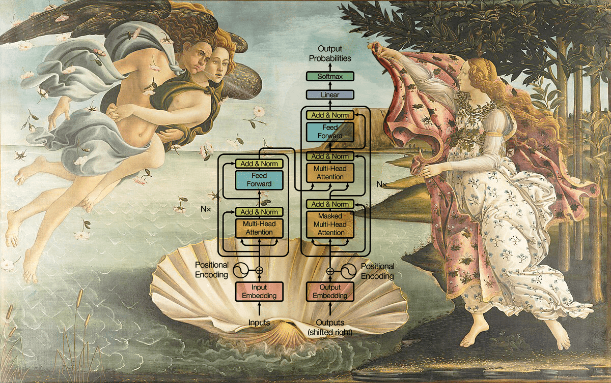

# Low Level Learning

*Created by [Vicki Boykis](https://twitter.com/vboykis) using [Dingboard](https://dingboard.com/), a free AI powered meme image editor that doesn't suck made by [Yacine](https://twitter.com/yacineMTB).*

## Overview

Core disciplines offer timeless principles that underpin various technologies. While tech may evolve rapidly, these fundamentals endure. 

Contributions are very welcome! Feel free to message me at <youbiidrissi.abdallah@gmail.com>

## Table Of Contents

- [Computer Science](#computer-science)
- [Information Theory](#information-theory)
- [Uncertainty Estimation](#uncertainty-estimation)
- [Signal Processing](#signal-processing)
- [Optimization](#optimization)
- [Causal Inference](#causal-inference)
- [Game Theory](#game-theory)
- [Control Theory and Optimal Control](#control-theory-and-optimal-control)
- [Geometric and Topological Inference](#geometric-and-topological-inference)
- [Probabilistic Programming and Relational Learning](#probabilistic-programming-and-relational-learning)
- [Decision Making Under Uncertainty](#decision-making-under-uncertainty)
- [Reinforcement Learning](#reinforcement-learning)
- [Bayesian Statistics and Monte Carlo Methods](#bayesian-statistics-and-monte-carlo-methods)
- [Probabilistic Graphical Models](#probabilistic-graphical-models)
- [High-Dimensional Data Analysis](#high-dimensional-data-analysis)
- [Robotics](#robotics)
- [Machine Learning](#machine-learning)
- [Deep Learning](#deep-learning)
- [Self-Supervised Learning](#self-supervised-learning)
- [Deep Generative Models](#deep-generative-models)
- [Computer Vision](#computer-vision)
- [Natural Language Processing](#natural-language-processing)
- [Quantitative Finance](#quantitative-finance)
- [Actuarial Science](#actuarial-science)
- [Category Theory](#category-theory)
- [Cool Stuff](#cool-stuff)

## Computer Science

### Theoretical Computer Science and Theory of Computation

#### Theoretical Computer Science and Theory of Computation: Courses

- MIT 18.404J Theory of Computation, Fall 2020 by Michael Sipser - [Course Website](https://ocw.mit.edu/courses/18-404j-theory-of-computation-fall-2020/) and [Youtube Playlist](https://www.youtube.com/playlist?list=PLUl4u3cNGP60_JNv2MmK3wkOt9syvfQWY)
- Models of Computation by Jeff Erickson - [Lecture Notes](https://jeffe.cs.illinois.edu/teaching/algorithms/models/all-models.pdf)
- Introduction to Theoretical Computer Science by Boaz Barak - [Lecture Notes](https://files.boazbarak.org/introtcs/lnotes_book.pdf)
- Introduction to the Theory of Computing by John Watrous - [Course website](https://cs.uwaterloo.ca/~watrous/ToC-notes/) and [Lecture Notes](https://cs.uwaterloo.ca/~watrous/ToC-notes/ToC-notes.pdf)
- Introduction to the Theory of Computation by David Liu - [Lecture Notes](https://www.cs.toronto.edu/~david/course-notes/csc236.pdf)

#### Theoretical Computer Science and Theory of Computation: Books

- Introduction to Automata Theory, Languages, and Computation by JOHN E. HOPCROFT, RAJEEV MOTWANI and JEFFREY D. ULLMAN.
- Introduction to the Theory of Computation by Michael Sipser.
- Models Of Computation Exploring the Power of Computing by John E. Savage.
- Computational complexity A Modern Approach by SANJEEV ARORA and BOAZ BARAK.
- The Nature of Computation by Cristopher Moore and Stephan Mertens.
- Structure and Interpretation of Computer Programs by Harold Abelson and Gerald Jay Sussman with Julie Sussman.
- Once Upon an Algorithm How Stories Explain Computing by Martin Erwig.

#### Topics

##### Computational Logic

- Foundations of Computer Science Logic, models, and computations - [Website](https://www.enseignement.polytechnique.fr/informatique/INF412/i.php?n=Main.HomePage) and [Lecture Notes](https://www.enseignement.polytechnique.fr/informatique/INF412/uploads/Main/polyinf412english-goodINF412ENGLISH.pdf)
- INF551 – Computational logic - [Website](https://www.lix.polytechnique.fr/Labo/Samuel.Mimram/teaching/INF551/) and [Lecture Notes](https://www.lix.polytechnique.fr/Labo/Samuel.Mimram/teaching/INF551/course.pdf)

##### Software Foundations

- [The Software Foundations Series](https://softwarefoundations.cis.upenn.edu/)
- [How to Design Programs](https://htdp.org/)

##### Lambda Calculus, Category theory and Functional Programming

- [Lambda-calculus and Categories](https://www.irif.fr/~mellies/mpri-ens.html)
- [Lecture Notes on the Lambda Calculus by Peter Selinger](https://arxiv.org/pdf/0804.3434.pdf)

##### Formal Methods

- [Formal-Methods-Courses](https://github.com/luigiapetre/Formal-Methods-Courses)
- [Formal Methods of Software Design by Eric Hehner](https://www.cs.toronto.edu/~hehner/FMSD/) and [Textbook](https://www.cs.toronto.edu/~hehner/aPToP/)

##### Design and Analysis of Algorithms

- Jeff Erickson Course: CS 473 Algorithms - [Webpage](https://courses.engr.illinois.edu/cs473/fa2022/), [Lectures](https://mediaspace.illinois.edu/channel/crissywakeup/265961502), [Lecture Notes](https://courses.engr.illinois.edu/cs473/fa2022/lectures.html) and [Textbook](https://jeffe.cs.illinois.edu/teaching/algorithms/)
- CMU 15-850: Advanced Algorithms, Spring 2023 - [Webpage](https://www.cs.cmu.edu/~15850/) and [Lectures](https://scs.hosted.panopto.com/Panopto/Pages/Sessions/List.aspx#folderID=%2253c58248-7fd4-4f71-8774-af85013a570a%22&page=0&maxResults=50)
- CMU 15-451/651: Algorithm Design and Analysis - [Webpage](https://www.cs.cmu.edu/~15451-s23/schedule.html)
- MIT 6.5210/18.415: Advanced Algorithms - [Webapge](https://6.5210.csail.mit.edu/)
- Advanced Algorithms, ETH Zurich, Fall 2023 - [Webpage](https://people.inf.ethz.ch/~aroeyskoe/AA23)
- Thatchaphol Saranurak Courses:
  - EECS 477 Introduction to Algorithms (Winter 2023) - [Webpage](https://sites.google.com/site/thsaranurak/teaching/intro-algo?authuser=0) and [Lectures](https://www.youtube.com/playlist?list=PLVw32sKsg0NuY9-DBVSbPHDa4yWma0BMo)
  - Expanders and Fast Graph Algorithms - [Webpage](https://sites.google.com/site/thsaranurak/teaching/Expander?authuser=0) and [Lectures](https://www.youtube.com/playlist?list=PLVw32sKsg0Ntcr6mRvPhvY71_xSkFMHHg)
  
- CSE373 -- Analysis of Algorithms (Fall 2021) by Steven Skiena - [Textbook](https://www3.cs.stonybrook.edu/~skiena/373/videos/) and [Lectures](https://www.youtube.com/playlist?list=PLOtl7M3yp-DXbHTFe_w9zFPXeau28CDao)

### Digital Systems and Computer Architecture

#### Digital Systems and Computer Architecture: Courses

- Digital Design and Computer Architecture by Onur Mutlu - [Course Website](https://safari.ethz.ch/digitaltechnik/spring2023/doku.php?id=start) and [Youtube Playlist](https://www.youtube.com/playlist?list=PL5Q2soXY2Zi-EImKxYYY1SZuGiOAOBKaf)
- Computer Architecture by Onur Mutlu - [Course Website](https://safari.ethz.ch/architecture/fall2023/doku.php) and [Youtube Playlist](https://www.youtube.com/playlist?list=PL5Q2soXY2Zi9UFWwfRtSjpKX_IRF0lPSe)

#### Digital Systems and Computer Architecture: Books

- Digital Design and Computer Architecture by David Money Harris and Sarah L. Harris
- introduction to computing systems from bits & gates to C/C++ & beyond by Yale N. Patt and Sanjay J. Patel
- Digital Systems Principles and Applications by Neal S. Widmer and Gregory L. Moss

### Foundation of Computer Systems

- [Foundations of Computer Science](https://www.teach.cs.toronto.edu/~csc110y/fall/notes/)
- [Crafting Interpreters by Robert Nystrom](https://craftinginterpreters.com/)

#### Foundation of Computer Systems: Courses

- CMU 15-213/15-513/14-513 Introduction to Computer Systems (ICS) - [Website](https://www.cs.cmu.edu/~213/index.html) and [Lectures](https://scs.hosted.panopto.com/Panopto/Pages/Sessions/List.aspx#folderID=%22b96d90ae-9871-4fae-91e2-b1627b43e25e%22)
- MIT 6.172 Performance Engineering of Software Systems, Fall 2018 - [Website](https://ocw.mit.edu/6-172F18) and [Youtube Playlist](https://www.youtube.com/playlist?list=PLUl4u3cNGP63VIBQVWguXxZZi0566y7Wf)

#### Foundation of Computer Systems: Books

- Digital Systems Principles and Applications by Neal S. Widmer and Gregory L. Moss

### Operating Systems

- Operating Systems: Three Easy Pieces - [Website](https://pages.cs.wisc.edu/~remzi/OSTEP/)
- Operating Systems: Principles and Practice by Thomas Anderson and Michael Dahlin.
- MODERN OPERATING SYSTEMS by ANDREW S. TANENBAUM and HERBERT BOS.
- Operating Systems: Internals and Design Principles by William Stallings.

### Database Systems, Distributed Systems and Parallel Computing

#### Database Systems

- Database Systems Design, Implementation, and Management
- Database Systems The Complete Book
- Database in Depth - Relational Theory for Practitioners
- Database Design for Mere Mortals
- Ghislain Fourny's lectures - [Webpage](https://people.inf.ethz.ch/gfourny/#teaching), [Youtube Channel](https://www.youtube.com/@GhislainFournysLectures/playlists) and [The Big Data Textbook Teaching large-scale databases in universities](https://ghislainfourny.github.io/big-data-textbook/)

### Cryptography

- [A curated list of cryptography resources and links](https://github.com/sobolevn/awesome-cryptography)
- [A collection of awesome software, learning tutorials, theoretical resources, books and videos, best practices in applied cryptography](https://github.com/paulveillard/cybersecurity-applied-cryptography)
- [The Joy of Cryptography](https://joyofcryptography.com/)
- [An Intensive Introduction to Cryptography](https://intensecrypto.org/public/index.html)
- [A Course in Cryptography by Rafael Pass and Abhi Shelat](https://www.cs.cornell.edu/courses/cs4830/2010fa/lecnotes.pdf)
- [A Graduate Course in Applied Cryptography Dan Boneh and Victor Shoup](https://toc.cryptobook.us/)

### Computer Networking

- [A collection of awesome networking courses, books, tutorials and other resources](https://github.com/facyber/awesome-networking)

### High Performance Computing

- [The art of HPC](https://theartofhpc.com/)

## Information Theory

### Basics of Information Theory

### Basics of Information Theory: Courses

- Introduction to Information Theory (Fall 2021) by Michael Walter - [Website](https://qi.ruhr-uni-bochum.de/iit21/)
- Information Theory course by Guillaume Charpiat - [Website](https://www.lri.fr/~gcharpia/informationtheory/)
- Illinois ECE 563 - Information Theory (Fall 2022) by Olgica Milenkovic - [Website](https://courses.engr.illinois.edu/ece563/fa2022/)
- Notes on information theory for artificial intelligence and statistical learning by Yann Ollivier - [Website](http://www.yann-ollivier.org/rech/publs/mdltalks)
- Introduction to Information Theory, Fall 2019 by Hsuan-Tien Lin - [Website](https://www.csie.ntu.edu.tw/~htlin/course/iit19fall/)
- Changho Suh Lecture notes: [website](http://csuh.kaist.ac.kr/teaching.html)
  - [Introduction to Information Theory](http://csuh.kaist.ac.kr/Suh_textbook_info.pdf)
  - [Introduction to Communication Engineering](http://csuh.kaist.ac.kr/Suh_textbook_comm.pdf)  
- Introduction to Information Theory by Stanford Research Talks - [Lectures](https://www.youtube.com/playlist?list=PLv_7iO_xlL0Kz2nU05COpINjU8C0UPICA)
- Stanford EE276/Stats376a: Information Theory Winter 2021-2022 by David Tse[Website](https://web.stanford.edu/class/ee276/)

### Basics of Information Theory: Books

- Information Theory, Inference, and Learning Algorithms by David MacKay - [Website](http://www.inference.org.uk/mackay/itila/), [Book](http://www.inference.org.uk/mackay/itila/book.html) and [Lectures](http://videolectures.net/course_information_theory_pattern_recognition/)
- Elements of Information Theory, Second Edition by Thomas M. Cover and Joy A. Thomas - [Book (PDF File)](http://staff.ustc.edu.cn/~cgong821/Wiley.Interscience.Elements.of.Information.Theory.Jul.2006.eBook-DDU.pdf)
- Information Theory and Network Coding by Raymond Yeung - [Book (PDF file)](http://iest2.ie.cuhk.edu.hk/~whyeung/post/manuscript/main2.pdf) and [Lectures](https://www.youtube.com/playlist?list=PLZDU8a6AcnuixlMLNuqvQSS7PDUK8pZmO)
  
### Algorithmic Information Theory

- [Algorithmic Information Theory by Marcus Hutter](http://www.hutter1.net/ait.htm)
- [Algorithmic Information Theory by G J Chaitin](https://doc.lagout.org/Others/Information%20Theory/Information%20Theory/ALGORITHMIC%20INFORMATION%20THEORY%20-%20G.J.%20Chaitin.pdf)
- [An Introduction to Kolmogorov Complexity and Its Applications by Ming Li, Paul Vitányi](https://link.springer.com/book/10.1007/978-0-387-49820-1)
- [Symposium on Algorithmic Information Theory and Machine Learning](https://sites.google.com/site/boumedienehamzi/symposium-on-algorithmic-information-theory-and-machine-learning?authuser=0) and [Lectures](https://www.youtube.com/channel/UCzk5nfLgy6MgeqtHPUTpVGQ/videos)
- [Algorithmic Information Theory: A MOOC](https://aiai.telecom-paris.fr/)

### Information Geometry

- [An elementary introduction to information geometry by Frank Nielsen](https://arxiv.org/abs/1808.08271) and [Lecture](https://www.youtube.com/watch?v=w6r_jsEBlgU)
- [The Many Faces of Information Geometry by Frank Nielsen](https://www.ams.org/journals/notices/202201/rnoti-p36.pdf)
- [More ressources on the topic by Frank Nielsen](https://franknielsen.github.io/IG/index.html)

### Coding Theory

#### Coding Theory: Courses

- Stanford EE 388 – Modern Coding Theory - [Website](https://web.stanford.edu/class/ee388/ee388.html)
- CSS.318.1: Coding Theory - Monsoon Semester (2022-23) - [Wesbite](https://www.tifr.res.in/~prahladh/teaching/2022-23/coding/) and [Lectures](https://www.youtube.com/playlist?list=PLTtM9ThZ2L-dVk_fP2UDReKhWdgoDt1Zw)

#### Coding Theory: Books

- Essential Coding Theory - [Website](https://cse.buffalo.edu/faculty/atri/courses/coding-theory/book/) and [Draft of the book](https://cse.buffalo.edu/faculty/atri/courses/coding-theory/book/web-coding-book.pdf)
- Modern Coding Theory by T. Richardson and R. Urbanke
- Information, Physics, and Computation by M. Mezard and A. Montanari

#### Coding Theory: Blog Posts

- [Explained: The Shannon limit](https://news.mit.edu/2010/explained-shannon-0115) and [https://news.mit.edu/2010/gallager-codes-0121](https://news.mit.edu/2010/gallager-codes-0121?fbclid=IwAR2MtPLFnokJNusRiLFOimmkT7iIEyzgl4m1jfgb86oWnMU_0L2lf7T1jYU)

## Uncertainty Estimation

### Uncertainty Estimation: Courses

- Modern Topics in Unertainty Estimation by Aaron Roth (CIS 7000: A Course at the University of Pennsylvania) - [Draft book](https://www.cis.upenn.edu/~aaroth/uncertainty-notes.pdf) and [Lectures](https://uncertaintyclass.com/lectures/)
- Uncertainty Modelling in AI [Lectures](https://www.youtube.com/playlist?list=PLxg0CGqViygOb9Eyc8IXM27doxjp2SK0H)
- Generative Models and Uncertainty Quantification - [Website](https://genu.ai/2022/)
- Seminar By Branden Fitelson - [Website](http://fitelson.org/coherence/), [a preliminary draft](https://fitelson.org/coherence/coherence_duke.pdf) and [more presentations](http://www.fitelson.org/presentation.html)
- Uncertainty in Artificial Intelligence (UAI) - [Website](https://www.auai.org/uai2022/)
- [Topics In Modern Statistical Learning (UPenn, 2022 Spring) - uncertainty quantification, conformal prediction, calibration](https://github.com/dobriban/Topics-In-Modern-Statistical-Learning)
- [Numerics of Machine Learning at the University of Tübingen](https://github.com/philipphennig/NumericsOfML) and [Lectures](https://www.youtube.com/playlist?list=PL05umP7R6ij2lwDdj7IkuHoP9vHlEcH0s)

### Uncertainty Estimation: Books

- Probabilistic Numerics - [Website](https://www.probabilistic-numerics.org/) and [Free textbook](https://www.probabilistic-numerics.org/assets/ProbabilisticNumerics.pdf)
- Reasoning about Uncertainty By Joseph Y. Halpern - [Website](https://direct.mit.edu/books/book/3540/Reasoning-about-Uncertainty)
- Reasoning about Uncertainty Learning and Teaching Informal Inferential Reasoning by Andrew Zieffler, Elizabeth Fry - [Book (PDF File)](https://www.datadreaming.org/files/reasoning-about-uncertainty-2008.pdf)

### Uncertainty Estimation: Papers

- [General and Foundational Research](https://www.probabilistic-numerics.org/research/general/)

### Uncertainty Estimation: Libraries

- [ProbNum: Probabilistic Numerics in Python](https://probnum.readthedocs.io/en/latest/#)
- [Fortuna: A Library for Uncertainty Quantification](https://github.com/awslabs/fortuna)
- [Uncertainty Toolbox: A python toolbox for predictive uncertainty quantification, calibration, metrics, and visualization](https://github.com/uncertainty-toolbox/uncertainty-toolbox)
- [Emukit: A Python-based toolbox of various methods in uncertainty quantification and statistical emulation: multi-fidelity, experimental design, Bayesian optimisation, Bayesian quadrature](https://github.com/EmuKit/emukit)
- [Chaospy: A Toolbox for performing uncertainty quantification](https://github.com/jonathf/chaospy)
- [UQ360: An extensible open-source toolkit that can help you estimate, communicate and use uncertainty in machine learning model predictions](https://github.com/IBM/UQ360)

### A Framework for Uncertainty Quantification: Conformal Inference (a.k.a. Conformal Prediction)

- [Algorithmic Learning in a Random World by Vladimir Vovk, Alexander Gammerman, Glenn Shafer](http://www.alrw.net/)
- [Conformal Prediction for Reliable Machine Learning Theory, Adaptations and Applications](https://www.elsevier.com/books/conformal-prediction-for-reliable-machine-learning/balasubramanian/978-0-12-398537-8)
- [A Gentle Introduction to Conformal Prediction and Distribution-Free Uncertainty Quantification](https://arxiv.org/abs/2107.07511), [Youtube Playlist](https://www.youtube.com/playlist?list=PLBa0oe-LYIHa68NOJbMxDTMMjT8Is4WkI) and [Implementation](https://github.com/aangelopoulos/conformal-prediction)
- [A professionally curated list of awesome Conformal Prediction videos, tutorials, books, papers, PhD and MSc theses, articles and open-source libraries](https://github.com/valeman/awesome-conformal-prediction)  
- [A Tutorial on Conformal Prediction](https://jmlr.csail.mit.edu/papers/volume9/shafer08a/shafer08a.pdf)
- [NeurIPS: Conformal Prediction by Emmanuel Candes](https://slideslive.com/38996063/conformal-prediction-in-2022)
- [Conformal prediction: A unified review of theory and new challenges](https://arxiv.org/abs/2005.07972)
- [Conformal Prediction Beyond Exchangeability](https://arxiv.org/abs/2202.13415)
- [Conformal Prediction Under Covariate Shift](https://arxiv.org/abs/1904.06019)
- [Adaptive Conformal Inference Under Distribution Shift](https://arxiv.org/abs/2106.00170)
- [Conformal Inference for Online Prediction with Arbitrary Distribution Shifts](https://arxiv.org/abs/2208.08401)
- [Doubly Robust Calibration of Prediction Sets under Covariate Shift](https://arxiv.org/abs/2203.01761)

## Signal Processing

### Signal Processing: Courses

- Statistical Signal Processing by Don H. Johnson - [Notes](https://bpb-us-e1.wpmucdn.com/blogs.rice.edu/dist/7/3490/files/2022/03/notes.pdf) and [Lectures](Lectures)
- Stanford Courses:
  - EE 178/278A: Probabilistic System Analysis (Spring 2014) - [Website](http://stanford.edu/~dntse/classes/ee178_278a.html)
  - EE278: Introduction to Statistical Signal Processing by David Tse - [Website](https://web.stanford.edu/class/ee278/index.html)
  - EE 378A – Statistical Signal Processing by Andrea Montanari - [Website](http://web.stanford.edu/class/ee378a/ee378a.html)
  - EE 378B: Inference, estimation, and information processing - [Website](https://web.stanford.edu/class/ee378b/#:~:text=Tools%20from%20modern%20high%2Ddimensional,matrix%2C%20graph%20and%20tensor%20data.)
  - EE269 - Signal Processing for Machine Learning - [Website](http://web.stanford.edu/class/ee269/)
  - [More Related Courses](https://tselab.stanford.edu/teaching/)
- IKT721 - Statistical Signal Processing [Lectures](https://www.youtube.com/playlist?list=PLItUftQ-Nkb90TGFxTv8I8LXGgQZyJUC9), [Slides](https://www.dropbox.com/sh/hjzv7g1nttvjwjq/AACJozvnt8d1B-D9EnxHdYLEa?dl=0) and [Website](https://asl.uia.no/daniel/courses/ssp/material)
- EECS 225A: Statistical Signal Processing, University of California Berkeley, Jiantao Jiao, Spring 2020 - [Website](https://people.eecs.berkeley.edu/~jiantao/225a2020spring/material.html)
- ECE 531: Detection and Estimation Theory by Prof. Mojtaba Soltanalian, UIC - [Website](https://msol.people.uic.edu/ECE531/)

### Signal Processing: Books

- SIGNAL PROCESSING FOR COMMUNICATIONS by Paolo Prandoni and Martin Vetterli - [Website](https://www.sp4comm.org/) and [Book (PDF File)](https://www.sp4comm.org/docs/sp4comm_corrected.pdf)
- Introduction to Spectral Analysis by Petre Stoica and Randolph Moses - [Book (PDF File)](https://www.maths.lu.se/fileadmin/maths/personal_staff/Andreas_Jakobsson/StoicaM05.pdf)
- A wavelet tour of signal processing the Sparse way by Stephane Mallat - [Website](https://wavelet-tour.github.io/), [Book (PDF File)](http://www.lib.ysu.am/disciplines_bk/d7f742bb4675c323cefe071da33f7d55.pdf) and [Correction of the exercises from the book by Gabriel Peyré](https://wavelet-tour.github.io/files/WaveletTourCorrections.pdf)
- An Introduction to Statistical Signal Processing by Robert M. Gray and Lee D. Davisson - [Book (PDF File)](https://ee.stanford.edu/~gray/sp.pdf)
- Foundations of Signal Processing by Martin Vetterli, Jelena Kovacevic and Vivek K Goyal - [Website](https://www.fourierandwavelets.org/) and [Book (PDF File)](https://www.fourierandwavelets.org/FSP_v1.1_2014.pdf)
- Fourier and Wavelet Signal Processing by Martin Vetterli, Jelena Kovacevic and Vivek K Goyal - [Website](https://www.fourierandwavelets.org/) and [Book (PDF File)](https://www.fourierandwavelets.org/FWSP_a3.2_2013.pdf)
- Introduction to Nonparametric Estimation by  Alexandre B. Tsybakov - [Book (PDF File)](http://old.ins.sjtu.edu.cn/files/common/20121209191850_7.pdf)
- An Introduction to Sparse Stochastic Processes by MICHAEL UNSER and POUYA D. TAFTI
- SPECTRAL ANALYSIS OF SIGNALS by Petre Stoica and Randolph Moses - [Book (PDF File)](https://user.it.uu.se/~ps/SAS-new.pdf)
- System Identification by Petre Stoica and Torsten Söderström - [Book (PDF File)](https://user.it.uu.se/~ps/sysidbook.pdf)
- Fundamentals of Statistical Signal Processing, Volume I Estimation Theory by Steven M. Kay
- Fundamentals of Statistical Signal Processing, Volume II Detection Theory by Steven M. Kay

## Optimization

### Convex Optimization

#### Convex Optimization: Courses

- Master M2 MVA: Convex Optimization, Algorithms and Applications by Alexandre d'Aspremont - [Slides and Lectures](https://www.di.ens.fr/~aspremon/OptConvexeM2.html)
- EEC 227C: Convex Optimization and Approximation Spring 2018 - [Website](https://ee227c.github.io/)
- EEC 227C: Convex Optimization and Approximation Spring 2022 - [Website](https://people.eecs.berkeley.edu/~jiantao/227c2022spring/material.html)
- MATH-329 Nonlinear Optimization, Institute of Mathematics, EPFL, Nicolas Boumal - [Notes (PDF File)](https://sma.epfl.ch/~nboumal/papers/MATH329-Lecture_notes_Boumal_2022.pdf)
- IKT719 - Advanced Optimization by Daniel Romero - [Notes (PDF File)](https://asl.uia.no/static/labcontent/teaching/aopt-notes.pdf)
- Stanford EE364a: Convex Optimization I - [Website](https://web.stanford.edu/class/ee364a/)
- Stanford EE364b - Convex Optimization II - [Website](https://web.stanford.edu/class/ee364b/)
- Stochastic Optimization and Automatic Differentiation for Machine Learning by Marco Cuturi - [Website](http://marcocuturi.net/soadml.html)
- Statistical machine learning and convex optimization by Francis Bach - [Website](https://www.di.ens.fr/~fbach/orsay2022.html) and [Slides](https://www.di.ens.fr/~fbach/fbach_orsay_2022.pdf)
- Optimization for Large Scale Machine Learning by Francis Bach - [Slides](https://www.di.ens.fr/~fbach/hausdorff2020.pdf) and Lectures:
  - [Francis Bach : Large-scale machine learning and convex optimization 1/2](https://www.youtube.com/watch?v=RPIfP00emcs) & [Francis Bach: Large-scale machine learning and convex optimization 2/2](https://www.youtube.com/watch?v=nM4lK9ORQx8)
  - [Francis Bach: Large scale Machine Learning and Convex Optimization (Lecture 1)](https://www.youtube.com/watch?v=V7lBkV9-kgc&list=PLul8LCT3AJqSQo3lr5RbwxJ92RsgRuDtx&index=2), [Francis Bach: Large scale Machine Learning and Convex Optimization (Lecture 2)](https://www.youtube.com/watch?v=4C65WnxoWPg&list=PLul8LCT3AJqSQo3lr5RbwxJ92RsgRuDtx&index=10), [Francis Bach: Large scale Machine Learning and Convex Optimization (Lecture 3)](https://www.youtube.com/watch?v=naXDNOMNazo&list=PLul8LCT3AJqSQo3lr5RbwxJ92RsgRuDtx&index=25) & [Francis Bach: Large scale Machine Learning and Convex Optimization (Lecture 4)](https://www.youtube.com/watch?v=KGx23IxC_Fk&list=PLul8LCT3AJqSQo3lr5RbwxJ92RsgRuDtx&index=23)
- [ELE539/COS512: Optimization for Machine Learning](https://sites.google.com/view/cjin/ee539cos512?authuser=0)

#### Convex Optimization: Books

- Convex Optimization. S. Boyd and L. Vandenberghe. Cambridge University Press, Cambridge, 2003 - [Website](https://web.stanford.edu/~boyd/cvxbook/), [Book (PDF File)](https://web.stanford.edu/~boyd/cvxbook/bv_cvxbook.pdf) and [Stanford Lectures](https://www.youtube.com/playlist?list=PL3940DD956CDF0622)
- Algorithms for Optimization by Mykel J. Kochenderfer Tim A. Wheeler - [Website](https://algorithmsbook.com/optimization/), [Book (PDF File)](https://algorithmsbook.com/optimization/files/optimization.pdf) and [Jupyter Notebooks](https://github.com/algorithmsbooks/algforopt-notebooks)
- First-order methods in optimization by Amir Beck - [Website](https://sites.google.com/site/amirbeck314/books)
- Linear Algebra and Optimization for Machine Learning A Textbook by Charu C. Aggarwal - [Book (PDF File)](https://tocit.ru/static/files/3ed7f8bf5f3b74f557a486038a2923d92b96774b07aeecf432d88975be46e9ff.pdf)
- Numerical Optimization Theoretical and Practical Aspects - [Book (PDF File)](http://calebrascon.info/IA/Topic3-Optimization/literature/Numerical_Optimization.pdf)
- Large-Scale Convex Optimization: Algorithms & Analyses via Monotone Operators by Ernest Ryu and Wotao Yin - [Slides and Lectures](https://large-scale-book.mathopt.com/) and [Book (PDF File)](https://large-scale-book.mathopt.com/LSCOMO.pdf)
- CONVEX OPTIMIZATION FOR MACHINE LEARNING by CHANGHO SUH - [Website](https://www.nowpublishers.com/article/BookDetails/9781638280521)
- LECTURES ON MODERN CONVEX OPTIMIZATION ANALYSIS, ALGORITHMS, AND ENGINEERING APPLICATIONS by Aharon Ben-Tal, Arkadi Nemirovski - [Book (PDF File)](https://www2.isye.gatech.edu/~nemirovs/LMCOBookSIAM.pdf)
- Optimization for Data Analysis by Stephen J. Wright, Benjamin Recht - [Website](https://www.cambridge.org/core/books/optimization-for-data-analysis/C02C3708905D236AA354D1CE1739A6A2) and [Draft](https://people.eecs.berkeley.edu/~brecht/opt4ml_book/)
- [Statistical Inference via Convex Optimization by Anatoli Juditsky and Arkadi Nemirovski](https://www2.isye.gatech.edu/~nemirovs/StatOptPUPWeb)

#### Convex Optimization: Papers

- [Convex Optimization: Algorithms and Complexity by Sébastien Bubeck](https://arxiv.org/abs/1405.4980)
- Roadmap for optimization by Yasmin H. Said, and Edward J. Wegman

#### Convex Optimization: Libraries

- [Convex.jl](https://jump.dev/Convex.jl/stable/)
- [CVXPY](https://www.cvxpy.org/)

### Numerical Optimization

- Numerical Optimization by Nocedal and Wright - [Website](http://users.iems.northwestern.edu/~nocedal/book/) and [Book (PDF File)](https://www.csie.ntu.edu.tw/~r97002/temp/num_optimization.pdf)
- [Numerical Algorithms by Justin Solomon](https://people.csail.mit.edu/jsolomon/share/book/numerical_book.pdf)

### Sums-of-Squares (SOS) programming

- [Semidefinite Optimization and Convex Algebraic Geometry](http://www.mit.edu/~parrilo/sdocag/SIAMBookFinalvNov12-2012.pdf)
- [Structured Semidefinite Programs and Semialgebraic Geometry Methods in Robustness and Optimization by Pablo A. Parrilo](https://thesis.library.caltech.edu/1647/1/Parrilo-Thesis.pdf)

### Mixed-Integer Programming (MIP)

- [Integer Programming by Giacomo Zambelli, Gérard Cornuéjols, and Michele Conforti](http://solab.kaist.ac.kr/files/IP/IP2017/2014_Integer%20Prog_Conforti-Cornuejols-Zambelli.pdf)

## Causal Inference

### Causal Inference: Books

- Causal Inference: What If Miguel A. Hernán, James M. Robins - [Website](https://www.hsph.harvard.edu/miguel-hernan/causal-inference-book/) and [Book (PDF File)](https://cdn1.sph.harvard.edu/wp-content/uploads/sites/1268/2022/12/hernanrobins_WhatIf_20dec22.pdf)
- Causation, Prediction, and Search by Peter Spirtes, Clark Glymour, and Richard Scheines
- Elements of Causal Inference Foundations and Learning Algorithms by Jonas Peters, Dominik Janzing, Bernhard Schölkopf
- Matching, regression discontinuity, difference in differences, and beyond by Lee, Myoung-jae
- Judea Pearl:
  - Causality - Models, Reasoning and Inference
  - Causal Inference in Statistics A Primer
  - The Book of Why
  - Probabilistic and Causal Inference
- Introduction to Modern Causal Inference (work in-progress) - [Website](https://alejandroschuler.github.io/mci/)
- Causal Inference The Mixtape by Scott Cunningham
- Bayesuvius, a visual dictionary of Bayesian Networks and Causal Inference - [Website](https://qbnets.wordpress.com/2020/11/30/my-free-book-bayesuvius-on-bayesian-networks/), [Book](https://github.com/rrtucci/Bayesuvius/raw/master/main.pdf) and [repo](https://github.com/rrtucci/Bayesuvius)

### Causal Inference: Courses

- Introduction to Causal Inference by Brady Neal [Lectures](https://www.bradyneal.com/causal-inference-course) and [Notes (PDF File)](https://www.bradyneal.com/Introduction_to_Causal_Inference-Dec17_2020-Neal.pdf)
- Causal inference meets probabilistic models - [Lectures](https://www.youtube.com/playlist?list=PLZ_xn3EIbxZEPmFCCCACWe9jpSN6KHA2P)
- Algorithmic Aspects of Causal Inference by Simons Institute - [Website](https://simons.berkeley.edu/workshops/algorithmic-aspects-causal-inference) and [Youtube Playlist](https://www.youtube.com/playlist?list=PLgKuh-lKre10nS_YodPwp-N9aTZxlw2LV)
- Causal Inference by Elias Bareinboim - [Website](https://causalai.net/#teaching)
- Causal Reasoning by Bert Huang - [Website](https://berthuang.com/courses/causal20/)
- 6.S091 Causality: Policy Evaluation, Structure Learning, and Representation Learning - [Website](https://github.com/csquires/6.S091-causality) and [Lectures](https://www.youtube.com/@chandler.squires)
- CS 295 - Winter 2022-23, Causal Reasoning - [Website](https://www.ics.uci.edu/~dechter/courses/ics-295cr/2022-23_Q2_Winter/)
- [IAS Causality Series](https://www.youtube.com/playlist?list=PLy66Zw8nf6kDI6ACsRRvi_7YRhiNZmF67)
- Causality with Boris - [Website](https://sobolevspace.com/), [Course Roadmap](https://world.hey.com/aiia/road-maps-for-causality-with-boris-episodes-bb19010a) and [Lectures](https://www.youtube.com/playlist?list=PLwmD6dkUR0Di3QLjllAWFxkQBkXLPln6u)
- 6.S091: Causality Policy Evaluation, Structure Learning, and Representation Learning - [Website](https://github.com/csquires/6.S091-causality) and [Lectures](https://www.youtube.com/playlist?list=PLiyH4sDpByicWHWv-xaI4gRbxrpFv2-FA)

### Causal Inference: Libraries

- [CausalPy - causal inference for quasi-experiments](https://www.pymc-labs.io/blog-posts/causalpy-a-new-package-for-bayesian-causal-inference-for-quasi-experiments/)

### Causal Inference: Papers

- [Causal models and learning from data: integrating causal modeling and statistical estimation](https://pubmed.ncbi.nlm.nih.gov/24713881/)
- [A Primer on Causality in Data Science](https://arxiv.org/abs/1809.02408)
- [An Introduction to Causal Inference by Judea Pearl](https://www.ncbi.nlm.nih.gov/pmc/articles/PMC2836213/)
- [An Introduction to Causal Inference](https://psyarxiv.com/b3fkw)
- On Pearl’s Hierarchy and the Foundations of Causal Inference
- The Seven Tools of Causal Inference, with Reflections on Machine Learning
- Causal Effect Inference with Deep Latent-Variable Models - [Paper](https://arxiv.org/pdf/1705.08821v2.pdf) and [Multiple Implentations](https://paperswithcode.com/paper/causal-effect-inference-with-deep-latent)

## Game Theory

### Game Theory: Books

- Game Theory by Giacomo Bonanno - [Website](https://faculty.econ.ucdavis.edu/faculty/bonanno/GT_Book.html) and [Book](https://faculty.econ.ucdavis.edu/faculty/bonanno/PDF/GT_book.pdf)
- Game Theory and Behavior By Jeffrey Carpenter and Andrea Robbett
- Game Theory A Very Short Introduction by Ken Binmore - [Book](https://dr-notes.com/game-theory-a-very-short-introduction-oiw)
- Game Theory, M.Maschler, E. Solan and S. Zamir. Cambridge UP 2013.
- Mathematical Foundations of Game Theory. R. Laraki, J. Renault and S.Sorin. Springer 2019.
- Game Theory, Alive by Anna R. Karlin and Yuval Peres - [Book (PDF File)](https://homes.cs.washington.edu/~karlin/GameTheoryBook.pdf)
- GAME THEORY AN INTRODUCTION by Steven Tadelis - [Book (PDF File)](http://students.aiu.edu/submissions/profiles/resources/onlineBook/Y5z2A2_Game_Theory_An_Introduction.pdf)

### Game Theory: Courses

- Xiang Sun Courses:
  - [Lecture Notes on Game Theory: Theory and Examples](https://www.dropbox.com/s/nh9qysi67kifmrl/game.pdf?dl=0)
  - [Matching and Market Design: Theory and Practice](https://www.dropbox.com/s/54suvtezo7bm628/matching-print-2018.pdf?dl=0)
- Jérôme Renault Lecture Notes - [Website](https://sites.google.com/site/jrenaultsite/lecturenotes)
- Game Theory 101 Full Course by William Spaniel - [Youtube Playlist](https://www.youtube.com/playlist?list=PLKI1h_nAkaQoDzI4xDIXzx6U2ergFmedo)
- Game Theory Online - [Youtube Channel](https://www.youtube.com/@gametheoryonline/playlists)
- Game Theory by Jules Hedges - [Youtube Playlist](https://www.youtube.com/playlist?app=desktop&list=PLEXSr4muucafwZdGz4Kw8ALni5sFKMdc3)
- Selcuk Ozyurt - [Youtube Channel](https://www.youtube.com/@selcukozyurt/playlists)
- Strategy: An Introduction to Game Theory by Aditya Jagannatham - [Youtube Playlist](https://www.youtube.com/playlist?list=PLDlJ2nw7-dHb3oowMJfwgleor6dwWsVZ1)
- UBC ISCI 344 Game Theory - [Lectures](https://www.youtube.com/playlist?list=PL8gpLQEUqzu3cdi0I1s_0d-G4gq6zQ4bC)
- [Game Theory: Penn State Math 486 Lecture Notes by Christopher Griffin](https://www.personal.psu.edu/cxg286/Math486.pdf)

### Game Theory: Advaned Topics

#### Algorithmic Game Theory

- MULTIAGENT SYSTEMS Algorithmic, Game-Theoretic, and Logical Foundations by Yoav Shoham, Stanford University, Kevin Leyton-Brown - [Book (PDF File)](http://www.masfoundations.org/mas.pdf) and [Website](http://www.masfoundations.org/)
- Algorithmic Game Theory - [Book (PDF File)](https://www.cs.cmu.edu/~sandholm/cs15-892F13/algorithmic-game-theory.pdf)
- Twenty Lectures on Algorithmic Game Theory by Tim Roughgarden - [Book](https://www.cambridge.org/core/books/twenty-lectures-on-algorithmic-game-theory/A9D9427C8F43E7DAEF8C702755B6D72B), [Lecture Notes](http://timroughgarden.org/notes.html) and [Lectures](https://www.youtube.com/playlist?list=PLEGCF-WLh2RJBqmxvZ0_ie-mleCFhi2N4)
- Algorithmic Game Theory by Thomas Kesselheim - [Website](https://nerva.cs.uni-bonn.de/doku.php?id=teaching%3Aws2021%3Avl-agt) and [Youtube Playlist](https://www.youtube.com/playlist?list=PLyzcvvgje7aD_DjpmhFzQ9DVS8zzhrgp6)
- 601.436/636 Algorithmic Game Theory - Spring 2022 by Michael Dinitz - [Website](https://www.cs.jhu.edu/~mdinitz/classes/AGT/Spring2022/)
- CMSC858F: Algorithmic Game Theory, Spring 2014 by Mohammad T. HajiAghayi - [Website](http://www.cs.umd.edu/~hajiagha/AGT10/AGT14.html)
- Algorithms, Games, and Networks at CMU by Avrim Blum and Ariel Procaccia - [Website](http://www.cs.cmu.edu/~arielpro/15896/schedule.html)
- Algorithmic Game Theory Lectures by Computer Science Theory Explained - [Youtube Playlist](https://www.youtube.com/playlist?list=PLdUzuimxVcC0QCFYP0Af3TNldswjL8_ep)

#### Mechanism Design

- Mechanism Design and Approximation By Jason D. Hartline - [Website](http://jasonhartline.com/MDnA/)

#### Decision Theory

- Statistical Decision Theory by Nicholas T. Longford
- Theory of Decision under Uncertainty by Gilboa I.
- Decision Theory Principles and Approaches by Giovanni Parmigiani, Lurdes Inoue
- Algorithmic Decision Theory: Lecture notes and presentation slides by Bisdorff, Raymond - [Website](https://orbilu.uni.lu/handle/10993/37933)
- Python resources for Algorithmic Decision Theory - [Website](https://digraph3.readthedocs.io/en/latest/)

#### Game Theory and Machine Learning

- [Website](https://gauthiergidel.github.io/courses/game_theory_ML_2021.html)

#### Game Theory and Optimization

- Advanced Optimization and Game Theory for Energy Systems - [Website](https://www.jalalkazempour.com/teaching) and [Lectures](https://www.youtube.com/playlist?list=PLe7H9pun_r8YHoGv0TnYxUsgbj0xAJmMR)

#### Differential Games

- [Introduction to differential games by Cardaliaguet Pierre](https://www.ceremade.dauphine.fr/~cardaliaguet/CoursJeuxDiff.pdf)
- [A VERY SHORT TOUR ON DIFFERENTIAL GAMES by Andrea Calogero](https://elearning.unimib.it/pluginfile.php/630564/mod_label/intro/game%20theory.pdf?time=1576233968931)

#### Mean Field Games

- [Magnetisation and mean field theory in the Ising model by Dalton A. R. Sakthivadivel](https://scipost.org/SciPostPhysLectNotes.35/pdf)
- [College de France Lectures](https://www.college-de-france.fr/site/en-pierre-louis-lions/course-2011-2012.htm)
- [UM6P 4 parts Lectures](https://www.youtube.com/watch?v=hI_4lltGyTM)
- [Notes on Mean Field Games by Pierre Cardaliaguet](https://www.ceremade.dauphine.fr/~cardaliaguet/MFG20200303.pdf)
- [Probabilistic Theory of Mean Field Games with Applications I Mean Field FBSDEs, Control, and Games by René Carmona,François Delarue](https://link.springer.com/book/10.1007/978-3-319-58920-6)
- [Mean Field Games-Springer by Yves Achdou, Pierre Cardaliaguet, François Delarue, Alessio Porretta, Filippo Santambrogio](https://www.springerprofessional.de/en/mean-field-games/18780524)
- [The Master Equation and the Convergence Problem in Mean Field Games](https://press.princeton.edu/books/hardcover/9780691190709/the-master-equation-and-the-convergence-problem-in-mean-field-games)

## Control Theory and Optimal Control

### Control Theory

- Brian Douglas:
  - [Website](https://engineeringmedia.com/)
  - [The Map of Control Theory](https://engineeringmedia.com/map-of-control)
  - [Control System Lectures](https://engineeringmedia.com/videos)
  - [Youtube Channel](https://www.youtube.com/@ControlLectures/playlists)
  - [Excellent Control Engineering Resources](https://resourcium.org/)
  - [FUNDAMENTALS OF CONTROL THEORY](https://engineeringmedia.com/books)

- Steve Brunton:
  - Control Bootcamp - [Youtube Playlist](https://www.youtube.com/playlist?list=PLMrJAkhIeNNR20Mz-VpzgfQs5zrYi085m)
  - Data-Driven Science and Engineering: Machine Learning, Dynamical Systems, and Control 1st Edition by Steven L. Brunton, J. Nathan Kutz - [Website](http://www.databookuw.com/), [IPython notebooks with demo code intended as a companion to the book](https://github.com/dynamicslab/databook_python)
  - [Steve Brunton Youtube Channel](https://www.youtube.com/@Eigensteve/playlists)

- Princeton University COS 597D: Computational Control Theory - [Website](https://sites.google.com/view/cos59x-cct/home?authuser=0) and [Lecture Notes](https://drive.google.com/file/d/1DDPrsWIineGu_LK_M2BpezT7aJTgGBwW/view)

- EE263: Introduction to Linear Dynamical Systems by Sanjay Lall, Stanford University, Fall Quarter 2022 - [Website](https://ee263.stanford.edu/) and [Lecttures by Stephen Boyd](https://www.youtube.com/playlist?list=PL06960BA52D0DB32B)

- Modern Control Engineering Fifth Edition by Katsuhiko Ogata - [Book (PDF File)](http://docs.znu.ac.ir/members/pirmohamadi_ali/Control/Katsuhiko%20Ogata%20_%20Modern%20Control%20Engineering%205th%20Edition.pdf)

- MIT 2.160 Identification, Estimation, and Learning - [Lectures](https://www.youtube.com/playlist?list=PLDHxS-d2mJqup7SwhgQjqCkXiDKo4rcL6) and [Material](https://darbelofflab.mit.edu/)

### Optimal Control

Main References:

- An extensive reference for Dynamic Programming is Dynamic Programming and Optimal Control by Dimitri P. Bertsekas - [Website](http://athenasc.com/dpbook.html)
- Classical references for optimal control:
  - Applied optimal control : optimization, estimation, and control by Arthur E. Bryson, Yu-Chi Ho - [Book (PDF File)](http://e.guigon.free.fr/rsc/book/BrysonHo75.pdf)
  - Optimal control and estimation by Stengel, Robert F - [Book (PDF File)](https://www.academia.edu/38041069/Stengel_R_F_Optimal_Control_and_Estimation_1994_) and [Some Notes from the Book](https://waxworksmath.com/Authors/N_Z/Stengel/WriteUp/weatherwax_stengel_notes.pdf)
- Numerical optimal control (a.k.a. Model Predictive Control):
  - Model Predictive Control: Theory, Computation, and Design - [Website](https://sites.engineering.ucsb.edu/~jbraw/mpc/) and [Book (PDF File)](https://sites.engineering.ucsb.edu/~jbraw/mpc/MPC-book-2nd-edition-4th-printing.pdf)
  - Predictive Control for Linear and Hybrid Systems by Borrelli, Bemporad, and Morari - [Website](http://www.mpc.berkeley.edu/mpc-course-material) and [Book (PDF File)](https://drive.google.com/file/d/1zaaZZjoXm73klAWfC62YlrUzujJOXUMt/view)
  - ECE5590: Model Predictive Control - [Lectures Notes and Recordings](http://mocha-java.uccs.edu/ECE5590/index.html)

- Stanford AA 203: Optimal and Learning-Based Control Spring 2022 - [Wesbite](https://stanfordasl.github.io/aa203/)
- Calculus of Variations and Optimal Control Theory A Concise Introduction by Daniel Liberzon - [Draft Version (PDF File)](http://liberzon.csl.illinois.edu/teaching/cvoc.pdf)
- An Introduction to Mathematical Optimal Control Theory By Lawrence C. Evans - [Lecture notes](https://math.berkeley.edu/~evans/control.course.pdf)
- TSRT08 Optimal control - [Website](https://www.control.isy.liu.se/student/tsrt08/), [Lecture notes](https://www.math.kth.se/optsyst/grundutbildning/kurser/SF2852/LecturenotesScanned.pdf), [Exercises with solutions](https://www.control.isy.liu.se/student/tsrt08/file/optimal_control_exercises.pdf), [Formula Sheet](https://www.control.isy.liu.se/student/tsrt08/file/formula_sheet.pdf)
- SF2852 Optimal Control - [Website](https://www.math.kth.se/optsyst/grundutbildning/kurser/SF2852/KursPMOptStyr.html), [Lecture notes](https://www.math.kth.se/optsyst/grundutbildning/kurser/SF2852/LecturenotesScanned.pdf), [Exercice Notes](https://www.math.kth.se/optsyst/grundutbildning/kurser/SF2852/ExercisenotesScanned.pdf)

### Stochastic Control and dynamic programming

- Stanford Engineering Sciences 203 - [Website](http://stanford.edu/~yamins/stochastic-control.html)
- EE266: Stochastic Control by Sanjay Lall, Stanford University, Spring Quarter 2016 - [Website](https://lall.stanford.edu/ee266/)
- MIT Dynamic Programming And Stochastic Control - [Website](https://ocw.mit.edu/courses/6-231-dynamic-programming-and-stochastic-control-fall-2015/)
- A Mini-Course on Stochastic Control by Qi Lu, Xu Zhang - [Paper](https://arxiv.org/abs/1612.02523)
- Stochastic Control by Neil Walton - [Book](https://appliedprobability.files.wordpress.com/2021/01/stochastic_control_jan29.pdf)
- Dynamic Programming VOLUME I: FOUNDATIONS, QUANTECON BOOK II by Thomas J. Sargent and John Stachurski[Website](https://quantecon.org/quantecon-textbook/), [Book (PDF File)](https://github.com/QuantEcon/book-dp1/blob/main/dp.pdf) and [Julia/Python Code](https://github.com/QuantEcon/book-dp1)

### State Space Models and Filtering

- [Bayesian Inference of State Space Models Kalman Filtering and Beyond](https://link.springer.com/book/10.1007/978-3-030-76124-0)
- [Dynamax: a library for probabilistic state space models (SSMs) written in JAX](https://probml.github.io/dynamax/)
- [kalman-jax: Approximate inference for Markov Gaussian processes using iterated Kalman smoothing, in JAX](https://github.com/AaltoML/kalman-jax)
- [State-Space Routines: Package implementing common state-space routines in Julia](https://github.com/FRBNY-DSGE/StateSpaceRoutines.jl)
- Kalman and Bayesian Filters in Python - [Jupyter Notebook](https://github.com/rlabbe/Kalman-and-Bayesian-Filters-in-Python) and [Book (PDF File)](https://drive.google.com/file/d/0By_SW19c1BfhSVFzNHc0SjduNzg/view?usp=sharing&resourcekey=0-41olC9ht9xE3wQe2zHZ45A)
- Bayesian Filtering and Smoothing Textbook by Simo Särkkä - [Book (PDF File)](https://users.aalto.fi/~ssarkka/pub/cup_book_online_20131111.pdf)
- Basics of Sensor Fusion by Roland Hostettler and Simo Särkkä - [Lecture Notes (PDF File)](https://users.aalto.fi/~ssarkka/pub/basics_of_sensor_fusion_2020.pdf)
- Stochastic Calculus, Filtering, and Stochastic Control by Ramon van Handel - [Book (PDF File)](https://web.math.princeton.edu/~rvan/acm217/ACM217.pdf)

## Geometric and Topological Inference

### Computational Geometry and Topology

- [Teaching Computational Geometry and Topology](https://comptag.github.io/teaching-compGT/index.html)
- [Topology by MyWhyU](https://www.youtube.com/playlist?list=PL09E9E697F585A58C)
- [Applied Algebraic Topology Research Network Website](https://www.aatrn.net/) and [Youtube Channel](https://www.youtube.com/@aatrn1/featured)
- [Bridging applied and quantitative topology Workshop Website](https://sites.google.com/view/applied-quantitative-topology/) and [2022 Edition](https://www.youtube.com/playlist?list=PL4kY-dS_mSmKuB0IUMQsG3Nsrb_5pzmBC)
- [CS 498 TC: Computational Geometry](http://jeffe.cs.illinois.edu/teaching/compgeom/index.html) and [Lectures](https://mediaspace.illinois.edu/channel/foo/241832232)
- [CS 598 JGE: One-Dimensional Computational Topology](https://jeffe.cs.illinois.edu/teaching/comptop/2020/) and [Lectures](https://mediaspace.illinois.edu/channel/CS+598+JGE+%E2%80%94%C2%A0Fall+2020/177766461/)
- [Video lectures by Philipp Kindermann, for his computational geometry course at the University of Würzburg](https://www.youtube.com/channel/UCuAzKw_VngkAsQh7ummYq0A/playlists?view=50&sort=dd&shelf_id=1) and [Course website](https://wuecampus2.uni-wuerzburg.de/moodle/course/view.php?id=41721)
- [Discrete Differential Geometry: An Applied Introduction](https://www.cs.cmu.edu/~kmcrane/Projects/DDG/), [Course Website](https://brickisland.net/DDGSpring2022/) and [Lectures](https://www.youtube.com/playlist?list=PL9_jI1bdZmz0hIrNCMQW1YmZysAiIYSSS)
- [Computational Algebraic Topology](https://people.maths.ox.ac.uk/nanda/cat/) and [Lectures](https://www.youtube.com/playlist?list=PLnLAqsCN_2ke8_EUd_KoJsLkPO0BKrrc6)
- [A curated list of awesome computational geometry visualizations, frameworks, and resources](https://github.com/atkirtland/awesome-computational-geometry)

### Geometric and Topological Data Analysis

- Topological Data Analysis - [Website](https://julien-tierny.github.io/topologicalDataAnalysisClass.html), [Lecture Notes](https://hal.inria.fr/hal-01615863v2/document)
- [Quick List of Resources for Topological Data Analysis with Emphasis on Machine Learning](https://gist.github.com/calstad/01e174faff2cdca7faf9)
- [Topological Data Analysis with Applications by Gunnar Carlsson, Mikael Vejdemo-Johansson](https://www.cambridge.org/core/books/topological-data-analysis-with-applications/00B93B496EBB97FB6E7A9CA0176F0E12)
- [Topological Data Analysis by Larry Wasserman](https://arxiv.org/abs/1609.08227)
- A Primer in Topological Data Analysis - [Lecture 1](https://bastian.rieck.me/talks/Primer_2020_1.pdf) and [Lecture 2](https://bastian.rieck.me/talks/Primer_2020_2.pdf)
- [HIGH-DIMENSIONAL TOPOLOGICAL DATA ANALYSIS by Frédéric Chazal](https://geometrica.saclay.inria.fr/team/Fred.Chazal/papers/c-hdtda-16/chap27-fin.pdf)
- [Database of Original & Non-Theoretical Uses of Topology](https://donut.topology.rocks/)
- [Geometry of Data](https://tomfletcher.github.io/GeometryOfData/schedule.html)
- [6.838: Shape Analysis (Spring 2021)](https://groups.csail.mit.edu/gdpgroup/6838_spring_2021.html) and [Lectures](https://www.youtube.com/playlist?list=PLQ3UicqQtfNtUcdTMLgKSTTOiEsCw2VBW)
- Geometric data analysis - [Website](https://www.jeanfeydy.com/Teaching/index.html) and [Lectures](https://www.youtube.com/playlist?list=PLBFtqeJgRBGguiWbxWEz-Ty0CEPpTbZxC)
- [The Shape of Things to Come: Topological Data Analysis and Biology, from Molecules to Organisms](https://anatomypubs.onlinelibrary.wiley.com/doi/10.1002/dvdy.175)
- [Handbook of Discrete and Computational Geometry](http://www.csun.edu/~ctoth/Handbook/HDCG3.html)
- [Computational and applied topology, tutorial by Paweł Dłotko](https://arxiv.org/abs/1807.08607)

### Distances, Dissimilarities, and Divergences

- Minimum Divergence Methods in Statistical Machine Learning
- Statistical inference based on divergence measures
- Statistical inference the minimum distance approach
- The Methods of Distances in the Theory of Probability and Statistics
- Encyclopedia of Distances by Michel Marie Deza, Elena Deza
- [Distances, divergences, statistical divergences and diversities by Frank Nielsen](https://franknielsen.github.io/blog/Distance/Distance.pdf)
- [More ressources on the topic by Frank Nielsen](https://franknielsen.github.io/Divergence/index.html)

### Optimal Transport

#### Optimal Transport: Courses

- Introduction to Optimal Transport, University of Cambridge - [Website](https://www.matthewthorpe.co.uk/teaching) and [Lecture Notes](https://drive.google.com/file/d/1-6FpiqPG4GVDEBk1qgsGU141oVKyxVG-/view)
- Optimal Transport for Unsupervised Learning Tutorial - [Website](https://optimaltransporttutorial.github.io/)
- Computational Optimal Transport Book by Gabriel Peyré and Marco Cuturi - [Website](https://optimaltransport.github.io/book/)
- [Optimal Transport (Spring 2022) by Marco Cuturi](http://marcocuturi.net/ot.html) and [Old Practicals](https://github.com/francoispierrepaty/Teaching_Optimal_Transport)
- Computational Optimal Transport by Gabriel Peyré [Slides](https://optimaltransport.github.io/slides/)[Notes (PDF File)](https://mathematical-tours.github.io/book-sources/optimal-transport/CourseOT.pdf)
- Introduction to Optimal Transport Theory by Lénaïc Chizat and Luca Nenna - [Website](https://lchizat.github.io/ot2021orsay.html)
- [A Primer on Optimal Transport](https://vimeo.com/248504509)
- Optimal Transport for Applied Mathematicians by F. Santambrogio - [Youtube Playlist](https://www.youtube.com/playlist?list=PLfMS16WRMpWliVdvhm1WD0V1VNo1L5v76)
- Optimal Transport by Brittany Hamfeldt - [Youtube Playlist](https://www.youtube.com/playlist?list=PLJ6garKOlK2qKVhRm6UwvcQ46wK-ciHbl)
- [Optimal transport for machine learning topics](https://github.com/kilianFatras/awesome-optimal-transport)

#### Optimal Transport: Papers

- [Optimal Transport for Deep Generative Models: State of the Art and Research Challenges](https://www.ijcai.org/proceedings/2021/0607.pdf)
- [A Survey on Optimal Transport for Machine Learning: Theory and Applications](https://arxiv.org/pdf/2106.01963.pdf)
- [Optimal transport: discretization and algorithms](https://hal.archives-ouvertes.fr/hal-02494446/document)
  
#### Optimal Transport: Blog Posts

- [Optimal Transport Theory the New Math for Deep Learning](https://medium.com/intuitionmachine/optimal-transport-theory-the-new-math-for-deep-learning-2520395fc183)
- [Optimal transport: a hidden gem that empowers today’s machine learning](https://towardsdatascience.com/optimal-transport-a-hidden-gem-that-empowers-todays-machine-learning-2609bbf67e59)

### Geometric Inference, ML and DL

- [Geometric and Topological Inference by by Jean-Daniel Boissonnat, Frédéric Chazal, Mariette Yvinec](https://www.cambridge.org/core/books/geometric-and-topological-inference/7C8CC34D8463132AE15178C5091869D0) - [Draft](https://hal.inria.fr/hal-01615863/) and [an Old Draft](https://team.inria.fr/geometrica/files/2016/01/main-1.pdf)
- Geometric Inference - [Website](https://perso.lpsm.paris/~aamari/teaching/2021-2022/M2_Jussieu.html)
- Geometrical approaches in statistical learning - [Website](https://who.rocq.inria.fr/Stanley.Durrleman/)
- Geometric Methods in Machine Learning by Marco Cuturi - [Website](http://marcocuturi.net/gmml.html) and [Practicals](https://github.com/francoispierrepaty/Teaching_GMML)
- Geometric Aspects of Statistical Learning Theory by Shahar Mendelson - [Draft (PDF Book)](https://www.esi.ac.at/uploads/11053b15-f227-4623-9f14-64a7b634f7b5.pdf)
- Geometric Deep Learning by Michael M. Bronstein, Joan Bruna, Taco Cohen, Petar Veličković:
  - [Website](https://geometricdeeplearning.com/)
  - [Course](https://geometricdeeplearning.com/lectures/) and [Youtube Playlist](https://www.youtube.com/playlist?list=PLn2-dEmQeTfSLXW8yXP4q_Ii58wFdxb3C)
  - [Blog](https://geometricdeeplearning.com/blogs/)
  - [Proto-Book](https://arxiv.org/abs/2104.13478) and [Keynotes](https://geometricdeeplearning.com/keynotes/)
  - Petar Veličković Talks - [Website](https://petar-v.com/publications.html) and [Youtube Channel](https://www.youtube.com/@petarvelickovic6033/videos)
- Current Topics in Machine Learning Methods in 3D and Geometric Deep Learning - [Website](https://www.pair.toronto.edu/csc2547-w21/) and [Lectures](https://www.youtube.com/playlist?list=PLki3HkfgNEsLrbI_r2iqNogmL5DW6HJXF)
- Oxford Geometric Deep Learning by Federico Barbero - [Youtube Channel](https://www.youtube.com/@TheEFfilms)
- [Geometric Methods for Machine Learning and Optimization by Melanie Weber](https://www.youtube.com/watch?v=1djs_2PPDsw) and [Website](https://multithreaded.stitchfix.com/blog/2021/03/14/melanie-weber-algo-hour-video/)
- [A Survey of Topological Machine Learning Methods](https://www.frontiersin.org/articles/10.3389/frai.2021.681108/full)
- [ECML PKDD 2020 Tutorial on Topological Data Analysis for Machine Learning](https://bastian.rieck.me/talks/ecml_pkdd_2020/) and [Talks, workshops, and more by Bastian Rieck](https://bastian.rieck.me/talks/)
- [Symmetry and Geometry in Neural Representations](https://github.com/neurreps/awesome-neural-geometry)
- [Geometric GNN Dojo](https://github.com/chaitjo/geometric-gnn-dojo)
- [A curated list of topological deep learning (TDL) resources and links](https://github.com/lrnzgiusti/awesome-topological-deep-learning)

### Libraries and ToolKits

- [TTK - The Topology ToolKit Topological Data Analysis and Visualization](https://github.com/topology-tool-kit/ttk)
- [UMAP - Uniform Manifold Approximation and Projection](https://github.com/lmcinnes/umap) and [Paper](https://arxiv.org/abs/1802.03426)
- [torch_topological – Topological Machine Learning with pytorch](https://pytorch-topological.readthedocs.io/en/latest/)
- [Ripser - Efficient computation of Vietoris–Rips persistence barcodes](https://github.com/Ripser/ripser)
- [Geomstats - Computations and statistics on manifolds with geometric structures](https://geomstats.github.io/index.html)
- [StochMan: Stochastic Manifolds made easier](https://github.com/MachineLearningLifeScience/stochman/)
- [Geometric Kernels](https://geometric-kernels.github.io/)
- [A collection of adaptive sparse multi-scale solvers for optimal transport and related optimization problems](https://github.com/bernhard-schmitzer/optimal-transport)
- [POT: Python Optimal Transport](https://pythonot.github.io/)

## Probabilistic Programming and Relational Learning

### Probabilistic Programming

- An Introduction to Probabilistic Programming by Jan-Willem van de Meent, Brooks Paige, Hongseok Yang, Frank Wood - [arXiv paper](https://arxiv.org/abs/1809.10756)
- The Design and Implementation of Probabilistic Programming Languages by Noah D. Goodman and Andreas Stuhlmüller - [Website](http://dippl.org/)
- Bayesian Machine Learning and Information Processing (5SSD0) - [Website](https://biaslab.github.io/teaching/bmlip/) and [Lectures](https://www.youtube.com/@biaslab730/playlists)
- [Turing.jl Bayesian inference with probabilistic programming](https://turing.ml/stable/) and [Julia Tutorials](https://www.youtube.com/playlist?list=PLQqPyhvM7LOiJJzvvge8BCa3yo5f4u6YW)
- [Gen: A General-Purpose Probabilistic Programming System with Programmable Inference](https://www.gen.dev/)
- [PyMC3 Probabilistic Programming in Python](https://docs.pymc.io/en/v3/index.html)
- [Stan](https://mc-stan.org/)
- [PYRO: Deep Universal Probabilistic Programming](https://pyro.ai/)
- [Hakaru](https://hakaru-dev.github.io/)

### Relational Learning

- Fundamentals of Artificial Intelligence, CS161, Fall by Guy Van den Broeck - [Website](https://web.cs.ucla.edu/~guyvdb/teaching/cs161/2022f/)
- Probabilistic Programming and Relational Learning, CS267A, Spring by Guy Van den Broeck - [Website](https://web.cs.ucla.edu/~guyvdb/teaching/cs267a/2022s/)
- CS 264A: AUTOMATED REASONING - [Lectures](https://www.youtube.com/playlist?list=PLlDG_zCuBub5AyHuxnw8vfgx7Wd-P-4XN) and [Notes](https://web.cs.ucla.edu/~patricia.xiao/)
- Modeling and Reasoning with Bayesian Networks by Adnan Darwich - [Book](https://www.cambridge.org/core/books/modeling-and-reasoning-with-bayesian-networks/8A3769B81540EA93B525C4C2700C9DE6) and [Lectures](https://www.youtube.com/playlist?list=PLlDG_zCuBub6ywAIrM1DfJp8xaeVjyvwx)
- An Introduction to Lifted Probabilistic Inference - [Website](https://mitpress.mit.edu/9780262542593/an-introduction-to-lifted-probabilistic-inference/)
- Introduction to Statistical Relational Learning - [Website](http://www.cs.umd.edu/srl-book/)
- Foundations of Probabilistic Logic Programming Languages, Semantics, Inference and Learning - [Websiite](http://mcs.unife.it/~friguzzi/plp-book.html)
- Artificial Intelligence: Foundations of Computational Agents,  2nd Edition - [Website](http://artint.info/2e/html/ArtInt2e.html)
- Artificial Intelligence: A Modern Approach, 4th ed.
- Query Processing on Probabilistic Data: A Survey
- Markov Logic: An Interface Layer for Artificial Intelligence
- Statistical Relational Artificial Intelligence Logic, Probability, and Computation

## Decision Making Under Uncertainty

### Decision Making Under Uncertainty: Books

- Algorithms for Optimization by Mykel J. Kochenderfer, Tim A. Wheeler - [Website](https://algorithmsbook.com/optimization/), [Book (PDF File)](https://algorithmsbook.com/optimization/files/optimization.pdf) and [Jupyter Notebooks](https://github.com/algorithmsbooks/algforopt-notebooks)
- Algorithms for Decision Making by Mykel J. Kochenderfer, Tim A. Wheeler - [Website](https://algorithmsbook.com/), [Book (PDF File)](https://algorithmsbook.com/files/dm.pdf), [Problems from Algorithms for Decision Making](https://github.com/algorithmsbooks/DecisionMakingProblems.jl) and [All typeset code blocks from the book](https://github.com/algorithmsbooks/decisionmaking-code)
- Decision Making Under Uncertainty Theory and Application Mykel J. Kochenderfer - [Book (PDF File)](http://web.stanford.edu/group/sisl/public/dmu.pdf)
- Decision Making Under Uncertainty and Reinforcement Learning by Christos Dimitrakakis, Ronald Ortner - [Book (PDF File)](http://www.cse.chalmers.se/~chrdimi/downloads/book.pdf)
- PATTERNS, PREDICTIONS, AND ACTIONS A story about machine learning by Moritz Hardt and Benjamin Recht - [book (PDF File)](https://mlstory.org/pdf/patterns.pdf) and [Website](https://mlstory.org/index.html)

### Decision Making Under Uncertainty: Courses

- Stanford University, CS238: Decision Making under Uncertainty - [Website](https://web.stanford.edu/class/aa228/cgi-bin/wp/)
- University of Colorado, ASEN 5519-003: Decision Making under Uncertainty - [syllabus](https://www.colorado.edu/aerospace/sites/default/files/attached-files/syllabus.pdf)
- Brown University, CSCI 2951-F: Learning and Sequential Decision Making - [Website](https://cs.brown.edu/courses/cs2951f/)
- short 5 lecture course about decision making under uncertainty by Zachary Sunberg - [Notebooks](https://github.com/zsunberg/HPC-DMU-notebooks)
- Optimization and Decision-Making Under Uncertainty Workshop by Simons Insitute - [Website](https://simons.berkeley.edu/workshops/optimization-decision-making-under-uncertainty) and [Lectures](https://www.youtube.com/playlist?list=PLgKuh-lKre10CNAxIFib9h2ezBuEuSR-U)
- Structure of Constraints in Sequential Decision-Making by Simons Institute - [Website](https://simons.berkeley.edu/workshops/structure-constraints-sequential-decision-making) and [Youtube Playlist](https://www.youtube.com/playlist?list=PLgKuh-lKre13SiuShpUjLVwoW0lowz1KG)

### Decision Making Under Uncertainty: Libraries

- Decision Making Under Uncertainty using POMDPs.jl (MDPs and POMDPs in Julia - An interface for defining, solving, and simulating fully and partially observable Markov decision processes on discrete and continuous spaces.)- [Introduction](https://www.youtube.com/watch?v=v7XhdLkLMEg), [Lectures](https://www.youtube.com/playlist?list=PLP8iPy9hna6QPqk4N8eBk0oXzLrLbOtTA), [Github repo](https://github.com/JuliaPOMDP/POMDPs.jl) and [Documentation and Tutorials](http://juliapomdp.github.io/POMDPs.jl/latest/)
- [DI-ENGINE](https://di-engine-docs.readthedocs.io/en/latest/)

### Decision Making Under Uncertainty: Advanced Topics

#### Sequential Learning & Sequential Decision Making

##### Sequential Learning & Sequential Decision Making: Books

- Prediction, Learning, and Games by NICOLO CESA-BIANCHI, GABOR LUGOSI - [Book (PDF File)](https://www.ii.uni.wroc.pl/~lukstafi/pmwiki/uploads/AGT/Prediction_Learning_and_Games.pdf)
- Regret Analysis of Stochastic and Nonstochastic Multi-armed Bandit Problems By Sébastien Bubeck and Nicolo Cesa-Bianchi - [Paper](http://sbubeck.com/SurveyBCB12.pdf)
- Introduction to Online Convex Optimization, Graduate text in machine learning and optimization by Elad Hazan - [Website](https://sites.google.com/view/intro-oco/) and [Paper](https://arxiv.org/abs/1909.05207)
- Bandit Algorithms by Tor Lattimore and Csaba Szepesvari - [Website](https://banditalgs.com/), [Book (PDF File)](https://tor-lattimore.com/downloads/book/book.pdf) and [Solutions to Selected Exercises](https://tor-lattimore.com/downloads/book/solutions.pdf)
- The Design of Competitive Online Algorithms via a Primal–Dual Approach By Niv Buchbinder and Joseph (Seffi) Naor - [Paper](https://www.tau.ac.il/~nivb/download/pd-survey.pdf)

##### Sequential Learning & Sequential Decision Making: Courses

- Learning and Sequential Optimization - [Website](https://www.imo.universite-paris-saclay.fr/fr/perso/gilles-stoltz/teaching/)
- Sequential Decision Making - [Website](https://emiliekaufmann.github.io/SDM.html)
- Sequential Learning - [Website](http://pierre.gaillard.me/teaching/mva2022.php)
- CS 639 (Spring 2021) Topics in Sequential Decision Making and Learning - [Website](https://pages.cs.wisc.edu/~jerryzhu/cs639s2021.html)
- Stanford EE290S/CS194: Machine Learning for Sequential Decision Making Under Uncertainty - [Website](https://inst.eecs.berkeley.edu/~ee290s/fa18/index.html)

#### Interactive Decision Making

- [ICML 2022 Tutorial: Bridging Learning and Decision Making](https://dylanfoster.net/bldm.html)

#### Transformers and Sequential Decision Making

- [Awesome Transformers for Sequential Decision Making](https://github.com/hammer-wang/Awesome-Transformers-for-Sequential-Decision-Making)
- [Awesome Decision Transformer](https://github.com/opendilab/awesome-decision-transformer)

## Reinforcement Learning

### Reinforcement Learning: Books

- Warren B. Powel [Courses & tutorials](https://castlelab.princeton.edu/):
  - Reinforcement Learning and Stochastic Optimization: A Unified Framework for Sequential Decisions - [Website](https://castlelab.princeton.edu/RLSO/)
  - Sequential Decision Analytics and Modeling - [Website](https://castlelab.princeton.edu/sdamodeling), [Draft](https://castlelab.princeton.edu/wp-content/uploads/2022/03/Powell-Sequential_Decision_Analytics_NOW_March4-2022-1.pdf), [Modeling exercises with python](https://tinyurl.com/sequentialdecisionanalytics) and [Blog post](https://castlelab.princeton.edu/sda/)
  - Approximate Dynamic Programming
- Dimitri P. Bertsekas [Lecture Notes, Videos...](http://www.mit.edu/people/dimitrib/home.html):
  - Dynamic Programming and Optimal Control - [Website](http://athenasc.com/dpbook.html)
  - Reinforcement learning and Optimal Control - [Website](http://web.mit.edu/dimitrib/www/RLbook.html)
  - Abstract Dynamic Programming - [Book (PDF File)](http://web.mit.edu/dimitrib/www/AbstractDP_ED3_TEXT_2021.pdf)
  - Neuro-Dynamic Programming with John Tsitsiklis
- Csaba Szepesvari:
  - Bandit Algorithms with Tor Lattimore  - [Website](https://banditalgs.com/), [Book (PDF File)](https://tor-lattimore.com/downloads/book/book.pdf) and [Solutions to Selected Exercises](https://tor-lattimore.com/downloads/book/solutions.pdf)
  - Algorithms for Reinforcement Learning - [Website](https://sites.ualberta.ca/~szepesva/rlbook.html) and [Drafft (PDF File)](https://sites.ualberta.ca/~szepesva/papers/RLAlgsInMDPs.pdf)
- Reinforcement Learning: Theory and Algorithms by Alekh Agarwal Nan Jiang Sham M. Kakade Wen Sun - [Website](https://rltheorybook.github.io/) and [Book (PDF File)](https://rltheorybook.github.io/rltheorybook_AJKS.pdf)
- Reinforcement Learning: An Introduction Richard S. Sutton and Andrew G. Barto - [Website](http://www.incompleteideas.net/book/the-book-2nd.html), [Book (PDF File)](https://www.andrew.cmu.edu/course/10-703/textbook/BartoSutton.pdf) and [Implementation of Reinforcement Learning Algorithms](https://github.com/dennybritz/reinforcement-learning)
- Reinforcement Learning:  Foundations by Shie Mannor, Yishay Mansour, and Aviv Tamar - [Website](https://sites.google.com/view/rlfoundations/home) and [Draft (PDF File)](https://drive.google.com/file/d/1004d-GVvXuI7vgLpzPvoESeP5jyERw9Z/view)
- Markov Decision Processes: Discrete Stochastic Dynamic Programming, by Martin Puterman
- [Introduction to Markov Decision Processes by Martin Puterman and Tim Chan](https://github.com/martyput/MDP_book)
- [Distributional Reinforcement Learning](https://www.distributional-rl.org/)

### Reinforcement Learning: Courses

- DAVID SILVER UCL Course on RL - [Website](https://www.davidsilver.uk/teaching/) and [Lectures](https://www.youtube.com/playlist?list=PLqYmG7hTraZDM-OYHWgPebj2MfCFzFObQ)
- CMPUT 653: Theoretical Foundations of Reinforcement Learning by Csaba Szepesvári - [Lecture Notes and Slides](https://rltheory.github.io/) and [Lecttures](https://www.youtube.com/playlist?list=PLQCZ7_TRKVIzODPXorEyvhCk25TlcTANC)
- CS 6789: Foundations of Reinforcement Learning - [Website](https://wensun.github.io/CS6789_fall_2021.html)
- Deep mind - [Website](https://deepmind.com/learning-resources/reinforcement-learning-series-2021) and [Lectures](https://www.youtube.com/playlist?list=PLqYmG7hTraZDVH599EItlEWsUOsJbAodm)
- Nan Jiang Courses:
  - CS 498 Reinforcement Learning - [Website](http://nanjiang.cs.illinois.edu/cs498/)
  - CS 542 Statistical Reinforcement Learning - [Website](http://nanjiang.cs.illinois.edu/cs542/), [Old Version with Lectures](http://nanjiang.cs.illinois.edu/cs598/)
- Reinforcement Learning by Melih Kandemir - [Website](https://melihkandemir.github.io/teaching/)
- Introduction to Reinforcement Learning (M2 DS) by Erwan LE PENNEC - [Website](http://www.cmap.polytechnique.fr/~lepennec/fr/teaching/) and [Reinforcement Learning Book of Proofs](http://www.cmap.polytechnique.fr/~lepennec/files/RL/BOP_RL_21.pdf)
- EE 290: Theory of Multi-armed Bandits and Reinforcement Learning, University of California Berkeley, Jiantao Jiao, Spring 2021 - [Website](https://people.eecs.berkeley.edu/~jiantao/2902021spring/index.html)
- COMP 579 Reinforcement Learning by Doina Precup - [Website](https://www.cs.mcgill.ca/~dprecup/courses/RL/lectures.html)
- INF8953DE - Reinforcement Learning by Sarath Chandar - [Website](https://chandar-lab.github.io/INF8953DE/schedule.html) and [Lectures](https://www.youtube.com/playlist?list=PLImtCgowF_ES_JdF_UcM60EXTcGZg67Ua)
- INF8250E - Reinforcement Learning by Sarath Chandar - [Website](https://chandar-lab.github.io/INF8250E/schedule.html)
- MIT 6.7950 Fall 2022 (Formerly 6.246) Reinforcement Learning: Foundations And Methods - [Website](https://web.mit.edu/6.7950/www/)
- Reinforcement Learning Course at ASU, Spring 2022 by Dimitri Bertsekas - [Website](http://web.mit.edu/dimitrib/www/RLbook.html) and [Lectures](https://www.youtube.com/playlist?list=PLmH30BG15SIoXhxLldoio0BhsIY84YMDj)
- Introduction to Reinforcement Learning by Amir-massoud Farahmand - [Website](https://amfarahmand.github.io/IntroRL/) and [Lectures](https://www.youtube.com/playlist?list=PLCveiXxL2xNbiDq51a8iJwPRq2aO0ykrq)
- Stanford CS234: Reinforcement Learning | Winter 2019 - [Lectures](https://www.youtube.com/playlist?list=PLoROMvodv4rOSOPzutgyCTapiGlY2Nd8u)
- Stanford CME 241: Foundations of Reinforcement Learning with Applications in Finance - [Website](http://web.stanford.edu/class/cme241/) and [Course Textbook](https://stanford.edu/~ashlearn/RLForFinanceBook/book.pdf) with [Python Code](https://github.com/TikhonJelvis/RL-book/tree/master/rl)
- [Reinforcement Learning by Steve Brunton](https://www.youtube.com/playlist?list=PLMrJAkhIeNNQe1JXNvaFvURxGY4gE9k74)
- [Learn Deep Reinforcement Learning in 60 days! Lectures & Code in Python](https://github.com/andri27-ts/Reinforcement-Learning)
- [MIT 9.S915 Statistical Reinforcement Learning and Decision Making](https://www.mit.edu/~rakhlin/course-decision-making.html)
- [ICML 2022 Tutorial: Bridging Learning and Decision Making](https://dylanfoster.net/bldm.html)
- [ECE524: Foundations of Reinforcement Learning](https://sites.google.com/view/cjin/ece524?authuser=0)
- [CSC 696H: Topics in Reinforcement Learning Theory (Fall 2021)](https://zcc1307.github.io/courses/csc696fa21/index.html)
- [Dynamic Optimization and Foundations of Reinforcement Learning](https://djrusso.github.io/Dynamic-Optimization-Course/)
- [Reinforcement Learning by Chris G. Willcocks](https://cwkx.github.io/teaching.html)

### Reinforcement Learning: Tutorials

- COLT 2021 Tutorial: Statistical Foundations of Reinforcement Learning by Akshay Krishnamurthy and Wen Sun - [Website](https://rltheorybook.github.io/colt21tutorial)
- AAAI 2020 and ALT 2019 Tutorials: Exploration-Exploitation in Reinforcement Learning by Ronan Fruit, Mohammad Ghavamzadeh, Alessandro Lazaric, and Matteo Pirotta - [Website](https://rlgammazero.github.io/)
- FOCS 2020 Tutorial: Theoretical Foundations of Reinforcement Learning by Alekh Agarwal, Akshay Krishnamurthy, and John Langford - [Website](https://hunch.net/~tforl/)
- ICML 2018 Tutorial: Optimization Perspectives on Learning to Control by Ben Recht - [Website](https://people.eecs.berkeley.edu/~brecht/l2c-icml2018/)

### Reinforcement Learning: Blogs

- [Bandit Algorithms](https://banditalgs.com/)
- [Robotic Sea Bass](https://roboticseabass.com/)
- [The Gradient](https://thegradient.pub/)
- [The RL Probabilist](https://dibyaghosh.com/blog/)
- [Lil’Log](https://lilianweng.github.io/)

### Reinforcement Learning: Blog Posts

- [Reinforcement Learning Series by Chunpai Wang](https://chunpai.github.io/tags/reinforcement-learning)
- [A (Long) Peek into Reinforcement Learning](https://lilianweng.github.io/posts/2018-02-19-rl-overview/)
- [An Introduction to Control as Inference](https://dibyaghosh.com/blog/rl/controlasinference.html)
- [Deep Reinforcement Learning & Meta-Learning Series](https://jonathan-hui.medium.com/rl-deep-reinforcement-learning-series-833319a95530)
- [Awesome Reinforcement Learning Awesome](https://github.com/aikorea/awesome-rl)
- [Reinforcement Learning as a fine-tuning paradigm](https://ankeshanand.com/blog/2022/01/08/rl-fine-tuning.html)

### Planning, Learning and Control

- Stanford AA 203: Optimal and Learning-Based Control Spring 2022 - [Wesbite](https://stanfordasl.github.io/aa203/)
- ECSE 506: Stochastic Control and Decision Theory by Aditya Mahajan - [Website](https://adityam.github.io/stochastic-control/)
- CS294-190 Advanced Topics in Learning and Decision Making - [Website](https://sites.google.com/view/berkeley-cs294-190-fa21/home?authuser=0)
- CSE574: Planning & Learning (Fall 2022) by [Subbarao Kambhampati](https://twitter.com/rao2z) - [Website](https://yochan-lab.github.io/courses/CSE574-F22/), [Syllabus](https://rakaposhi.eas.asu.edu/cse574/), [Lectures](https://www.youtube.com/playlist?list=PLNONVE5W8PCRvVliwpI5PGcRBI5xdywha) and [A talk](https://www.youtube.com/watch?v=7C5oidaknV8&list=PLNONVE5W8PCRbf3WmbcqgXPToJuA2NUfP&index=6)
- CS 159 Advanced Topics in Machine Learning - [Website](https://1five9.github.io/) and [Lectures](https://www.youtube.com/@YisongYue/featured)
- Automated Planning and Acting - [Website](https://projects.laas.fr/planning/) and [Draft Textbook](https://projects.laas.fr/planning/book.pdf)

### Deep Reinforcement Learning

#### Deep Reinforcement Learning: Books

- Deep Reinforcement Learning Fundamentals, Research and Applications - [Website](https://deepreinforcementlearningbook.org/)
- Deep Reinforcement Learning by Aske Plaat - [Website](https://deep-reinforcement-learning.net/) and [Textbook (PDFF File)](https://arxiv.org/pdf/2201.02135.pdf)
- Foundations of Deep Reinforcement Learning Theory and Practice in Python - [Website](https://slm-lab.gitbook.io/foundations-of-deep-rl/)

#### Deep Reinforcement Learning: Courses

- Deep RL Bootcamp -[Website](https://sites.google.com/view/deep-rl-bootcamp/lectures)
- CS 285 at UC Berkeley Deep Reinforcement Learning - [Slides and Homeworks](http://rail.eecs.berkeley.edu/deeprlcourse/)  and [Lectures](https://www.youtube.com/playlist?list=PL_iWQOsE6TfX7MaC6C3HcdOf1g337dlC9)
- Advanced Topics in Deep Reinforcement learning - [Website](https://deeppavlov.ai/rl_course_2020)
- Foundations of Deep RL -- 6-lecture series by Pieter Abbeel - [Lectures](https://www.youtube.com/playlist?list=PLwRJQ4m4UJjNymuBM9RdmB3Z9N5-0IlY0) and [Slides](https://www.dropbox.com/s/to43tskzsydqhel/foundations-deep-rl-abbeel.zip?dl=0)
- CMU Deep Reinforcement Learning - [Website](https://cmudeeprl.github.io/703website_f22/) and [Lectures](https://scs.hosted.panopto.com/Panopto/Pages/Sessions/List.aspx#folderID=%22ee5794a2-cb54-4edc-836b-aefc01023243%22)

- Programming Oriented Courses:
  - Spinning Up in Deep RL by OpenAI - [Website](https://spinningup.openai.com/en/latest/index.html)
  - Deep Reinforcement Learning Course by Hugging Face - [Website](https://huggingface.co/deep-rl-course/unit0/introduction)
  - A Free course in Deep Reinforcement Learning from beginner to expert by SIMONINI Thomas - [Website](https://simoninithomas.github.io/Deep_reinforcement_learning_Course/)

### Meta-Reinforcement Learning

- [A Survey of Meta-Reinforcement Learning](https://arxiv.org/pdf/2301.08028.pdf)
- Stanford CS 330 Deep Multi-Task and Meta Learning:
  - [Fall 2019](http://cs330.stanford.edu/fall2019/index.html) and [Lectures](https://www.youtube.com/playlist?list=PLoROMvodv4rMC6zfYmnD7UG3LVvwaITY5)
  - [Autumn/Fall 2020](http://cs330.stanford.edu/fall2020/index.html) and [Lectures](https://www.youtube.com/playlist?list=PLoROMvodv4rOxuwpC_raecBCd5Jf54lEa)
  - [Autumn/Fall 2021](http://cs330.stanford.edu/fall2021/index.html) and [Lectures](https://www.youtube.com/playlist?list=PLoROMvodv4rMIJ-TvblAIkw28Wxi27B36)
  - [Fall 2022: No material on reinforcement learning and meta-reinforcement learning](https://cs330.stanford.edu/)

- 6.883 Meta Learning MIT - Fall 2020 - [Website](https://www.mit.edu/~idrori/metalearningmitfall2020.html)

- [Meta Reinforcement Learning by Lilian Weng](https://lilianweng.github.io/posts/2019-06-23-meta-rl/)

### Reinforcement Learning from Human Feedback (RLHF)

- [Implementation of RLHF (Reinforcement Learning with Human Feedback) on top of the PaLM architecture. Basically ChatGPT but with PaLM](https://github.com/lucidrains/PaLM-rlhf-pytorch)
- [official chatgpt blogpost](https://openai.com/blog/chatgpt/)

### Imitation Learning

- [Paper Collection for Imitation Learning in RL](https://github.com/apexrl/Imitation-Learning-Paper-Lists)
- [A curated list of awesome imitation learning resources and publications](https://github.com/kristery/Awesome-Imitation-Learning)
- [paperswithcode](https://paperswithcode.com/task/imitation-learning)

### Papers

- [Bayesian Reinforcement Learning A Survey](https://arxiv.org/abs/1609.04436)
- [An Introduction to Deep Reinforcement Learning](https://arxiv.org/abs/1811.12560)
- [Model-based Reinforcement Learning: A Survey](https://arxiv.org/abs/2006.16712)
- [A Distributional Perspective on Reinforcement Learning](https://arxiv.org/abs/1707.06887)
- [A Survey on Policy Search for Robotics](https://spiral.imperial.ac.uk/bitstream/10044/1/12051/7/fnt_corrected_2014-8-22.pdf)
- [Introduction to Multi-Armed Bandits](https://arxiv.org/abs/1904.07272)
- [Making Sense of Reinforcement Learning and Probabilistic Inference](https://arxiv.org/abs/2001.00805)
- [Reinforcement Learning and Control as Probabilistic Inference](https://arxiv.org/abs/1805.00909)
- [Model Predictive Control via On-Policy Imitation Learning](https://arxiv.org/abs/2210.09206)

### Libraries and Frameworks

- [TorchRL](https://github.com/pytorch/rl)
- [EvoTorch](https://evotorch.ai/)
- [Gymnasium](https://gymnasium.farama.org/)
- [Stable-Baselines3](https://stable-baselines3.readthedocs.io/en/master/#)
- [Pytorch tutorials by chandar-lab](https://www.youtube.com/playlist?list=PLImtCgowF_ETp5rXg0_dr8tL9nUQ-HluF)

## Bayesian Statistics and Monte Carlo Methods

### Bayesian Statistics

#### Bayesian Statistics: Courses

- Bayesian Learning course at Stockholm University by Mattias Villani - [Website](https://github.com/mattiasvillani/BayesLearnCourse)
- Bayesian Learning Book (book-in-progress) - [Website](https://github.com/mattiasvillani/BayesianLearningBook) and [PDF File](https://mattiasvillani.com/BayesianLearningBook/pdf/BayesBook.pdf)
- Carleton Math 315: Bayesian Statistics Adam Loy - [Website](github.com/aloy/math315-fall2019) and [Old Commit for solutions](https://github.com/aloy/math315-fall2019/tree/c241d15067b55ab7c753d54ea666fec7ce6f454b)
- Bayesian Data Analysis course - [Website](https://avehtari.github.io/BDA_course_Aalto/index.html)
- Computational Statistics and Machine Learning - [Website](https://www.zabaras.com/statistical-computing) and [Lectures](https://www.youtube.com/playlist?list=PLZBswPA7UFR8pUkCNPgoaT0diXyX6b_e9)
- Bayesian Statistics course from Virginia Tech [Website](https://www.apps.stat.vt.edu/leman/VTCourses/Courses.html) and [Lectures](https://www.youtube.com/playlist?list=PLLG1JiumJDku-znWg0WYRfTr9gF2HsNkl)
- Statistical Rethinking by Richard McElreath - [Webiste](https://xcelab.net/rm/statistical-rethinking/) and [Lectures](https://www.youtube.com/playlist?list=PLDcUM9US4XdMROZ57-OIRtIK0aOynbgZN)
- [Statistical Rethinking with PyTorch and Pyro](https://fehiepsi.github.io/rethinking-pyro/)
- [More Books and Code](https://www.pymc.io/projects/docs/en/stable/learn/books.html)

#### Bayesian Statistics: Books

- A First Course in Bayesian Statistical Methods by Peter D.Hoff
- Bayesian Statistical Methods by Brian J. Reich Sujit K. Ghosh - [Website](https://bayessm.wordpress.ncsu.edu/)
- The Bayesian choice from decision-theoretic foundations to computational implementation by Christian P. Robert
- Bayesian Data Analysis by Andrew Gelman, John B. Carlin, Hal S. Stern, David B. Dunson, Aki Vehtari, Donald B. Rubin - [Lectures](https://www.youtube.com/playlist?list=PLtFRWXW-prs9F-P7F09IxqDkzGyKUH0hm)
- In French:
  - Pratique du calcul bayésien by Jean-Jacques Boreux, Eric Parent, Jacques Bernier
  - Le raisonnement bayesien  Modelisation et inference by Eric Parent, Jacques Bernier
  - Le choix bayesien  Principes et pratique by Christian P. Robert

#### Bayesian Statistics: Papers

- [Patterns of Scalable Bayesian Inference](https://arxiv.org/abs/1602.05221)

#### Bayesian Statistics: Blog Posts

- [An Introduction to Being Less Wrong](https://www.ajordannafa.com/blog/2022/being-less-wrong/)
- [These Are Not the Effects You Are Looking For](https://www.ajordannafa.com/blog/2022/statistical-adjustment-interpretation/)
- [Bayesian Inference an interactive visualization](https://rpsychologist.com/d3/bayes/)

### Bayesian Optimization

#### Bayesian Optimization: Books

- Bayesian Optimization Book - [Website](https://bayesoptbook.com/) and [Book (PDF File)](https://bayesoptbook.com/book/bayesoptbook.pdf)
  
#### Bayesian Optimization: Courses

- Course in Bayesian Optimization by Javier Gonzalez - [Website](https://javiergonzalezh.github.io/community.html)
  
#### Bayesian Optimization: Papers

- [Taking the Human Out of the Loop: A Review of Bayesian Optimization](https://ieeexplore.ieee.org/stamp/stamp.jsp?arnumber=7352306)

#### Bayesian Optimization: Blog Posts

- [Exploring Bayesian Optimization: Breaking Bayesian Optimization into small, sizeable chunks](https://distill.pub/2020/bayesian-optimization/)

#### Bayesian Optimization: Libraries

- [BoTorch: Bayesian Optimization in PyTorch](https://botorch.org/)

### Gaussian Processes

#### Gaussian Processes: Courses

- Gaussian Processes - Philipp Hennig - MLSS 2013 Tübingen:
  - Part 1: [Slides](http://mlss.tuebingen.mpg.de/2013/hennig_slides1.pdf) and [Lecture](https://www.youtube.com/watch?v=50Vgw11qn0o&list=PLqJm7Rc5-EXFv6RXaPZzzlzo93Hl0v91E&index=19)
  - Part 2: [Slides](http://mlss.tuebingen.mpg.de/2013/hennig_slides2.pdf) and [Lecture](https://www.youtube.com/watch?v=TR0LCVslIIM&list=PLqJm7Rc5-EXFv6RXaPZzzlzo93Hl0v91E&index=20)
  - Part 3: [Slides](http://mlss.tuebingen.mpg.de/2013/hennig_slides3.pdf) and [Lecture](https://www.youtube.com/watch?v=KRLW5abMV6s&list=PLqJm7Rc5-EXFv6RXaPZzzlzo93Hl0v91E&index=20)

- Gaussian Process Summer School:
  - Gaussian Process Summer School 2017 - [Website](http://gpss.cc/gpss17/) and [Lectures](https://www.youtube.com/playlist?list=PLpTp0l_CVmgwyAthrUmmdIFiunV1VvicM)
  - Gaussian Process Summer School 2018 - [Website](http://gpss.cc/gpss18/) and [Lectures](https://www.youtube.com/playlist?list=PLFfvLE9TGnegjHFetV-zjPztaM_1UQk9B)
  - Gaussian Process Summer School 2019 - [Website](http://gpss.cc/gpss19/) and [Lectures](https://www.youtube.com/playlist?list=PLZ_xn3EIbxZHoq8A3-2F4_rLyy61vkEpU)
  - Gaussian Process Summer School 2020 - [Website](http://gpss.cc/gpss20/) and [Lectures](https://www.youtube.com/playlist?list=PLZ_xn3EIbxZHynuWRdYp4WDtpKm5Xo9Ge)
  - Gaussian Process Summer School 2021 - [Website](http://gpss.cc/gpss21/) and [Lectures](https://www.youtube.com/playlist?list=PLZ_xn3EIbxZGcqHGFj-P_SI6OCXy8TfoL)

#### Gaussian Processes: Books

- Gaussian Processes for Machine Learning by C. E. Rasmussen and C. K. I. Williams

#### Gaussian Processes: Papers

- [Gaussian Processes: A Quick Introduction](https://arxiv.org/abs/1505.02965)
- [A Tutorial on Sparse Gaussian Processes and Variational Inference](https://arxiv.org/pdf/2012.13962.pdf)
- [Sparse Gaussian Processes for Bayesian Optimization](https://cs.stanford.edu/~ermon/papers/sparse-gp-uai.pdf)
- [Understanding Probabilistic Sparse Gaussian Process Approximations](https://arxiv.org/abs/1606.04820)
- [Learning Invariances using the Marginal Likelihood](https://arxiv.org/abs/1808.05563)

#### Gaussian Processes: Blog Posts

- [A Visual Exploration of Gaussian Processes](https://distill.pub/2019/visual-exploration-gaussian-processes/)
- Martin Krasser Series:
  - [Gaussian processes](https://krasserm.github.io/2018/03/19/gaussian-processes/)  
  - [Gaussian processes for classification](https://krasserm.github.io/2020/11/04/gaussian-processes-classification/)
  - [Sparse Gaussian processes](https://krasserm.github.io/2020/12/12/gaussian-processes-sparse/)
- [Sparse and Variational Gaussian Process (SVGP) — What To Do When Data is Large](https://towardsdatascience.com/sparse-and-variational-gaussian-process-what-to-do-when-data-is-large-2d3959f430e7)
- [A Handbook for Sparse Variational Gaussian Processes](https://tiao.io/post/sparse-variational-gaussian-processes/)
- [Gaussian Processes for Dummies](http://katbailey.github.io/post/gaussian-processes-for-dummies/)
- [The Art of Gaussian Processes](https://github.com/GAMES-UChile/The_Art_of_Gaussian_Processes)
- [Awesome Gaussian Processes](https://github.com/RaulPL/awesome-gaussian-processes)
- [Gaussian Process, Not Quite for Dummies](https://yugeten.github.io/posts/2019/09/GP/)
- Peter Roelants - Gaussian processes From scratch:
  - [Understanding Gaussian processes (1/3)](https://peterroelants.github.io/posts/gaussian-process-tutorial/)
  - [Fitting a Gaussian process kernel (2/3)](https://peterroelants.github.io/posts/gaussian-process-kernel-fitting/)
  - [Gaussian process kernels (3/3)](https://peterroelants.github.io/posts/gaussian-process-kernels/)

#### Gaussian Processes: Libraries

- [GPyTorch: Gaussian processes for modern machine learning systems](https://gpytorch.ai/)
- [GPJax](https://gpjax.readthedocs.io/en/latest/)
  
### Markov Chains

### Markov Chains: Courses

### Markov Chains: Books

- Nicolas Privault Notes - [Website](https://personal.ntu.edu.sg/nprivault/indext.html)
- Markov Chains by Randal Douc , Eric Moulines , Pierre Priouret , Philippe Soulier (Advanced Topics) - [Website](https://link.springer.com/book/10.1007/978-3-319-97704-1)

### Monte Carlo and MCMC Methods

#### Monte Carlo and MCMC Methods: Courses

- Monte Carlo for Beginners (undergraduate level, 2022) by Ying Nian Wu - [Website](http://www.stat.ucla.edu/~ywu/teaching.html)
- Monte Carlo Methods and Stochastic Algorithms by BERNARD LAPEYRE AND BENJAMIN JOURDAIN - [Notes](http://cermics.enpc.fr/~jourdain/MC/polybernard.pdf) and [Other material in french](http://cermics.enpc.fr/~jourdain/MC/MonteCarlo.html)
- François Portier Monte Carlo methods/Bootstrap and resampling methods Lecture Notes - [Website](https://sites.google.com/site/fportierwebpage/)
- IEOR E4703: Monte-Carlo Simulation by Martin Haugh - [Website](https://martin-haugh.github.io/teaching/monte-carlo/)
- Monte Carlo: Simulation Methods for Statistical Inference Sinan Yıldırım - [Lecture Notes](http://people.sabanciuniv.edu/sinanyildirim/Lecture_notes.pdf)

#### Monte Carlo and MCMCM Methods: Books

- Monte Carlo theory, methods and examples by Art Owen - [Website](https://artowen.su.domains/mc/)
- Stochastic Simulation and Monte Carlo Methods by Carl Graham, Denis Talay
- Monte Carlo Methods by Adrian Barbu, Song-Chun Zhu
- An Introduction to Sequential Monte Carlo by Nicolas Chopin, Omiros Papaspiliopoulos
- Introducing Monte Carlo Methods with R by Christian P. Robert, George Casella
- Markov Chain Monte Carlo: Stochastic Simulation for Bayesian Inference by Dani Gamerman, Hedibert Freitas Lopes
- Markov Chains - Gibbs Fields, Monte Carlo Simulation and Queues Pierre Brémaud
- Monte Carlo Statistical Methods by Christian Robert, George Casella
- Stochastic Modeling by Nicolas Lanchier

#### Monte Carlo and MCMCM Methods: Papers and Surveys

- [A Tutorial on Markov Chain Monte-Carlo and Bayesian Modeling by Martin B. Haugh](https://papers.ssrn.com/sol3/papers.cfm?abstract_id=3759243)
- [A Conceptual Introduction to Markov Chain Monte Carlo Methods by Joshua S. Speagle](https://arxiv.org/abs/1909.12313)
- [Elements of Sequential Monte Carlo by Christian A. Naesseth and Fredrik Lindsten](https://arxiv.org/abs/1903.04797)
- [A Conceptual Introduction to Hamiltonian Monte Carlo by Michael Betancourt](https://arxiv.org/abs/1701.02434)
- [The Geometric Foundations of Hamiltonian Monte Carlo by Michael Betancourt, Simon Byrne, Sam Livingstone, and Mark Girolami](https://arxiv.org/abs/1410.5110)
- [Gibbs Sampling for the Uninitiated Resnik Philip and Hardisty Eric](https://drum.lib.umd.edu/handle/1903/10058), [Python implementation](https://github.com/bobflagg/gibbs-sampling-for-the-uninitiated) and [a blog post by Arya McCarthy](https://aryamccarthy.github.io/resnik2010gibbs/)
- [An Overview of Existing Methods and Recent Advances in Sequential Monte Carlo by Olivier Cappe; Simon J. Godsill; Eric Moulines](https://ieeexplore.ieee.org/document/4266870)
- [Importance Sampling: A Review by Surya T Tokdar and Robert E Kass](http://www2.stat.duke.edu/~st118/Publication/impsamp.pdf)
- [MCMC using Hamiltonian dynamics by Radford M. Neal](https://arxiv.org/abs/1206.1901)
- [An Introduction to MCMC for Machine Learning Christophe Andrieu, Nando de Freitas, Arnaud Doucet & Michael I. Jordan](https://www.cs.ubc.ca/~arnaud/andrieu_defreitas_doucet_jordan_intromontecarlomachinelearning.pdf)
- [Monte Carlo Gradient Estimation in Machine Learning by Shakir Mohamed, Mihaela Rosca, Michael Figurnov, Andriy Mnih](https://arxiv.org/abs/1906.10652)
- Great notes by Samuel Power:
  - [Hamiltonian Monte Carlo with Finite Differences](https://drive.google.com/file/d/1qRYnK0yD3cJnZpqayu-NnL4qsRcruxmN/view)
  - [Markov Chain Monte Carlo without Metropolis-Hastings](https://drive.google.com/file/d/1dyiYCy2AquswLwNRigQNK0nfu0KUXcQQ/view)
- [Taking the Human Out of the Loop: A Review of Bayesian Optimization by Bobak Shahriari; Kevin Swersky; Ziyu Wang; Ryan P. Adams; Nando de Freitas](https://ieeexplore.ieee.org/document/7352306)
- [The No-U-Turn Sampler: Adaptively Setting Path Lengths in Hamiltonian Monte Carlo](https://arxiv.org/abs/1111.4246)
- [Langevin and Hamiltonian based Sequential MCMC for Efficient Bayesian Filtering in High-dimensional Spaces](https://arxiv.org/abs/1504.05715)
- [A Tutorial on Thompson Sampling](https://arxiv.org/abs/1707.02038)
- [Variational Sequential Monte Carlo](https://arxiv.org/abs/1705.11140)
- [Variational MCMC](https://arxiv.org/abs/1301.2266)
- [Rao-Blackwellization in the MCMC era](https://arxiv.org/abs/2101.01011) and [Slides](https://www.cirm-math.fr/ProgWeebly/Renc1619/Robert2.pdf)
- [Markov Chain Monte Carlo Methods, a survey with some frequent misunderstandings](https://arxiv.org/abs/2001.06249)
- [MCMC-Interactive Variational Inference](https://arxiv.org/abs/2010.02029)
- [Backward Simulation Methods for Monte Carlo Statistical Inference](https://www.nowpublishers.com/article/Details/MAL-045)
- [The beginners guide to Hamiltonian Monte Carlo](https://bayesianbrad.github.io/posts/2019_hmc.html)

#### Monte Carlo and MCMC Methods: Examples

- [The Markov-chain Monte Carlo Interactive Gallery](https://chi-feng.github.io/mcmc-demo/)
- [Collection of Monte Carlo (MC) and Markov Chain Monte Carlo (MCMC) algorithms applied on simple examples](https://github.com/wiseodd/MCMC)

### Bayesian Nonparametric Statistics

#### Bayesian Nonparametric Statistics: Courses and Tutorials

- Bayesian nonparametric statistics by Vincent Rivoirard - [Notes (PDF File)](https://www.ceremade.dauphine.fr/~rivoirar/Poly-M2-BNP.pdf)
- Bayesian Nonparametrics by Peter Orbanz - [Website](http://www.gatsby.ucl.ac.uk/~porbanz/GR8201S17.html) and [Notes (PDF File)](http://www.gatsby.ucl.ac.uk/~porbanz/papers/porbanz_BNP_draft.pdf)
- Bayesian nonparametric statistics by Julyan Arbel - [Website](https://www.julyanarbel.com/teaching/bayesian-statistics-ensimag) and [Lecture Notes](https://www.dropbox.com/s/ugo6v1axcuf0tnj/main.pdf)
- [Nonparametric Bayes Tutorial by Tamara Broderick](https://tamarabroderick.com/tutorial_2016_mlss_cadiz.html)

#### Bayesian Nonparametric Statistics: Books

- Fundamentals of nonparametric Bayesian inference by Ghoshal, Subhashis Vaart, Aad W. van der

#### Bayesian Nonparametric Statistics: Papers

- [A Tutorial on Bayesian Nonparametric Models by Samuel J. Gershman and David M. Blei](https://arxiv.org/abs/1106.2697)

### Other Related Topics

#### Probability, Statistics and Econometrics

- STATS 200B - Theoretical Statistics by Arash A. Amini - [Website](http://www.stat.ucla.edu/~arashamini/teaching/200b) and [Lectures](https://www.youtube.com/playlist?list=PLN_qg0-2-0SxITXtaAsO93zPSuQx03e1I)
- Probability and Statistics by Pierre Youssef - [Lecture Notes](https://s18798.pcdn.co/pyoussef/wp-content/uploads/sites/20482/2021/01/Probability-and-statistics-NYUAD.pdf)
- Methods of Statistical Inference - [Lecture Notes](http://people.sabanciuniv.edu/sinanyildirim/ENS%20505%20Lecture_notes.pdf)
- Probability and Statistics for Economists by Bruce E. Hansen
- Econometrics by Bruce E. Hansen
- Econometrics Academy - [Website](https://sites.google.com/site/econometricsacademy/home)
- Econometrics Resources by Giselle Montamat - [Website](https://gisellemontamat.github.io/resources.html)
- Lecture notes by Paul Soderlind - [Website](https://sites.google.com/site/paulsoderlindecon/home/courses)
- Matching, regression discontinuity, difference in differences, and beyond by Lee, Myoung-jae
- Causal Econometrics by David Childers - [Website](https://donskerclass.github.io/CausalEconometrics.html)
- Econometrics by David Childers - [Website](https://donskerclass.github.io/EconometricsII.html)
- ECON 626: Empirical Microeconomics, University of Maryland, Fall 2019 - [Website](http://economics.ozier.com/econ626/)
- Joan Llull Courses - [Website](http://pareto.uab.cat/jllull/teaching.htm)

#### Stochastic Processes

- STOCHASTIC PROCESSES by Dr. Christoph Belak - [Lecture Notes](https://christophbelak.com/wp-content/uploads/2022/01/Stochastic-Processes.pdf)
- Stochastic Calculus by Genevieve Gauthier - [Website](http://neumann.hec.ca/~p240/c80646en/c8064604en.html)

#### Copulas Theory

- An Introduction to Copula Theory by - [PDF File](https://ntnuopen.ntnu.no/ntnu-xmlui/bitstream/handle/11250/2980279/no.ntnu%3Ainspera%3A79432288%3A35311762.pdf?sequence=1)
- Analyzing Dependent Data with Vine Copulas by Claudia Czado - [Website](https://www.math.cit.tum.de/en/math/research/groups/statistics/vine-copula-models/)
- Elements of Copula Modeling with R by Marius Hofert, Ivan Kojadinovic, Martin Mächler, Jun Yan

#### Survival Analysis

- [Survival Analysis: Proportional and Non-Proportional Hazards Regression](https://link.springer.com/book/10.1007/978-3-030-33439-0)
- [Survival Analysis A Self-Learning Text, Third Edition](https://link.springer.com/book/10.1007/978-1-4419-6646-9)
- [Statistical Models and Methods for Lifetime Data](https://onlinelibrary.wiley.com/doi/book/10.1002/9781118033005)
- [SURVIVAL ANALYSIS Techniques for Censored and Truncated Data](https://link.springer.com/book/10.1007/b97377)
- [Survival Analysis By Prabhanjan Narayanachar Tattar, H J Vaman](https://www.routledge.com/Survival-Analysis/Tattar-Vaman/p/book/9780367030377)
- [scikit-survival: Survival analysis built on top of scikit-learn](https://github.com/sebp/scikit-survival)
- [Pysurvival : Open source package for Survival Analysis modeling](https://github.com/square/pysurvival/)
- [survival: A package for survival analysis in R](https://cran.r-project.org/web/packages/survival/index.html) and [Documentation](https://cran.r-project.org/web/packages/survival/vignettes/survival.pdf)
- [Survival Analysis with R Workshop](https://bioconnector.github.io/workshops/r-survival.html)

## Probabilistic Graphical Models

Here is two lists of non-exhaustive key concepts and algorithms that you may find very useful:

- [Overview by Sewoong Oh](http://swoh.web.engr.illinois.edu/courses/IE598/handout/summary.pdf)
- [This one by me](./PGM.pdf)

### PGMs

#### PGMs : Books

- Probabilistic Graphical Models Principles and Techniques by Daphne Koller Nir Friedman
- Probabilistic Graphical Models Principles and Applications by Luis Enrique Sucar
- Reasoning with Probabilistic and Deterministic Graphical Models - Exact Algorithms by Rina Dechter
- An Introduction to Probabilistic Graphical Models by Michael I. Jordan - [Draft Chapters](https://people.eecs.berkeley.edu/~jordan/prelims/)
- Modeling and Reasoning with Bayesian Networks by Adnan Darwich - [Book](https://www.cambridge.org/core/books/modeling-and-reasoning-with-bayesian-networks/8A3769B81540EA93B525C4C2700C9DE6) and [Lectures](https://www.youtube.com/playlist?list=PLlDG_zCuBub6ywAIrM1DfJp8xaeVjyvwx)
- Information Theory, Inference, and Learning Algorithms by David J.C. MacKay - [Book (PDF File)](https://www.inference.org.uk/itprnn/book.pdf)
- Bayesian Reasoning and Machine Learning by David Barber - [Website](http://web4.cs.ucl.ac.uk/staff/D.Barber/pmwiki/pmwiki.php?n=Brml.HomePage) and [Book (PDF File)](http://web4.cs.ucl.ac.uk/staff/D.Barber/textbook/200620.pdf)
- Gaussian Processes for Machine Learning by Carl Edward Rasmussen and Christopher K. I. Williams - [Website](https://gaussianprocess.org/gpml/) and [Book (PDF File)](https://gaussianprocess.org/gpml/chapters/RW.pdf)
- Pattern Recognition and Machine Learning by Christopher M. Bishop - [Book (PDF File)](https://www.microsoft.com/en-us/research/uploads/prod/2006/01/Bishop-Pattern-Recognition-and-Machine-Learning-2006.pdf)
- Kevin P. Murphy Books [Website](https://probml.github.io/pml-book/):
  - Machine Learning A Probabilistic Perspective, 2012 - [Book (PDF File)](http://noiselab.ucsd.edu/ECE228/Murphy_Machine_Learning.pdf)
  - Probabilistic Machine Learning - An Introduction, 2022 - [https://probml.github.io/pml-book/book1.html](https://probml.github.io/pml-book/book1.html) and [Draft (PDF File)](https://github.com/probml/pml-book/releases/latest/download/book1.pdf)
  - Probabilistic Machine Learning - Advanced Topics, 2023 - [Website](https://probml.github.io/pml-book/book2.html) and [Final Draft](https://github.com/probml/pml2-book/releases/latest/download/book2.pdf)
- Bayesuvius, a visual dictionary of Bayesian Networks and Causal Inference - [Website](https://qbnets.wordpress.com/2020/11/30/my-free-book-bayesuvius-on-bayesian-networks/), [Book](https://github.com/rrtucci/Bayesuvius/raw/master/main.pdf) and [repo](https://github.com/rrtucci/Bayesuvius)

#### PGMs: Courses

- University of Notre Dame Probabilistic Graphical Models Spring 2018 - [Website](https://www.zabaras.com/probabilistic-graphical-models) and [Lectures](https://www.youtube.com/playlist?list=PLd-PuDzW85AcV4bgdu7wHPL37hm60W4RM)
- CMU 10-418/10-618  Machine Learning for Structured Data:
  - Fall 2019 - [Website](http://www.cs.cmu.edu/~mgormley/courses/10418-f19/) and [Lectures](https://www.youtube.com/playlist?list=PL4CxkUJbvNVihRKP4bXufvRLIWzeS-ieP)
  - Fall 2022 - [Website](http://www.cs.cmu.edu/~mgormley/courses/10418/)

- CMU 10-708 Probabilistic Graphical Models:
  - Spring 2021 - [Website](http://www.cs.cmu.edu/~mgormley/courses/10708/index.html)
  - Spring 2020 - [Website](https://www.cs.cmu.edu/~epxing/Class/10708-20/) and [Lectures](https://www.youtube.com/playlist?list=PLoZgVqqHOumTqxIhcdcpOAJOOimrRCGZn)
  - Fall 2020 - [Website](http://www.cs.cmu.edu/~pradeepr/courses/708/2020-fall/)
  
- Illinois Institute of Technology CS 583 Probabilistic Graphical Models - Fall 2021 - [Website](https://github.com/CS583pgm/F2021)
- Illinois Institute of Technology IE598 Inference in Graphical Models - [Website](http://swoh.web.engr.illinois.edu/courses/IE598/index.html) and [Handouts](http://swoh.web.engr.illinois.edu/courses/IE598/handout.html)
- Stanford CS 228 - Probabilistic Graphical Models Winter 2021-22 - [Website](https://ermongroup.github.io/cs228/) and [Notes](https://ermongroup.github.io/cs228-notes/)
- University of Washington CSE 515 - Statistical Methods in Computer Science - [website](https://courses.cs.washington.edu/courses/cse515/21wi/schedule/)
- UCL Probabilistic and Unsupervised Learning Approximate Inference and Learning in Probabilistic Models (2022) - [Website](http://www.gatsby.ucl.ac.uk/teaching/courses/ml1/)
- CMSC 691 Graphical and Statistical Models of Learning Spring 2020 — [Website](https://redirect.cs.umbc.edu/~ferraro/teaching/691-s20/)

- University of Arizona :
  - [CSC 380 Probabilistic Graphical Models Fall 2021 (Principles of Data Science)](https://www2.cs.arizona.edu/~pachecoj/courses/csc380_fall21/index.html)
  - [CSC 535 Probabilistic Graphical Models Spring 2022](https://www2.cs.arizona.edu/~pachecoj/courses/csc535_spring22/index.html)
  - [CSC 696H  Probabilistic Graphical Models Fall 2022](https://www2.cs.arizona.edu/~pachecoj/courses/csc696h_fall22/index.html)
- University of Toronto CSC412/2506 Winter 2020 Probabilistic Learning and Reasoning [Website](https://probmlcourse.github.io/csc412/)
- University of Wisconsin CS839 Probabilistic Graphical Models [Website](https://thodrek.github.io/CS839_fall18/)
- University of Montreal IFT 6269 : Probabilistic Graphical Models - Fall 2022 [Website](http://www.iro.umontreal.ca/~slacoste/teaching/ift6269/A22/)
- University of Montreal IFT 6132 : Advanced Structured Prediction and Optimization - Winter 2021 [Website](http://www-labs.iro.umontreal.ca/~slacoste/teaching/ift6132/W21/)
- Mini-course "Learning with Structured Data" - [Lectures](https://www.youtube.com/playlist?list=PLEqoHzpnmTfA0wc1JxjoVVOrJlx8W0rGf)
- CompSci-276 Fall 2021, Reasoning in Graphical Models - [Lectures and Slides](https://www.ics.uci.edu/~dechter/courses/ics-276/fall-2021/)
  
#### PGMs: Papers

- [Graphical Models, Exponential Families, and Variational Inference by Martin J. Wainwright and Michael I. Jordan](https://people.eecs.berkeley.edu/~wainwrig/Papers/WaiJor08_FTML.pdf)
- [Structured Learning and Prediction in Computer Vision by Sebastian Nowozin and Christoph H. Lampert](http://www.nowozin.net/sebastian/papers/nowozin2011structured-tutorial.pdf)
- Linguistic Structure Prediction by Noah A. Smith
- An Introduction to Conditional Random Fields by Charles Sutton

#### PGMs: Examples

- [About Collection of probabilistic models and inference algorithms](https://github.com/wiseodd/probabilistic-models)

### Variational Inference in Depth

Inference in probabilistic models is often intractable. There are algorithms that provide approximate solutions to the inference problem (e.g., marginal inference) by using subroutines that involve sampling random variables. Most sampling-based inference algorithms are instances of Markov Chain Monte-Carlo (MCMC); two popular MCMC methods are Gibbs sampling and Metropolis-Hastings. Unfortunately, these sampling-based methods have several important shortcomings. Although they are guaranteed to find a globally optimal solution given enough time, it is difficult to tell how close they are to a good solution given the finite amount of time that they have in practice. In order to quickly reach a good solution, MCMC methods require choosing an appropriate sampling technique (e.g., a good proposal in Metropolis-Hastings). Choosing this technique can be an art in itself.
In this post, we are going to look at an alternative approach to approximate inference called the variational family of algorithms. The main idea of variational methods is to cast inference as an optimization problem.

#### Variational Inference: Books

- Kevin P. Murphy Books [Website](https://probml.github.io/pml-book/):
  - Machine Learning A Probabilistic Perspective, 2012 - [Book (PDF File)](http://noiselab.ucsd.edu/ECE228/Murphy_Machine_Learning.pdf)
  - Probabilistic Machine Learning - An Introduction, 2022 - [https://probml.github.io/pml-book/book1.html](https://probml.github.io/pml-book/book1.html) and [Draft (PDF File)](https://github.com/probml/pml-book/releases/latest/download/book1.pdf)
  - Probabilistic Machine Learning - Advanced Topics, 2023 - [Website](https://probml.github.io/pml-book/book2.html) and [Final Draft](https://github.com/probml/pml2-book/releases/latest/download/book2.pdf)
- Pattern Recognition and Machine Learning by Christopher Bishop- [Book (PDF File)](https://www.microsoft.com/en-us/research/uploads/prod/2006/01/Bishop-Pattern-Recognition-and-Machine-Learning-2006.pdf)
- [Machine Learning by Jérémy Fix, Hervé Frezza-Buet, Matthieu Geist](https://frezza.pages.centralesupelec.fr/teachml2/Poly/Poly-ML-SDImetz.pdf) and [Older Version with Bayesian Machine Learning](http://sirien.metz.supelec.fr/depot/SIR/CoursML/Poly-ML-SIR.pdf)
- Information Theory, Inference, and Learning Algorithms by David J.C. MacKay - [Book (PDF File)](https://www.inference.org.uk/itprnn/book.pdf)

#### Variational Inference: Courses

- MATH 5472. Computer-Age Statistical Inference and its applications - [Website](https://sites.google.com/site/eeyangc/teaching/math-5472-computer-age-statistical-inference-and-its-applications)
- [Meerkat Statistics Youtube Channel](https://www.youtube.com/@MeerkatStatistics/playlists)
- [Probabilistic Machine Learning](https://www.youtube.com/playlist?list=PLISXH-iEM4JlFsAp7trKCWyxeO3M70QyJ)

#### Variational Inference: Papers and surveys

- Topics in approximate inference by Yingzhen Li - [Website](http://yingzhenli.net/home/en/?page_id=895) and [Paper](http://yingzhenli.net/home/pdf/topics_approx_infer.pdf)
- [Variational Inference: A Review for Statisticians by David M. Blei, Alp Kucukelbir, Jon D. McAuliffe](https://arxiv.org/abs/1601.00670)
- [Graphical Models, Exponential Families, and Variational Inference by Martin J. Wainwright and Michael I. Jordan](https://people.eecs.berkeley.edu/~wainwrig/Papers/WaiJor08_FTML.pdf)
- [Markov Chain Monte Carlo and Variational Inference: Bridging the Gap by Tim Salimans, Diederik P. Kingma, Max Welling](https://arxiv.org/abs/1410.6460)
- [Black Box Variational Inference Rajesh Ranganath, Sean Gerrish, David M. Blei](https://arxiv.org/abs/1401.0118), [a report](https://miguelbiron.github.io/docs/STAT548_report_1_BBVI.pdf) and [Lecture](https://www.youtube.com/watch?v=-H2N4tVDK7I)
- [Automatic Differentiation Variational Inference by Alp Kucukelbir, Dustin Tran, Rajesh Ranganath, Andrew Gelman, David M. Blei](https://arxiv.org/abs/1603.00788)
- [Auto-Encoding Variational Bayes Diederik P Kingma, Max Welling](https://arxiv.org/abs/1312.6114)
- [Advances in Variational Inference by Cheng Zhang, Judith Butepage, Hedvig Kjellstrom, Stephan Mandt](https://arxiv.org/abs/1711.05597)
- [Expectation Propagation for approximate Bayesian inference by Thomas P. Minka](https://arxiv.org/abs/1301.2294), [A roadmap to research on EP](https://tminka.github.io/papers/ep/roadmap.html) and [Lectures about Approximate Inference](http://videolectures.net/mlss09uk_minka_ai/)
- [Expectation Propagation as a Way of Life: A Framework for Bayesian Inference on Partitioned Data](https://arxiv.org/abs/1412.4869)
- [Amortized Variational Inference: Towards the Mathematical Foundation and Review](https://arxiv.org/abs/2209.10888)
- [Normalizing Flows for Probabilistic Modeling and Inference by George Papamakarios et al.](https://arxiv.org/pdf/1912.02762.pdf)
- [A practical tutorial on Variational Bayes by Minh-Ngoc Tran](https://arxiv.org/abs/2103.01327)
- [Reinforcement Learning and Control as Probabilistic Inference: Tutorial and Review](https://arxiv.org/abs/1805.00909)
- [A General Method for Amortizing Variational Filtering](https://arxiv.org/abs/1811.05090)
- [Iterative Amortized Inference](https://arxiv.org/abs/1807.09356)
- [A unifying tutorial on Approximate Message Passing](https://arxiv.org/pdf/2105.02180.pdf)

#### Variational Inference: Tutorials

- NeurIPS 2020 tutorial on approximate inference by Yingzhen Li - [Advances in Approximate Inference Slides](http://yingzhenli.net/home/en/?page_id=1341), [3 hours lecture](https://slideslive.com/38943571/advances-in-approximate-inference)
- [CIRM Bayesian Statistics and Algorithms Week](https://conferences.cirm-math.fr/1619.html)
- Variational Bayes methods and algorithms by Christine KERIBIN - [Slides - Part 1](https://www.cirm-math.fr/ProgWeebly/Renc1619/Keribin1.pdf) and [Lecture](https://www.youtube.com/watch?v=kmz5ujbI9O4), [pt.2](https://www.cirm-math.fr/ProgWeebly/Renc1619/Keribin2.pdf)
- The Expectation-Propagation Algorithm: a tutorial by Simon Barthelmé - [Slides - Part 1](https://www.cirm-math.fr/ProgWeebly/Renc1619/Barthelme_EP1.pdf) and [Lecture](https://www.youtube.com/watch?v=0tomU1q3AdY), [pt.2](https://www.cirm-math.fr/ProgWeebly/Renc1619/Barthelme_EP2.pdf)
- [Tamara Broderick: Variational Bayes and Beyond: Bayesian Inference for Big Data (ICML 2018 tutorial)](https://tamarabroderick.com/tutorial_2018_icml.html)
- [Variational Inference: ELBO, Mean-Field Approximation, CAVI and Gaussian Mixture Models](https://brunomaga.github.io/Variational-Inference-GMM)
- [A Beginner's Guide to Variational Methods: Mean-Field Approximation](https://blog.evjang.com/2016/08/variational-bayes.html)
- [Expectation-maximization: theory and intuition](https://mbernste.github.io/posts/em/)
- [Introduction to Automatic Differentiation Variational Inference](https://luiarthur.github.io/statorial/varinf/introvi/)
- [Bayesian Linear Regression ADVI using PyTorch](https://luiarthur.github.io/statorial/varinf/linregpy/)
- [Theory of variational based inference](https://hiraksarkar.github.io/posts/2021/06/theory-of-vae/)
- [How to derive an EM algorithm from scratch](https://teng-gao.github.io/blog/2022/ems/)
- [High-Level Explanation of Variational Inference](https://www.cs.jhu.edu/~jason/tutorials/variational.html)
- [An Introduction to Control as Inference: Stuffing RL into a graphical model](https://dibyaghosh.com/blog/rl/controlasinference.html)
- [Variational Bayes and Beyond: Foundations of Scalable Bayesian Inference by Tamara broderick](https://tamarabroderick.com/tutorial_2020_smiles.html)

## High-Dimensional Data Analysis

### High-Dimensional Statistics and Probability

#### High-Dimensional Statistics and Probability: Courses

- Introduction to High-Dimensional Statistics by Christophe Giraud - [Website](https://www.imo.universite-paris-saclay.fr/~christophe.giraud/Orsay/HDPS.html), [Lectures](https://www.youtube.com/playlist?list=PLhH-yRX5JhWf1k73zFeGafkPDi0iyAuwu), [Book (PDF File)](https://www.imo.universite-paris-saclay.fr/~christophe.giraud/Orsay/Bookv3.pdf) and [Solutions](http://high-dimensional-statistics.wikidot.com/)
- High-Dimensional Probability An Introduction with Applications in Data Science by Roman Vershynin - [Website](https://www.math.uci.edu/~rvershyn/papers/HDP-book/HDP-book.html#), [Book (PDF File)](https://www.math.uci.edu/~rvershyn/papers/HDP-book/HDP-book.pdf) and [Lectures](https://www.math.uci.edu/~rvershyn/teaching/hdp/hdp.html)
- PSL-maths program High dimensional probability and algorithms - [Website](https://hdpa2019.sciencesconf.org/)
- JOEL A. TROPP Lecture notes - [Website](https://tropp.caltech.edu/courses.html) :
  - Probability in High Dimensions - [Notes (PDF File)](https://authors.library.caltech.edu/114267/1/Tro21-Probability-High-LN.pdf)
  - Matrix Concentration & Computational Linear Algebra - [Notes (PDF File)](https://tropp.caltech.edu/notes/Tro19-Matrix-Concentration-LN-corr.pdf)
  - MATRIX ANALYSIS - [Notes (PDF File)](https://tropp.caltech.edu/notes/Tro22-Matrix-Analysis-LN.pdf)
  - Randomized algorithms for matrix computations - [Notes (PDF File)](https://tropp.caltech.edu/notes/Tro20-Randomized-Algorithms-LN.pdf)
- High-dimensional statistics by Vincent Rivoirard - [Website](https://www.ceremade.dauphine.fr/~rivoirar/index.php?static4/teaching) and [Notes (PDF File)](https://www.ceremade.dauphine.fr/~rivoirar/Poly-Mash.pdf)
- STAT 200C: High-dimensional Statistics UCLA by Arash A. Amini - [Website](http://www.stat.ucla.edu/~arashamini/teaching/200c-s22) and [Lectures](https://www.youtube.com/playlist?list=PLN_qg0-2-0SzyrvojbW4UZQjVG1CnBFMd)
- Probabilistic Methods by Luke Postle - [Lectures](https://www.youtube.com/playlist?list=PL2BdWtDKMS6nRF72s3TOGyBqXwMVHYiLU)
- Math 595: Concentration Inequalities and Stein's Method (Fall 2019) by Partha S. Dey - [Website](https://faculty.math.illinois.edu/~psdey/Math595FA19.html)
- High-Dimensional Data Analysis with Low-Dimensional Models by JOHN WRIGHT and YI MA - [Website](https://book-wright-ma.github.io/), [the book](https://book-wright-ma.github.io/Book-WM-20210422.pdf) and [slides](https://book-wright-ma.github.io/Lecture-Slides/)
- Wharton Statistics and Data Science STAT 991-302: Mathematics of High-Dimensional Data Spring 2022 by Yuxin Chen - [Website](https://yuxinchen2020.github.io/stat991_math_data/lectures.html)
- Stanford University Statistics 311/Electrical Engineering 377: Information Theory and Statistics by John Duchi Fall 2021 - [Website](https://web.stanford.edu/class/stats311/) and [Notes (PDF File)](https://web.stanford.edu/class/stats311/lecture-notes.pdf)
- ECE 598IS - Fundamental Limits in Data Science (Spring 2022) by Ilan Shomorony - [Website](https://courses.grainger.illinois.edu/ece598is/sp2022/notes.html)
- Lecture Notes on High Dimensional Data Analysis by Jiaming Xu - [PDF File](https://people.duke.edu/~jx77/HDA.pdf)
- Selected topics on robust statistical learning theory by Matthieu Lerasle - [Notes](https://lerasle.perso.math.cnrs.fr/docs/RobustLearning.pdf)
- MIT 18.S997: High Dimensional Statistics by Philippe Rigollet - [PDF File](https://math.mit.edu/~rigollet/PDFs/RigNotes15.pdf)
- University of California, Berkeley STAT260: Mean Field Asymptotics in Statistical Learning by Song Mei Spring 2021 - [Website](https://www.stat.berkeley.edu/~songmei/Teaching/STAT260_Spring2021/index.html)
- CS 294-165 (UC Berkeley). Sketching Algorithms. Fall’20 by - [Website](https://www.sketchingbigdata.org/fall20/lec/)
- MAT1841: Mathematics of Massive Data Analysis: Fundamentals and Applications - Fall 2021 - [Website](https://courses.ywyu.net/MAT1841-2021-Fall/) and [Lectures](https://www.youtube.com/playlist?list=PLME5LqfUcYzltPyDe-nQgwXrabqDU3oRD)
- EE 270 - Large Scale Matrix Computation, Optimization and Learning - [Website](http://web.stanford.edu/class/ee270/)
- Data Compression With Deep Probabilistic Models Course by Prof. Robert Bamler at University of Tuebingen - [Website](https://robamler.github.io/teaching/compress21/) and [Lectures](https://www.youtube.com/playlist?list=PL05umP7R6ij0Mp1dW2HuXlb-UQIYnv8xK)

#### High-Dimensional Statistics and Probability: Books

- [High-Dimensional Probability by Roman Vershynin](https://www.math.uci.edu/~rvershyn/papers/HDP-book/HDP-book.html)
- [High-Dimensional Statistics A Non-Asymptotic Viewpoint](https://www.cambridge.org/core/books/highdimensional-statistics/8A91ECEEC38F46DAB53E9FF8757C7A4E)
- [Algorithmic High-Dimensional Robust Statistics](https://sites.google.com/view/ars-book/home?authuser=0)
- [Information Theoretic Methods in Data Science](https://www.cambridge.org/core/books/informationtheoretic-methods-in-data-science/BC0340683CDB63CCFF73A41FE5E53E4C)
- [Introduction to High-Dimensional Statistics](https://www.imo.universite-paris-saclay.fr/~christophe.giraud/Orsay/Bookv3.pdf)
- [Large sample covariance matrices and high-dimensional data analysis](https://www.cambridge.org/core/books/large-sample-covariance-matrices-and-highdimensional-data-analysis/9450C33A0FB19D1974FDB0B4CAF41040)
- [Long-Range Dependence and Self-Similarity](https://www.cambridge.org/core/books/longrange-dependence-and-selfsimilarity/EC0867FA235989C077341B00822BF829)
- [Mathematical Foundations of Infinite-Dimensional Statistical Models](http://www.statslab.cam.ac.uk/~nickl/Site/__files/FULLPDF.pdf)
- [Nonparametric Estimation under Shape Constraints Estimators, Algorithms and Asymptotic](https://www.cambridge.org/core/books/nonparametric-estimation-under-shape-constraints/881B662EEF5B5266E5E4D80E6153FCDA)
- [Predictive Statistics Analysis and Inference Beyond Models](https://www.cambridge.org/core/books/predictive-statistics/875021D46B2B7FF26F62E1B072105C50)
- [Statistical Foundations Of Data Science](https://www.routledge.com/Statistical-Foundations-of-Data-Science/Fan-Li-Zhang-Zou/p/book/9781466510845)
- [Statistical Learning with Sparsity The Lasso and Generalizations](https://hastie.su.domains/StatLearnSparsity_files/SLS_corrected_1.4.16.pdf)
- [Foundations of Data Science by Blum, Avrim; Hopcroft, John E.; Kannan, Ravindran](http://xn--webducation-dbb.com/wp-content/uploads/2020/01/Avrim-Blum-John-Hopcroft-Ravindran-Kannan-Foundations-Of-Data-Science-Cambridge-University-Press-2020.pdf)
- [Analysis of Multivariate and High-Dimensional Data](https://www.cambridge.org/core/books/analysis-of-multivariate-and-highdimensional-data/2BF8DE949E18E3A68001976784087816)
- [Asymptotic Statistics](https://www.cambridge.org/core/books/asymptotic-statistics/A3C7DAD3F7E66A1FA60E9C8FE132EE1D)
- [Concentration Inequalities A Nonasymptotic Theory of Independence](https://www.hse.ru/data/2016/11/24/1113029206/Concentration%20inequalities.pdf)
- [Concentration Inequalities and Model Selection](http://www.stat.ucla.edu/~ywu/research/documents/BOOKS/MassartConcentrationModelSelection.pdf)
- [An Introduction to Sparse Stochastic Processes by MICHAEL UNSER and POUYA D. TAFTI](https://www.cambridge.org/core/books/an-introduction-to-sparse-stochastic-processes/50CC72A0D3EBC9AAA8727B900BC64F8E)

#### High-Dimensional Statistics and Probability: Papers

- [Concentration inequalities and martingale inequalities — a survey](https://mathweb.ucsd.edu/~fan/wp/concen.pdf)
- [Stein’s Method and The Bootstrap in Low and High Dimensions- A Tutorial](http://www.cs.cmu.edu/~aarti/SMLRG/Stein.pdf)

### Related Topics

#### Compressive Sensing

- A Mathematical Introduction to Compressive Sensing by Simon Foucart, Holger Rauhut - [Website](https://link.springer.com/book/10.1007/978-0-8176-4948-7) , [Book (PDF File)](https://users.math.msu.edu/users/iwenmark/Teaching/MTH994/Holger_Simon_book.pdf) [or](http://www.stat.ucla.edu/~ywu/research/documents/BOOKS/CompressedMath.pdf)
- Essentials of Compressive Sensing by Simon Foucart - [Lectures (4 Parts)](https://www.youtube.com/playlist?list=PLul8LCT3AJqSQo3lr5RbwxJ92RsgRuDtx)
- An Introduction to Compressed Sensing by Mathukumalli Vidyasagar - [Lecture Notes (PDF File)](https://personal.utdallas.edu/~mxv091000/Fall-2016/6v80/CS-Notes.pdf)
- An Introduction to Compressed Sensing by Niklas Koep, Arash Behboodi, Rudolf Mathar - [Notes (PDF File)](https://arashbehboodi.github.io/src/papers/introduction_to_CS.pdf)
- Compressive Sensing Course by Lecué Guillaume (In French) - [Website](https://guillaume-lecue.faculty.essec.edu/teaching/cours-de-compressed-sensing)

#### Sparse Coding

Sparse coding is a class of unsupervised methods for learning sets of over-complete bases to represent data efficiently.

- Sparse Coding by Hugo Sparse Coding - [Lectures](https://www.youtube.com/playlist?list=PL3YIdFDafNndxCE5KcKvaMG7S8I0LSXJG)
- Papers: Finding your way in the sparse coding literature is not easy. The literature is vast, redundant, sometimes confusing and many papers are claiming victory. The main classes of methods are:
  - Greedy procedures [Mallat and Zhang, 1993], [Weisberg, 1980]
  - Homotopy techniques [Osborne et al., 2000], [Efron et al., 2004], [Markowitz, 1956].
  - Soft-thresholding-based methods [Fu, 1998], [Daubechies et al., 2004], [Friedman et al., 2007], [Nesterov, 2007], [Beck and Teboulle, 2009].
  - Reweighted-f 2 procedures [13aubechies et al., 2009].
  - Active-set methods [Roth and Fischer, 2008].

#### Distribution Testing

- Topics and Techniques in Distribution Testing by Clément L. Canonne:
  - [Website](https://ccanonne.github.io/survey-topics-dt.html)
  - [Github repo](https://github.com/ccanonne/survey-dt-fnt-cit)
  - [Draft](https://ccanonne.github.io/files/misc/main-survey-fnt.pdf)
  - [Solutions to the exercises](https://ccanonne.github.io/files/misc/main-survey-exercises.pdf)
  - [A Survey on Distribution Testing: Your Data is Big. But is it Blue?](https://theoryofcomputing.org/articles/gs009/)

#### Extreme Value Theory

- Extremes by A. Sabourin - [Lecture Notes](https://helios2.mi.parisdescartes.fr/~asabouri/extremes-cours/poly.pdf)
- Tail events analysis - Robustness, outliers and models for extreme values - [Website (Coming Soon)](https://helios2.mi.parisdescartes.fr/~asabouri/extremesM2DS/extremesM2DS.html) [or here](https://perso.telecom-paristech.fr/mozharovskyi/index.php/teaching/)
- The Fundamentals of Heavy Tails - Properties, Emergence, and Estimation - [Website](https://adamwierman.com/book/) and [Draft (PDF File)](https://adamwierman.com/wp-content/uploads/2021/05/book-05-11.pdf)
- Statistical Consequences of Fat Tails by Nassim Nicholas Taleb - [Book (PDF File)](https://arxiv.org/pdf/2001.10488.pdf)

#### Anomaly Detection

- [Anomaly Detection Learning Resources](https://github.com/yzhao062/anomaly-detection-resources)
- [Multivariate and functional anomaly detection: tutorial by Pavlo Mozharovskyi](https://perso.telecom-paristech.fr/mozharovskyi/index.php/teaching/)

## Robotics

### Robotics: Books

- A Mathematical Introduction to Robotic Manipulation - [Website](http://www.cds.caltech.edu/~murray/mlswiki/index.php?title=First_edition) and [Book (PDF File)](http://www.cse.lehigh.edu/~trink/Courses/RoboticsII/reading/murray-li-sastry-94-complete.pdf)
- STATE ESTIMATION FOR ROBOTICS by Timothy D. Barfoot - [Website](http://asrl.utias.utoronto.ca/~tdb/), [State Estimation for Robotics -- First Edition](http://asrl.utias.utoronto.ca/~tdb/bib/barfoot_ser17.pdf) and [State Estimation for Robotics -- Draft Second Edition](http://asrl.utias.utoronto.ca/~tdb/bib/barfoot_ser22.pdf)
- PLANNING ALGORITHMS By Steven M. LaValle - [Website](http://lavalle.pl/planning/) and [Book (PDF File)](http://lavalle.pl/planning/bookbig.pdf)
- Probabilistic Robotics by Sebastian Thrun, Wolfram Burgard and Dieter Fox - [Website](http://www.probabilistic-robotics.org/) and [Book (PDF File)](https://docs.ufpr.br/~danielsantos/ProbabilisticRobotics.pdf)
- An Introduction to Multiagent Systems by Michael Wooldridge - [Website](https://www.cs.ox.ac.uk/people/michael.wooldridge/pubs/imas//IMAS2e.html)
- MODERN ROBOTICS MECHANICS, PLANNING, AND CONTROL by Kevin M. Lynch and Frank C. Park - [Book (PDF File)](http://hades.mech.northwestern.edu/images/7/7f/MR.pdf)
- [A Gentle Introduction to ROS by Jason M. O'Kane](https://jokane.net/agitr/)

### Robotics: Courses

- MIT 2.12/2.120: Introduction to Robotics - [Website](http://robotics212.mit.edu/)
- Robotic Manipulation Perception, Planning, and Control - [website](https://manipulation.csail.mit.edu/Fall2022/index.html), [Lectures](https://www.youtube.com/@underactuated5171/playlists) and [Lecture Notes](https://manipulation.csail.mit.edu/index.html)
- Underactuated Robotics Algorithms for Walking, Running, Swimming, Flying, and Manipulation - [Website](https://underactuated.csail.mit.edu/Spring2022/index.html), [Lectures](https://www.youtube.com/playlist?list=PLkx8KyIQkMfXyKku6DstXjD9xU93ptDyc) and [Lecture Notes](https://underactuated.csail.mit.edu/)
- CS-598 Advanced Topics in Robot Perception University of Illinois Urbana-Champaign - [Website](https://shenlong.web.illinois.edu/teaching/cs598fall21/)
- Learning in Robotics University of Virginia - [Website](https://linklab-uva.github.io/robotlearning/)
- [MIT CSAIL 6.882 Embodied Intelligence](https://phillipi.github.io/6.882/2020/index.html)
- [Robotic Systems (draft) by Kris Hauser](http://motion.cs.illinois.edu/RoboticSystems/Book.html) and [repo](https://github.com/krishauser/RoboticSystemsBook)
- [CSCI 3302 -- INTRODUCTION TO ROBOTICS](https://introduction-to-autonomous-robots.github.io/csci3302.html), [CSCI 4302 -- ADVANCED ROBOTICS](https://introduction-to-autonomous-robots.github.io/csci4302.html) and [INTRODUCTION TO AUTONOMOUS ROBOTS Textbook](https://github.com/Introduction-to-Autonomous-Robots/Introduction-to-Autonomous-Robots)
- Stanford Courses:
  - [Principles of Robot Autonomy I](https://stanfordasl.github.io//aa274a/)
  - [Principles of Robot Autonomy II](http://web.stanford.edu/class/cs237b/)
  - [Principles of Robot Autonomy Textbook](https://github.com/StanfordASL/Principles-of-Robot-Autonomy)
  - [Robot Perception and Decision-Making](https://robopdm.github.io/)
  - [Optimal and Learning-Based Control](https://stanfordasl.github.io/aa203/) and [Course Notes](https://github.com/StanfordASL/AA203-Notes)
- [CS391R: Robot Learning Perception and Decision Making: Architectures, Algorithms, and Applications](https://www.cs.utexas.edu/~yukez/cs391r_fall2021/)
- Courses:
  - [AutoRob: Robot Operating Systems](https://www.youtube.com/playlist?list=PLf_SmXJixhnWMMU6_xYW7iS08-7h9kENY)
  - [Mobile Robotics](https://www.youtube.com/playlist?list=PLdMorpQLjeXmbFaVku4JdjmQByHHqTd1F) and [Material](https://github.com/UMich-CURLY-teaching/UMich-ROB-530-public)
  - [DeepRob: Deep Learning for Robot Perception](https://deeprob.org/) and [Lectures](https://www.youtube.com/playlist?list=PLf_SmXJixhnXoMs0Qvxe500BrjfbIOwSg)

## Machine Learning

### Mathematics of Machine Learning

- EE 290: Mathematics of Data Science, University of California Berkeley, Jiantao Jiao, Fall 2019 - [Website](https://people.eecs.berkeley.edu/~jiantao/ee290/index.html)
- Introduction to Applied Linear Algebra – Vectors, Matrices, and Least Squares by Stephen Boyd and Lieven Vandenberghe - [Website](https://web.stanford.edu/~boyd/vmls/), [Book (PDF File)](https://web.stanford.edu/~boyd/vmls/vmls.pdf) and [Stanford Lectures](https://www.youtube.com/playlist?list=PLoROMvodv4rMz-WbFQtNUsUElIh2cPmN9)
- Interactive Linear Algebra - [Website](https://textbooks.math.gatech.edu/ila/) and [PDF Version](https://textbooks.math.gatech.edu/ila/ila.pdf)
- COS 302 / SML 305 / ECE 305: Mathematics for Numerical Computing and Machine Learning - [Website](https://www.cs.princeton.edu/courses/archive/fall22/cos302/) and [Lectures](https://www.youtube.com/playlist?list=PLCO4cUaBLHFEHo42HVIVWaSOvbAiH30uc)

### Learning Theory and Online Learning

Learning theory is a branch of machine learning that deals with the mathematical analysis of algorithms and their performance. It aims to understand the fundamental limits of what can be learned from data, and to identify the best algorithms for a given problem. It provides a set of mathematical tools to reason about generalization error, sample complexity, and the trade-offs between them. PAC (probably approximately correct) learning and the VC (Vapnik-Chervonenkis) dimension are concepts from learning theory that are used to analyze the sample complexity of machine learning algorithms. In PAC learning, the goal is to learn a concept or function from a finite set of examples, with a guarantee of a certain degree of accuracy and confidence. The VC dimension is a measure of the complexity of a concept class, which is the set of all possible hypotheses that the algorithm could consider. The smaller the VC dimension, the less data is required to learn the concept class.

Online learning and multi-armed bandits are both types of learning algorithms that are used in situations where data is generated sequentially, as opposed to being available all at once. In online learning, the algorithm makes predictions based on the data it has seen so far and updates its model as new data becomes available. Multi-armed bandits are a type of online learning where the algorithm must choose among a number of different actions (the "arms" of the bandit), with the goal of maximizing a reward signal. The algorithm learns from the feedback it receives after taking each action, and uses this information to guide its future choices. Online learning and multi-armed are used in many real-world applications, such as web search, recommendation systems, and real-time control systems.

In summary, Learning theory is the branch of Machine Learning that is concerned with the theoretical aspects and the mathematical foundation of learning. Whereas online learning is specific type of Machine Learning that deals with learning from streaming data. While Online learning is a subset of learning theory and it is more specific to the case where data comes in a stream.

#### Learning Theory and Online Learning: Courses

- STATS 231C: Theories of Machine Learning - [Website](http://www.stat.ucla.edu/~arashamini/teaching/231c-s22) and [Lectures](https://www.youtube.com/playlist?list=PLN_qg0-2-0SxKyZLv_FotPDED5ET_rQmo)
- Stanford STATS214 / CS229M: Machine Learning Theory - Fall 2021 - [Website](https://web.stanford.edu/class/stats214/) and [Lectures](https://www.youtube.com/playlist?list=PLoROMvodv4rP8nAmISxFINlGKSK4rbLKh)
- Learning Theory from First Principles by Francis Bach - [Website](https://www.di.ens.fr/~fbach/ltfp/) and [Notes (PDF File)](https://www.di.ens.fr/~fbach/ltfp_book.pdf).
- [Machine Learning by Jérémy Fix, Hervé Frezza-Buet, Matthieu Geist](https://frezza.pages.centralesupelec.fr/teachml2/Poly/Poly-ML-SDImetz.pdf)
- Mathematical Foundations of Machine Learning by Michael M. Wolf - [Notes (PDF File)](https://www-m5.ma.tum.de/foswiki/pub/M5/Allgemeines/MA4801_2021S/ML.pdf)
- Geometric Aspects of Statistical Learning Theory — A Preliminary Draft by Shahar Mendelson - [Book (PDF File)](https://www.esi.ac.at/uploads/11053b15-f227-4623-9f14-64a7b634f7b5.pdf)
- CMU 10716 Advanced Machine Learning: Theory and Methods Spring 2019 - [Website](http://www.cs.cmu.edu/~pradeepr/courses/716/2019-spring/)
- MIT 18.657 Mathematics of Machine Learning - [Website](https://ocw.mit.edu/courses/18-657-mathematics-of-machine-learning-fall-2015/pages/lecture-notes/)
- University of Notre Dame Advanced Topics in Machine Learning Spring 2021 - [Lecture notes and videos](https://www.zabaras.com/machine-learning)
- Reproducing Kernel Hilbert Spaces in Machine Learning:
  - Machine learning with kernel methods, Spring 2022 - [Website](https://mva-kernel-methods.github.io/course-2021-2022/schedule/)
  - Machine learning with kernel methods, Spring 2021 - [Website](https://members.cbio.mines-paristech.fr/~jvert/svn/kernelcourse/course/2021mva/index.html), [Lectures](https://www.youtube.com/playlist?list=PLD93kGj6_EdrkNj27AZMecbRlQ1SMkp_o)
  - Gaussian Processes and Kernel Methods (G8325) Fall 2015 by John P. Cunningham - [Course Syllabus](https://stat.columbia.edu/~cunningham/syllabi/STAT_G8325_2015fall_syllabus.pdf) and [Slides](https://stat.columbia.edu/~cunningham/teaching/G8325/)
  - UCL CS Advanced Topics in Machine Learning: Reproducing kernel Hilbert spaces in Machine Learning - [Slides and notes](http://www.gatsby.ucl.ac.uk/~gretton/coursefiles/rkhscourse.html). More short courses by ARTHUR GRETTON [Website](http://www.gatsby.ucl.ac.uk/~gretton/teaching.html)
  - From Basic Machine Learning models to Advanced Kernel Learning - [Website](https://kernel-learning.github.io/)
- University of Toronto CSC 2532 Winter 2022: Statistical Learning Theory - [Website](https://erdogdu.github.io/csc2532/)
- Princeton University COS 511: TML-2022 Theoretical Machine Learning by Elad Hazan - [Website](https://sites.google.com/view/cos-511-tml-2022/home?authuser=0)
- University of Maryland CMSC828U Algorithms in Machine Learning: Guarantees and Analyses - [Website](http://www.cs.umd.edu/class/fall2020/cmsc828u//schedule/)
- STAT928 Statistical Learning Theory and Sequential Prediction Spring 2014 - [Website](https://www.mit.edu/~rakhlin/courses/stat928/) and [Statistical Learning and Sequential Prediction (PDF File)](https://www.mit.edu/~rakhlin/courses/stat928/stat928_notes.pdf)
- 6.883: Online Methods in Machine Learning Theory and Applications - [Website](https://www.mit.edu/~rakhlin/6.883/)
- IDS.160/9.521/18.656: Mathematical Statistics: A Non-Asymptotic Approach by Sasha Rakhlin - [Lecture Notes](https://www.mit.edu/~rakhlin/courses/mathstat/rakhlin_mathstat_sp22.pdf)
- [Computational Learning Theory](https://www.cs.ox.ac.uk/people/varun.kanade/teaching/CLT-MT2022/lectures/)
- [CSC 665: Online Learning and Multi-armed Bandits - Spring 2020](https://kwangsungjun.github.io/teach/20.1.csc665/index.html)
- [18.409: Algorithmic Aspects of Machine Learning](http://people.csail.mit.edu/moitra/409.html) and [Lecture Notes](https://people.csail.mit.edu/moitra/docs/bookexv2.pdf)
- [CSE 599, Winter 2020 Interactive Learning](https://courses.cs.washington.edu/courses/cse599i/20wi/)
- [CSC 588: Machine Learning Theory - Spring 2022](https://kwangsungjun.github.io/teach/23.1.csc588/index.html)
- [ECE434/COS434: Machine Learning Theory](https://sites.google.com/view/cjin/ece434cos434?authuser=0)
- [AM207 - Stochastic Methods for Data Analysis, Inference and Optimization](https://onefishy.github.io/am207/)
- [CSS.314.1 Online Algorithms](https://www.youtube.com/playlist?list=PLTtM9ThZ2L-c638AjqTskivmXwVTzTYnl)
- [MIT 9.520/6.860: Statistical Learning Theory and Applications](https://www.mit.edu/~9.520/fall19/) and [Lectures](https://www.youtube.com/playlist?list=PLyGKBDfnk-iB4Xz_EAJNEgGF5I-6OzRNI)
- [Harvard CS 181: Machine Learning](https://harvard-ml-courses.github.io/cs181-web/), [repo](https://github.com/harvard-ml-courses/cs181-web) and [A Textbook](https://github.com/harvard-ml-courses/cs181-textbook)
  
#### Learning Theory and Online Learning: Books

- Understanding Machine Learning: From Theory to Algorithms By Shai Shalev-Shwartz and Shai Ben-David - [Website](https://www.cs.huji.ac.il/~shais/UnderstandingMachineLearning/) and [book (PDF File)](https://www.cs.huji.ac.il/~shais/UnderstandingMachineLearning/understanding-machine-learning-theory-algorithms.pdf)
- Foundations of Machine Learning by Mehryar Mohri, Afshin Rostamizadeh, and Ameet Talwalkar - [Free book and Slides](https://cs.nyu.edu/~mohri/mlbook/)
- [Statistical Inference via Convex Optimization by Anatoli Juditsky and Arkadi Nemirovski](https://www2.isye.gatech.edu/~nemirovs/StatOptPUPWeb)
- Mathematics for Machine Learning - [Website](https://mml-book.github.io/) and [Free book and Slides](https://mml-book.github.io/book/mml-book.pdf)
- The Elements of Statistical Learning - [Website](https://hastie.su.domains/ElemStatLearn/) and [book](https://hastie.su.domains/Papers/ESLII.pdf)
- An Introduction to Statistical Learning - [Website](https://www.statlearning.com/) and [Book](https://hastie.su.domains/ISLR2/ISLRv2_website.pdf)
- Applied Predictive Modeling - [Website](http://appliedpredictivemodeling.com/toc)
- Introduction to Machine Learning Fourth Edition by Ethem Alpaydın - [3rd edition (PDF File)](https://dl.matlabyar.com/siavash/ML/Book/Ethem%20Alpaydin-Introduction%20to%20Machine%20Learning-The%20MIT%20Press%20(2014).pdf) and [some slides](https://www.cmpe.boun.edu.tr/~ethem/i2ml3e/)
- Mathematical Foundations of Data Sciences by Gabriel Peyré - [Website](https://mathematical-tours.github.io/book/) and [Book](https://mathematical-tours.github.io/book-sources/FundationsDataScience.pdf)
- Introduction to Machine Learning by Alex Smola and S.V.N. Vishwanathan - [Website](https://alex.smola.org/teaching/cmu2013-10-701/index.html) and [Book](https://alex.smola.org/drafts/thebook.pdf)
- Exercises in Machine Learning by Michael U. Gutmann - [File](https://arxiv.org/pdf/2206.13446.pdf)
- Artificial Intelligence: A Textbook by Charu C. Aggarwal
- Artificial Intelligence: A Modern Approach, 4th Edition by Stuart Russell and Peter Norvig
- Mathematics for Artificial Intelligence by Christophe Giraud - [Book (PDF File)](https://www.imo.universite-paris-saclay.fr/~christophe.giraud/Orsay/MIA.pdf)
- [Algorithmic Aspects of Machine Learning](https://www.cambridge.org/core/books/algorithmic-aspects-of-machine-learning/165FD1899783C6D7162235AE405685DB)
- [Introduction to Online Convex Optimization by Elad Hazan](https://sites.google.com/view/intro-oco/)
- Bandit Algorithms Tor Lattimore and Csaba Szepesvari - [Website](https://banditalgs.com/), [Book (PDF File)](https://tor-lattimore.com/downloads/book/book.pdf) and [Solutions to Selected Exercises](https://tor-lattimore.com/downloads/book/solutions.pdf)
- Bayesian models of perception and action - [Website](http://www.cns.nyu.edu/malab/bayesianbook.html) and [book (PDF File)](http://www.cns.nyu.edu/malab/static/files/Bayesian_models_of_perception_and_action_v3.pdf)
- PATTERNS, PREDICTIONS, AND ACTIONS A story about machine learning by Moritz Hardt and Benjamin Recht - [Website](https://mlstory.org/index.html) and [book (PDF File)](https://mlstory.org/pdf/patterns.pdf)

#### Learning Theory and Online Learning: Papers and Surveys

- [Online Learning: A Comprehensive Survey](https://arxiv.org/abs/1802.02871)
- [Online Learning and Online Convex Optimization By Shai Shalev-Shwartz](https://www.cs.huji.ac.il/~shais/papers/OLsurvey.pdf)
- [Optimization for Machine Learning by Elad Hazan](https://arxiv.org/abs/1909.03550)
- [A Modern Introduction to Online Learning](https://arxiv.org/abs/1912.13213)
- [Introduction to Multi-Armed Bandits](https://arxiv.org/abs/1904.07272)
- [Regret Analysis of Stochastic and Nonstochastic Multi-armed Bandit Problems](https://arxiv.org/abs/1204.5721)

### Applied Machine Learning

- Courses by University of Tuebingen:
  - Introduction to Machine Learning by Dmitry Kobak, Winter Term 2020/21 - [Lectures](https://www.youtube.com/playlist?list=PL05umP7R6ij35ShKLDqccJSDntugY4FQT) and [Slides](https://dkobak.github.io)
  - Statistical Machine Learning by Ulrike von Luxburg, Summer Term 2020 - [Lectures](https://www.youtube.com/playlist?list=PL05umP7R6ij2XCvrRzLokX6EoHWaGA2cC) and [Slides](http://www.tml.cs.uni-tuebingen.de/teaching/2022_statistical_learning/)
  - Probabilistic Machine Learning by Philipp Hennig, Summer Term of 2020 - [Lectures](https://www.youtube.com/playlist?list=PL05umP7R6ij1tHaOFY96m5uX3J21a6yNd) and [Sldies](https://uni-tuebingen.de/en/fakultaeten/mathematisch-naturwissenschaftliche-fakultaet/fachbereiche/informatik/lehrstuehle/methoden-des-maschinellen-lernens/lehre/probabilistic-machine-learning/)
  - Numerics of Machine Learning by Philipp Hennig - [Lectures](https://www.youtube.com/playlist?list=PL05umP7R6ij2lwDdj7IkuHoP9vHlEcH0s) and [Slides](https://github.com/philipphennig/NumericsOfML)

  - Related Courses:
    - Essential Statistics by Philipp Berens, 2020/21 - [Lectures](https://www.youtube.com/playlist?list=PL05umP7R6ij0Gw5SLIrOA1dMYScCx4oXT)
    - Data Compression With Deep Probabilistic Models Course by Prof. Robert Bamler - [Website](https://robamler.github.io/teaching/compress21/) and [Lectures](https://www.youtube.com/playlist?list=PL05umP7R6ij0Mp1dW2HuXlb-UQIYnv8xK)
    - Math for Deep Learning (MaDL) A Short Guided Tour on Linear Algebra and Probability Theory by Prof. Andreas Geiger - [Lectures](https://www.youtube.com/playlist?list=PL05umP7R6ij0bo4UtMdzEJ6TiLOqj4ZCm) and [Slides](https://uni-tuebingen.de/de/241678)
    - Deep Learning by Andreas Geiger - [Lectures](https://www.youtube.com/playlist?list=PL05umP7R6ij3NTWIdtMbfvX7Z-4WEXRqD) and [Slides](https://uni-tuebingen.de/fakultaeten/mathematisch-naturwissenschaftliche-fakultaet/fachbereiche/informatik/lehrstuehle/autonomous-vision/lectures/deep-learning/)
    - Neural Data Science — Philipp Berens, 2021 - [Lectures](https://www.youtube.com/playlist?list=PL05umP7R6ij3SxudmSWFL_zGh0BMrRdrx) and [Notebooks](https://github.com/berenslab/neural_data_science)
    - Computer Vision by Prof. Andreas Geiger - [Lectures](https://www.youtube.com/playlist?list=PL05umP7R6ij35L2MHGzis8AEHz7mg381_) and [Course Website with Slides, Lecture Notes, Problems and Solutions](https://uni-tuebingen.de/fakultaeten/mathematisch-naturwissenschaftliche-fakultaet/fachbereiche/informatik/lehrstuehle/autonomous-vision/lectures/computer-vision/)
    - Self-Driving Cars by Prof. Andreas Geiger - [Lectures](https://www.youtube.com/playlist?list=PL05umP7R6ij321zzKXK6XCQXAaaYjQbzr) and [Course Website with Slides, Lecture Notes, Problems and Solutions](https://uni-tuebingen.de/fakultaeten/mathematisch-naturwissenschaftliche-fakultaet/fachbereiche/informatik/lehrstuehle/autonomous-vision/lectures/self-driving-cars/)

- Courses by UvA:
  - [Machine Learning 1](https://uvaml1.github.io/), [Lectures](https://www.youtube.com/playlist?list=PL8FnQMH2k7jzhtVYbKmvrMyXDYMmgjj_n) and [Lecture Notes](https://staff.fnwi.uva.nl/r.vandenboomgaard/MachineLearning/index.html)
  - [Machine Learning 2](https://datanose.nl/Course/Manual/77340/Machine%20Learning%202/2019) and [Lecture Notes](https://staff.fnwi.uva.nl/j.m.mooij/edu/ML2/ML2_lecture_notes.pdf)
  - [MACHINE LEARNING](https://mlvu.github.io/) and [Lectures](https://www.youtube.com/@riskone1/playlists)
  - [Machine Learning Theory](https://homepages.cwi.nl/~wmkoolen/MLT_2022/)

  - Related Courses:
    - [UvA Deep Learning I Course](https://uvadlc.github.io/) and [2020 Lectures](https://www.youtube.com/playlist?list=PLdlPlO1QhMiDlES3Vck6oQwO3TMYbdZDk)
    - [UvA Deep Learning II Course](https://uvadl2c.github.io/) and [Lectures](https://www.youtube.com/@deeplearningii8059/playlists)
    - [Tutorials for Both Courses](https://uvadlc-notebooks.readthedocs.io/en/latest/) and [Tutorials Lectures](https://www.youtube.com/playlist?list=PLdlPlO1QhMiAkedeu0aJixfkknLRxk1nA) and [Prracticals](https://github.com/uvadlc)
    - [Group Equivariant Deep Learning](https://uvagedl.github.io/) and [Lectures](https://www.youtube.com/playlist?list=PL8FnQMH2k7jzPrxqdYufoiYVHim8PyZWd)
    - [Lightning Tutorials](https://devblog.pytorchlightning.ai/lightning-tutorials-in-collaboration-with-the-university-of-amsterdam-uva-2499eaa0caad)

- Courses by Stanford University:
  - CS221: Artificial Intelligence: Principles and Techniques - [Website](https://stanford-cs221.github.io/autumn2022/), [Autumn 2019 Lectures](https://www.youtube.com/playlist?list=PLoROMvodv4rO1NB9TD4iUZ3qghGEGtqNX)/[Autumn 2021 Lectures](https://www.youtube.com/playlist?list=PLoROMvodv4rOca_Ovz1DvdtWuz8BfSWL2) and [Cheatsheets](https://stanford.edu/~shervine/teaching/cs-221/)
  - EE104: Introduction to Machine Learning - [Website](https://ee104.stanford.edu/) and [Lectures](https://www.youtube.com/playlist?list=PLoROMvodv4rN_Uy7_wmS051_q1d6akXmK)
  - CS229: Machine Learning - [Website](https://cs229.stanford.edu/), [Summer 2019 Lectures](https://www.youtube.com/playlist?list=PL4YhK0pT0ZhVf4nIsEjcRT5K47K7WH76P)/[Autumn 2018 Lectures](https://www.youtube.com/playlist?list=PLRQmQC3wIq9wl4WtUEA1PJoqw14ouro9m) and [Cheatsheets](https://stanford.edu/~shervine/teaching/cs-229/)
  - STATS214 / CS229M: Machine Learning Theory - [Website](https://web.stanford.edu/class/stats214/) and [Lectures](https://www.youtube.com/playlist?list=PLoROMvodv4rP8nAmISxFINlGKSK4rbLKh)
  - CS 329S: Machine Learning Systems Design - [Website](https://stanford-cs329s.github.io/syllabus.html) and [Stanford MLSys Seminar](https://www.youtube.com/watch?v=OEiNnfdxBRE&list=PLSrTvUm384I9PV10koj_cqit9OfbJXEkq)
  - CS224W: Machine Learning with Graphs - [Website](http://web.stanford.edu/class/cs224w/), [Lectures](https://www.youtube.com/playlist?list=PLoROMvodv4rPLKxIpqhjhPgdQy7imNkDn) and [Tutorials](https://medium.com/stanford-cs224w)
  - CS 329P: Practical Machine Learning - [Website](https://c.d2l.ai/stanford-cs329p/) and [Lectures](https://www.youtube.com/playlist?list=PLuQUxYHEVjGmekUNx8OySHpD9-x5GJt0N)
  - Related Courses:
    - CS 230: Deep Learning - [Website](https://cs230.stanford.edu/), [Lectures](https://cs230.stanford.edu/lecture/) and [Cheatsheets](https://stanford.edu/~shervine/teaching/cs-230/)
    - CS231n: Deep Learning for Computer Vision - [Website](http://cs231n.stanford.edu/) and [2017 Lectures](https://www.youtube.com/playlist?list=PL3FW7Lu3i5JvHM8ljYj-zLfQRF3EO8sYv)
    - CS234: Reinforcement Learning | Winter 2019 - [Lectures](https://www.youtube.com/playlist?list=PLoROMvodv4rOSOPzutgyCTapiGlY2Nd8u)
    - CS 330: Deep Multi-Task and Meta Learning:
      - [Fall 2019](http://cs330.stanford.edu/fall2019/index.html) and [Lectures](https://www.youtube.com/playlist?list=PLoROMvodv4rMC6zfYmnD7UG3LVvwaITY5)
      - [Autumn/Fall 2020](http://cs330.stanford.edu/fall2020/index.html) and [Lectures](https://www.youtube.com/playlist?list=PLoROMvodv4rOxuwpC_raecBCd5Jf54lEa)
      - [Autumn/Fall 2021](http://cs330.stanford.edu/fall2021/index.html) and [Lectures](https://www.youtube.com/playlist?list=PLoROMvodv4rMIJ-TvblAIkw28Wxi27B36)
      - [Fall 2022: No material on reinforcement learning and meta-reinforcement learning](https://cs330.stanford.edu/)
    - CS224U: Natural Language Understanding - [Website](http://web.stanford.edu/class/cs224u/) and [Lectures](https://www.youtube.com/playlist?list=PLoROMvodv4rPt5D0zs3YhbWSZA8Q_DyiJ)
    - CS224N: Natural Language Processing with Deep Learrning - [Website](http://web.stanford.edu/class/cs224n/) and [Spring 2021 Lectures](https://www.youtube.com/playlist?list=PLoROMvodv4rOhcuXMZkNm7j3fVwBBY42z)
    - CS25: Transformers United - [2023](https://web.stanford.edu/class/cs25/) - [2021](https://web.stanford.edu/class/cs25/prev_years/2021_fall/) and [Lectures](https://www.youtube.com/playlist?list=PLoROMvodv4rNiJRchCzutFw5ItR_Z27CM)
    - CS324 - Large Language Models - [Website](https://stanford-cs324.github.io/winter2022/)

- Courses by University of Toronto:
  - [STA 314 Fall 2021: Statistical Methods for Machine Learning I](https://www.cs.toronto.edu/~cmaddis/courses/sta314_f21/)
  - [CSC 2515 Fall 2021: Introduction to Machine Learning](https://amfarahmand.github.io/IntroML-Fall2021/) and [Lectures](https://www.youtube.com/playlist?list=PLCveiXxL2xNZRg7PVp-JM4teSmaBETksy) - [Winter 2021](https://subercui.github.io/csc2515/index.html) - [Fall 2020](https://www.cs.toronto.edu/~rgrosse/courses/csc311_f20/)
  - [CSC 2532 Winter 2022: Statistical Learning Theory](https://erdogdu.github.io/csc2532/)
  - [CSC412 Winter 2022: Probabilsitic Machine Learning](https://erdogdu.github.io/csc412/) - [Winter 2020](https://probmlcourse.github.io/csc412/)
  - [STA414 Winter 2023: Statistical Methods for Machine Learning II](https://erdogdu.github.io/sta414/) - [Winter 2022:](https://duvenaud.github.io/sta414/) - [Winter 2020I](https://probmlcourse.github.io/sta414/)
  - [JSC370 and JSC470: Data Science II and III](https://jsc370.github.io/)
  - Current Topics in Machine Learning Methods in 3D and Geometric Deep Learning - [Website](https://www.pair.toronto.edu/csc2547-w21/) and [Lectures](https://www.youtube.com/playlist?list=PLki3HkfgNEsLrbI_r2iqNogmL5DW6HJXF)

- Courses by University of Berkeley:
  - CS 189/289A Introduction to Machine Learning by Jonathan Shewchuk Spring 2022 - [Website](https://people.eecs.berkeley.edu/~jrs/189/)
  - CS 189/289A Introduction to Machine Learning Fall 2022 - [Website](https://www.eecs189.org/)
  - EE290-2 Hardware for Machine Learning - [Website](https://inst.eecs.berkeley.edu/~ee290-2/sp21/)
  - CS 182/282A | Deep Neural Networks - [Fall 2022](https://inst.eecs.berkeley.edu/~cs182/fa22/) - [Spring 2021](https://cs182sp21.github.io/) and [Lectures](https://www.youtube.com/playlist?list=PLki3HkfgNEsK1PNSxxPi1YuUKi2cvz5S5)
  - CS 285: Deep Reinforcement Learning Fall - [Website](https://rail.eecs.berkeley.edu/deeprlcourse/) and [Lectures](https://www.youtube.com/playlist?list=PL_iWQOsE6TfX7MaC6C3HcdOf1g337dlC9)

- Courses by UW-Madison
  - CS540: Introduction to Artificial Intelligence - [Fall 2022](https://pages.cs.wisc.edu/~kandasamy/courses/22fall-cs540/index.html), [Spring 2022](https://pages.cs.wisc.edu/~sharonli/courses/cs540_spring2022/index.html)
  - CS750: Machine Learning - [Fall 2022](http://www.iliasdiakonikolas.org/teaching/Fall22/index.html), [Spring 2022](https://danielpimentel.github.io/teaching.html)
  - CS 839 Advanced Machine Learning Systems, Spring 2022 - [Website](https://pages.cs.wisc.edu/~shivaram/cs839-sp22/)

- Courses by University of California:
  - CS161 Winter 2022 Fundamentals of Artificial Intelligence - [website](https://uclaml.github.io/CS161-Winter2022/)
  - CS260 Fall 2021 Machine Learning Algorithms - [Website](https://uclaml.github.io/CS260-Fall2022/)

- Courses by University of Notre Dame:
  - Statistical Computing for Scientists and Engineers - [Website](https://www.zabaras.com/statistical-computing) and [Lectures](https://www.youtube.com/playlist?list=PLZBswPA7UFR8pUkCNPgoaT0diXyX6b_e9)
  - Advanced Topics in Machine Learning - [Website](https://www.zabaras.com/machine-learning) and [Lectures](https://www.youtube.com/playlist?list=PLd-PuDzW85AeKg3S0UDWevofQqrBLCLnz)
  - Probabilistic Graphical Models - [Website](https://www.zabaras.com/probabilistic-graphical-models) and [Lectures](https://www.youtube.com/playlist?list=PLd-PuDzW85AcV4bgdu7wHPL37hm60W4RM)
  
- Courses by University of Pennsylvania:
  - CIS 419/519 : Applied Machine Learning - [Website](https://www.seas.upenn.edu/~cis5190/fall2020/index.html) and [Lectures](https://www.youtube.com/playlist?list=PLQcasX5-oG91lbjiHzQAxEQgsDOCjgZEs)
  - CIS 620 - Learning in Few-Labels Settings - [Website](https://www.seas.upenn.edu/~cis6200/)  
  - CIS 700 - Reasoning for Natural Language Understanding - [Website](https://www.seas.upenn.edu/~cis7000a/Spring20/)

- Courses by University of Washington:
  - CSE416: Introduction to Machine Learning - [Summer 2022](https://courses.cs.washington.edu/courses/cse416/22su/) - [Spring 2022](https://courses.cs.washington.edu/courses/cse416/22sp/) - [Spring 2019](https://courses.cs.washington.edu/courses/cse416/19sp/)
  - CSE446: Machine Learning - [Winter 2022](https://courses.cs.washington.edu/courses/cse446/22wi/) and [Previous Versions](http://courses.cs.washington.edu/courses/cse446/)
  - EE511 - Advanced Introduction to Machine Learning - Spring Quarter, 2020 - Spring Quarter, 2020 - [Website](https://people.ece.uw.edu/bilmes/classes/ee511/ee511_spring_2020/)
  - EE563 - Submodular Functions, Optimization, and Applications to Machine Learning, Fall Quarter, 2020 - [Website](https://people.ece.uw.edu/bilmes/classes/ee563/ee563_fall_2020/)

- Courses by Caltech:
  - CS/CNS/EE 155 Machine Learning & Data Mining Winter 2022 - [Website](https://sites.google.com/view/cs155caltech2022/home?authuser=0)
  - [Advanced Topics in Machine Learning](http://www.yisongyue.com/teaching.php)
    - Spring 2022: Representation Learning for Science
    - Spring 2021: Predictive Control & Neural Network Theory
    - Spring 2020: Data-Driven Algorithm Design
    - Spring 2019: Deep Probabilistic Models
    - Spring 2018: Imitation Learning and Reinforcement Learning
    - Spring 2017: Machine Learning for Structured Prediction
    - Spring 2016: Online Learning, Interactive Machine Learning, and Learning from Human Feedback

- NYU CENTER FOR DATA SCIENCE:
  - [Mathematical Tools for Data Science](https://cds.nyu.edu/math-tools/)
  - [MACHINE LEARNING](https://nyu-ds1003.github.io/spring2022/#home)
  - Yann LeCun’s Deep Learning Course - [Website](https://cds.nyu.edu/deep-learning/), [Material](https://atcold.github.io/NYU-DLSP21/) and [Lecturres](https://www.youtube.com/playlist?list=PLLHTzKZzVU9e6xUfG10TkTWApKSZCzuBI)

- Other Courses:
  - INF8245E - Machine Learning - [Website](https://chandar-lab.github.io/INF8245E/) and [Lectures](https://www.youtube.com/playlist?list=PLImtCgowF_ETupFCGQqmvS_2nqErZbifm)
  - Statistical methods for machine learning by Nicolò Cesa-Bianchi - [Website](https://cesa-bianchi.di.unimi.it/MSA/)
  - Advanced Machine Learning by Emilie CHOUZENOUX, Frédéric PASCAL - [Website](http://www-syscom.univ-mlv.fr/~chouzeno/ECPml/index.htm)
  - Machine Learning by Nando de Freitas - [Website](https://www.cs.ox.ac.uk/people/nando.defreitas/machinelearning/) and [Lectures](https://www.youtube.com/playlist?list=PLE6Wd9FR--EfW8dtjAuPoTuPcqmOV53Fu)
  - UCLA Machine Learning for Beginners - [Website](http://www.stat.ucla.edu/~ywu/teaching.html)
  - 36-708 Statistical Methods for Machine Learning by Larry Wasserman - [Website](https://www.stat.cmu.edu/~larry/=sml/)
  - [Machine Learning UVa CS 6316 (Spring 2022)](http://yangfengji.net/uva-ml-course/) and [Undergraduate Version](https://qiyanjun.github.io/2022sp-UVA-CS-MachineLearningDeep/)
  - CS8850: Advanced Machine Learning - [Website](https://splis.gsucreate.org/classes/advancedml/) and [Lectures](https://www.youtube.com/playlist?list=PLzERW_Obpmv_cdvD5kHnH7R_Rpdr7NyUx)
  - Intuition for the Algorithms of Machine Learning by Cynthia Rudin - [Website](https://users.cs.duke.edu/~cynthia/teaching.html) and [Lectures](https://www.youtube.com/playlist?list=PLNeXFnYrCJneoY_rKtWJy833YiMrCRi5f)
  - Cornell Tech CS 5787 Applied Machine Learning - [Course Materials](https://github.com/kuleshov/cornell-cs5785-2020-applied-ml) and [Lectures](https://www.youtube.com/playlist?list=PL2UML_KCiC0UlY7iCQDSiGDMovaupqc83)
  - CS 7641: Machine Learning Course - [Website](https://omscs.gatech.edu/cs-7641-machine-learning-course-videos)
  - Mathematical Foundations of Machine Learning - [Course Materials and Lectures](https://willett.psd.uchicago.edu/teaching/mathematical-foundations-of-machine-learning-fall-2021/)
  - MATH 4432 Statistical Machine Learning - [Website](https://sites.google.com/site/eeyangc/teaching/math-4432-statistical-machine-learning) and [Tutorials](https://github.com/statwangz/MATH-4432-Statistical-Machine-Learning)
  - Marc Toussaint AI-lectures - [Website](https://www.user.tu-berlin.de/mtoussai/teaching/) and [repo](https://github.com/MarcToussaint/AI-lectures)
  - [CSC 580: Principles of Machine Learning (Fall 2022)](https://zcc1307.github.io/courses/csc580fa22/index.html)
  - [Machine Learning - A First Course for Engineers and Scientists](http://smlbook.org/)
  - [Statistical Machine Learning 1RT700 11808 HT2022](https://uppsala.instructure.com/courses/65587)
  - [COMP 451: Fundamentals of Machine Learning](https://www.siamak.page/courses/COMP451F22/index.html) and [Practicals](https://github.com/mravanba/comp451)
  - [COMP 551: Applied Machine Learning - Winter 2023](http://www.reirab.com/Teaching/AML23/index.html) and [Practicals](https://github.com/mravanba/comp551-notebooks)

### Bayesian Machine Learning (A.k.a Probabilstic)

#### Bayesian Machine Learning: Courses

- Bayesian machine learning Roadmap by Roger Grosse - [Website](https://metacademy.org/roadmaps/rgrosse/bayesian_machine_learning)
- CSE 515T: Bayesian Methods in Machine Learning – Fall 2019 by Roman Garnett - [Website](https://www.cse.wustl.edu/~garnett/cse515t/fall_2019/) and [Bayesian Optimization Book](https://bayesoptbook.com/)
- Bayesian methods for machine learning course at CentraleSupélec - [Github repo](https://github.com/sleglaive/BayesianML)
- Bayeisan Machine Learning textbook - [Github repo](https://github.com/wbasener/BayesianML) and [Textbook](https://github.com/wbasener/BayesianML/blob/main/BasenerBrownBML_1_31_2022.pdf)
- Lecture Notes by Frezza-Buet Herve - [Website](http://sirien.metz.supelec.fr/spip.php?article91)
- Bayesian machine learning at ENS Paris-Saclay and Univ Lille - [Course Material](https://github.com/rbardenet/bml-course/)
- Bayesian Machine Learning and Information Processing (5SSD0) - [Website](https://biaslab.github.io/teaching/bmlip/) and [Lectures](https://www.youtube.com/@biaslab730/playlists)
- Managing Uncertainty by Frederic Pennerath - [Website](http://www.metz.supelec.fr/metz/personnel/pennerath/Cours/ManagingUncertainty/)
- University of Cambridge LE49 Probabilistic Machine Learning by Damon Wischik - [Website](https://www.cl.cam.ac.uk/teaching/2122/LE49/materials.html) and [Lectures](https://www.youtube.com/playlist?list=PLknxdt7zG11O5BV8ipHD30dnupEk-tKjn)
- University of Cambridge 4f13 Probabilistic Machine Learning - [Website](http://mlg.eng.cam.ac.uk/teaching/4f13/2223/) and [a more structured version](http://mlg.eng.cam.ac.uk/teaching/4f13/2223/chunks.html)
- MATH 5472 Computer-Age Statistical Inference and its applications - [Website](https://sites.google.com/site/eeyangc/teaching/math-5472-computer-age-statistical-inference-and-its-applications)
- [Meerkat Statistics Youtube Channel](https://www.youtube.com/@MeerkatStatistics/playlists)
- [Probabilistic Machine Learning](https://www.youtube.com/playlist?list=PLISXH-iEM4JlFsAp7trKCWyxeO3M70QyJ)

#### Bayesian Machine Learning: Books

- Kevin P. Murphy Books [Website](https://probml.github.io/pml-book/):
  - Machine Learning A Probabilistic Perspective, 2012 - [Book (PDF File)](http://noiselab.ucsd.edu/ECE228/Murphy_Machine_Learning.pdf)
  - Probabilistic Machine Learning - An Introduction, 2022 - [https://probml.github.io/pml-book/book1.html](https://probml.github.io/pml-book/book1.html) and [Draft (PDF File)](https://github.com/probml/pml-book/releases/latest/download/book1.pdf)
  - Probabilistic Machine Learning - Advanced Topics, 2023 - [Website](https://probml.github.io/pml-book/book2.html) and [Final Draft](https://github.com/probml/pml2-book/releases/latest/download/book2.pdf)
- Pattern Recognition and Machine Learning by Christopher Bishop - [Book (PDF File)](https://www.microsoft.com/en-us/research/uploads/prod/2006/01/Bishop-Pattern-Recognition-and-Machine-Learning-2006.pdf)
- [Machine Learning by Jérémy Fix, Hervé Frezza-Buet, Matthieu Geist](https://frezza.pages.centralesupelec.fr/teachml2/Poly/Poly-ML-SDImetz.pdf) and [Older Version with Bayesian Machine Learning](http://sirien.metz.supelec.fr/depot/SIR/CoursML/Poly-ML-SIR.pdf)
- [Bayesian models of perception and action](http://www.cns.nyu.edu/malab/bayesianbook.html)
- Bayesian Reasoning and Machine Learning by David Barber - [Website](http://web4.cs.ucl.ac.uk/staff/D.Barber/pmwiki/pmwiki.php?n=Brml.HomePage) and [Book (PDF File)](http://web4.cs.ucl.ac.uk/staff/D.Barber/textbook/200620.pdf)
- Gaussian Processes for Machine Learning by Carl Edward Rasmussen and Christopher K. I. Williams - [Website](https://gaussianprocess.org/gpml/) and [Book (PDF File)](https://gaussianprocess.org/gpml/chapters/RW.pdf)

#### Bayesian Machine Learning: Papers

- [The Bayesian Learning Rule by Mohammad Emtiyaz Khan, Håvard Rue](https://arxiv.org/abs/2107.04562)

### MultiModal Machine Learning

- CMU 11-777 MultiModal Machine Learning - [Website](https://cmu-multicomp-lab.github.io/mmml-course/fall2022/) and [Fall 2020 Lectures](https://www.youtube.com/playlist?list=PL-Fhd_vrvisNup9YQs_TdLW7DQz-lda0G)
- CMU 11-877 Advanced Topics in MultiModal Machine Learning - [Website](https://cmu-multicomp-lab.github.io/adv-mmml-course/spring2022/)
- Tutorial on Multimodal Machine Learning - [CVPR 2022](https://cmu-multicomp-lab.github.io/mmml-tutorial/cvpr2022/), [NAACL 2022](https://cmu-multicomp-lab.github.io/mmml-tutorial/naacl2022/)
- [Reading List for Topics in Multimodal Machine Learning](https://github.com/pliang279/awesome-multimodal-ml)
- [Foundations and Recent Trends in Multimodal Machine Learning: Principles, Challenges, and Open Questions](https://arxiv.org/abs/2209.03430)

### Machine Learning for Tabular Data

- [TABULAR DATA: DEEP LEARNING IS NOT ALL YOU NEED](https://arxiv.org/abs/2106.03253)
- [Deep Neural Networks and Tabular Data: A Survey](https://arxiv.org/abs/2110.01889)
- [A Short Chronology Of Deep Learning For Tabular Data](https://sebastianraschka.com/blog/2022/deep-learning-for-tabular-data.html)
- [XGBoost: Scalable and Flexible Gradient Boosting](https://xgboost.ai/)
- [NVTabular](https://github.com/NVIDIA-Merlin/NVTabular)
- [LightGBM: Light Gradient Boosting Machine](https://github.com/microsoft/LightGBM)
- [scikit-learn](https://scikit-learn.org/stable/)
- [Bojan Tunguz]((https://twitter.com/tunguz))
  - [Tabular Benchmarks](https://github.com/tunguz/TabularBenchmarks)
  - [ML/AI/DS resources](https://github.com/tunguz/ML_Resources)

### Blog Posts

- [On the Bias-Variance Tradeoff: Textbooks Need an Update](https://www.bradyneal.com/bias-variance-tradeoff-textbooks-update)

## Deep Learning

A quick and really good first option is to follow UvA Deep Learning Courses.

- UvA Deep Learning:
  - [UvA Deep Learning I Course](https://uvadlc.github.io/) and [2020 Lectures](https://www.youtube.com/playlist?list=PLdlPlO1QhMiDlES3Vck6oQwO3TMYbdZDk)
  - [UvA Deep Learning II Course](https://uvadl2c.github.io/) and [Lectures](https://www.youtube.com/@deeplearningii8059/playlists)
  - [Tutorials for Both Courses](https://uvadlc-notebooks.readthedocs.io/en/latest/) and [Tutorials Lectures](https://www.youtube.com/playlist?list=PLdlPlO1QhMiAkedeu0aJixfkknLRxk1nA) and [Prracticals](https://github.com/uvadlc)
  - [Group Equivariant Deep Learning](https://uvagedl.github.io/) and [Lectures](https://www.youtube.com/playlist?list=PL8FnQMH2k7jzPrxqdYufoiYVHim8PyZWd)
  - [Lightning Tutorials](https://devblog.pytorchlightning.ai/lightning-tutorials-in-collaboration-with-the-university-of-amsterdam-uva-2499eaa0caad)

### Deep Learning Theory

- [Understanding Deep Learningby Simon J.D. Prince](https://udlbook.github.io/udlbook/) and [Practicals](https://github.com/udlbook/udlbook)
- [The Mathematical Engineering of Deep Learning](https://deeplearningmath.org/)
- [The Principles of Deep Learning Theory An Effective Theory Approach to Understanding Neural Networks by Daniel A. Roberts, Sho Yaida, Boris Hanin](https://deeplearningtheory.com/)
- [Theory of Deep learning book draft, 2020 by Sanjeev Arora et al.](https://www.dropbox.com/s/smkp4vasbiszhw4/DLbook.pdf?dl=0) or [This Link](https://pages.cs.wisc.edu/~yliang/cs839_spring22/material/DLbook.pdf)
- [Deep Learning Architectures - A Mathematical Approach by Ovidiu Calin](https://library.samdu.uz/files/e77a6b6ba27540cad1ea4d0096de9195_Deep%20Learning%20Architectures.pdf)
- [Deep Learning Theory (CS 540)](https://mjt.cs.illinois.edu/courses/dlt-f22/), [Lecture Notes (Work in Progress)](https://mjt.cs.illinois.edu/dlt/two.pdf) and [Old Version (Complete)](https://mjt.cs.illinois.edu/dlt/index.pdf)
- [Deep Learning by Rita Singh and Bhiksha Raj](http://mlsp.cs.cmu.edu/people/rsingh/IDLbook.html)
- [IFT 6169: Theoretical principles for deep learning](http://mitliagkas.github.io/ift6085-dl-theory-class/)
- [CS269 Foundations of Deep Learning Foundations of Deep Learning](https://uclaml.github.io/CS269-Spring2022/) - [Spring 2021](https://uclaml.github.io/CS269-Spring2021/)
- [Computer Science 597G Theoretical Foundations of Deep Learning](https://www.cs.princeton.edu/courses/archive/fall18/cos597G/)
- [ICML 2018 Tutorial Toward theoretical understanding of deep learning by Sanjeev Arora](https://unsupervised.cs.princeton.edu/deeplearningtutorial.html)
- [CS229br Foundations of Deep Learning (aka Topics in the Foundations of Machine Learning)](https://boazbk.github.io/mltheoryseminar/) and [Spring 2021 Version](https://boazbk.github.io/mltheoryseminar/cs229br)
- [CSE 543 Deep Learning](https://courses.cs.washington.edu/courses/cse543/23wi/)
- [18.408 Theoretical Foundations for Deep Learning](http://people.csail.mit.edu/moitra/408b.html)
- [MIT EECS 6.S898 Deep Learning](https://phillipi.github.io/6.s898/)
- [6.883 Advanced Machine Learning  —  Learning with Combinatorial Structure](http://people.csail.mit.edu/stefje/fall15/index.html)
- [Windows On Theory blog](https://windowsontheory.org/category/ml-theory-seminar/?order=asc)
- [Tutorial on Generalization in Deep Learning](https://www.mit.edu/~rakhlin/papers/dl_bootcamp.pdf)
- [CS839 Theoretical Foundations of Deep Learning](https://pages.cs.wisc.edu/~yliang/cs839_spring22/index.html)
- [Short self-recorded videos by Sebastien Bubeck](https://www.youtube.com/playlist?list=PLAPSKVSdi0oYJ_zYvjQF2dJ31yuRpsK41)
- [MATH 6380P. Advanced Topics in Deep Learning Fall 2020](https://deeplearning-math.github.io/)
- [Analyses of Deep Learning (STATS 385)](https://stats385.github.io/)
- [M2 course, ENS Lyon: Mathematical foundations of deep neural networks](https://perso.ens-lyon.fr/aurelien.garivier/www.math.univ-toulouse.fr/_agarivie/DNN.html)
- [CSC2541 Neural Net Training Dynamics](https://www.cs.toronto.edu/~rgrosse/courses/csc2541_2021/)
- [CS 159: Advanced Topics in Machine Learning - Neural network theory: learning & generalisation](https://1five9.github.io/learning/)
- [The Modern Mathematics of Deep Learning](https://arxiv.org/abs/2105.04026)
- [Mathematics of Deep Learning](https://arxiv.org/abs/1712.04741)
- [Understanding Deep Learning](https://understandingdl.netlify.app/) and [Lectures](https://www.youtube.com/watch?v=oiIOxiIkauA&list=PLFE-LjWAAP9Q74cGaUF3yqUhqo2kOYY20)
- [6.883 Science of Deep Learning: Bridging Theory and Practice -- Spring 2018](https://people.csail.mit.edu/madry/6.883-Spring18/)
- [Understanding the Neural Tangent Kernel](https://rajatvd.github.io/NTK/)
- [The Philosophy of Deep Learning](https://phildeeplearning.github.io/) or [here](https://wp.nyu.edu/consciousness/the-philosophy-of-deep-learning/)
- [The Forward-Forward Algorithm: Some Preliminary Investigations by Geoffrey Hinton](https://arxiv.org/abs/2212.13345) and [Presentation](https://slideslive.com/38996068/the-forwardforward-algorithm-for-training-deep-neural-networks?ref=search-presentations-forward)
- [Signal Propagation: A Framework for Learning and Inference In a Forward Pass](https://arxiv.org/abs/2204.01723) and [Previous paper by the same authors: Error Forward-Propagation: Reusing Feedforward Connections to Propagate Errors in Deep Learning](https://arxiv.org/abs/1808.03357), [Blog Post](https://amassivek.github.io/sigprop) and [github repo](https://github.com/amassivek/signalpropagation)

### Applied Deep Learning

- [Deep Learning Tuning Playbook](https://github.com/google-research/tuning_playbook)
- NYU Deep Learning SP21 - [Website](https://atcold.github.io/NYU-DLSP21/) and [Lectures](https://www.youtube.com/playlist?list=PLLHTzKZzVU9e6xUfG10TkTWApKSZCzuBI)
- Courses by University of Tuebingen:
  - Math for Deep Learning (MaDL) A Short Guided Tour on Linear Algebra and Probability Theory by Prof. Andreas Geiger - [Lectures](https://www.youtube.com/playlist?list=PL05umP7R6ij0bo4UtMdzEJ6TiLOqj4ZCm) and [Slides](https://uni-tuebingen.de/de/241678)
  - Deep Learning by Andreas Geiger - [Lectures](https://www.youtube.com/playlist?list=PL05umP7R6ij3NTWIdtMbfvX7Z-4WEXRqD) and [Slides](https://uni-tuebingen.de/fakultaeten/mathematisch-naturwissenschaftliche-fakultaet/fachbereiche/informatik/lehrstuehle/autonomous-vision/lectures/deep-learning/)
- Stanford CS 230: Deep Learning - [Website](https://cs230.stanford.edu/), [Lectures](https://cs230.stanford.edu/lecture/) and [Cheatsheets](https://stanford.edu/~shervine/teaching/cs-230/)
- [CS W182 / 282A at UC Berkeley Designing, Visualizing and Understanding Deep Neural Networks](https://cs182sp22.github.io/) - [Spring 2021](https://cs182sp21.github.io/) and [Lectures](https://www.youtube.com/playlist?list=PLki3HkfgNEsK1PNSxxPi1YuUKi2cvz5S5)
- CMU 11-785 Introduction to Deep Learning - [Spring 2023](https://deeplearning.cs.cmu.edu/S23/index.html), [Spring 2022](https://deeplearning.cs.cmu.edu/S22/index.html) and [Lectures](https://www.youtube.com/@carnegiemellonuniversityde4339/playlists)
- [Dive into Deep Learning](http://d2l.ai/)
- [Neural Networks: Zero to Hero by Andrej Karpathy](https://www.youtube.com/playlist?list=PLAqhIrjkxbuWI23v9cThsA9GvCAUhRvKZ)
- [MIT Introduction to Deep Learning](http://introtodeeplearning.com/)
- [Deep Learning Do It Yourself!](https://dataflowr.github.io/website/)
- [Deep Learning Tutorial by Stanford](http://ufldl.stanford.edu/tutorial/)
- [Understanding Deep Learning by Chitta Ranjan](https://www.understandingdeeplearning.com/)
- [Imperial College London (70010 Deep Learning)](http://wp.doc.ic.ac.uk/bkainz/teaching/70010-deep-learning/), [Lectures](https://www.youtube.com/playlist?list=PLut9dwe1z0dDOlSikFHe-HH4O3uxETj4m) and [Notes](http://yingzhenli.net/home/en/?page_id=1366)
- [Deep Learning by Sargur Srihari](https://cedar.buffalo.edu/~srihari/CSE676/)
- [DEEP LEARNING COURSE](https://fleuret.org/dlc/)
- [Practical Deep Learning for Coders](https://course.fast.ai/)
- [Full Stack Deep Learning](https://fullstackdeeplearning.com/course/2022/)
- [Reproducible Deep Learning](https://www.sscardapane.it/teaching/reproducibledl/)
- [Deep Learning Systems](https://dlsyscourse.org/)
- [Deep Learning in Practice](https://www.lri.fr/~gcharpia/deeppractice/)
- [Deep Learning lectures at Master Year 2 Data Science from Institut Polytechnique de Paris](https://github.com/m2dsupsdlclass/lectures-labs)
- [Implementations/tutorials of deep learning papers with side-by-side notes](https://github.com/labmlai/annotated_deep_learning_paper_implementations)
- [Annotate Research Papers](https://github.com/AakashKumarNain/annotated_research_papers)
- [A Neural Network Playground - TensorFlow](https://playground.tensorflow.org/)
- [Applied Deep Learning Course](https://github.com/maziarraissi/Applied-Deep-Learning)
- [Deep learning for molecules and materials book](https://dmol.pub/index.html)

### Bayesian Deep Learning

#### Tutorials, Surveys and Talks

- [A Comprehensive Introduction to Bayesian Deep Learning](https://jorisbaan.nl/2021/03/02/introduction-to-bayesian-deep-learning.html)
- [Hands-on Bayesian Neural Networks – A Tutorial for Deep Learning Users](https://arxiv.org/abs/2007.06823)
- [Bayesian Neural Networks](https://www.cs.toronto.edu/~duvenaud/distill_bayes_net/public/)
- [A Simple Baseline for Bayesian Uncertainty in Deep Learning](https://arxiv.org/abs/1902.02476)
- Andrew Gordon Wilson:
  - [The Case for Bayesian Deep Learning](https://arxiv.org/abs/2001.10995)
  - [Bayesian Deep Learning and a Probabilistic Perspective of Generalization with Pavel Izmailov](https://arxiv.org/abs/2002.08791) and [ICML 2020 Tutorial](https://www.youtube.com/watch?v=E1qhGw8QxqY)
  - [Talks in The Summer School of Machine Learning at Skoltech (SMILES)](https://smiles.skoltech.ru/school) - [Talks](https://www.youtube.com/playlist?list=PLLQmSdmAWzkLAu6QHPvZDgAqyN2F8MqMB)
  - [Veroli OBA Summer School, 2022](https://cims.nyu.edu/~andrewgw/teaching/)
- [Literature survey, paper reviews, experimental setups and a collection of implementations for baselines methods for predictive uncertainty estimation in deep learning models](https://github.com/ahmedmalaa/deep-learning-uncertainty)
- [Bayesian-Torch: A library for Bayesian neural network layers and uncertainty estimation in Deep Learning](https://github.com/IntelLabs/bayesian-torch)
- [Probabilistic Deep Learning with Generalised Variational Inference](https://openreview.net/pdf?id=L_jGauvvbu0)
- [Variational Dropout and the Local Reparameterization Trick](https://arxiv.org/abs/1506.02557)
- [Pre-Train Your Loss: Easy Bayesian Transfer Learning with Informative Priors](https://arxiv.org/abs/2205.10279)
- [Weight Uncertainty in Neural Networks](https://arxiv.org/abs/1505.05424)
- [Dropout as a Bayesian Approximation Representing Model Uncertainty in Deep Learning](https://arxiv.org/abs/1506.02142)

#### More Topics  

- Automatic Differentiation:
  - Automatic Differentiation in Machine Learning: a Survey
- Approximate Inference for Deep Bayesian Models:
  - (Using an Alternate Divergence Measure for VI) Black-Box aDivergence Minimization
  - (Using an Alternate Variational Family) Variational Inference with Normalizing Flows
  - (Approximating the Posterior in a Subspace) Subspace Inference for Bayesian Deep Learning
- Evaluating Approximate Inference for Deep Bayesian Models:
  - (Why are BNN Posteriors So Difficult?) Visualizing the Loss Landscape of Neural Nets
  - (How to Evaluate the Epistemic Uncertainty of Approximate Posteriors of BNNs) Quality of Uncertainty Quantification for Bayesian Neural Network Inference
  - (Hard Limitations of Mean-Field VI for BNNs) On the Expressiveness of Approximate Inference in Bayesian Neural Networks
- Alternate Models for Deep Bayesian Networks:
  - (Neural Linear Models) Learned Uncertainty-Aware (LUNA) Bases for Bayesian
  - (Manifold Gaussian Processes) Manifold Gaussian Processes for Regression

### Geometric Deep Learning

- [Symmetry and Geometry in Neural Representations](https://github.com/neurreps/awesome-neural-geometry)
- [Geometric GNN Dojo](https://github.com/chaitjo/geometric-gnn-dojo)
- [A curated list of topological deep learning (TDL) resources and links](https://github.com/lrnzgiusti/awesome-topological-deep-learning)

#### Graphs and Networks

- Graph Theory by Luke Postle - [Lectures](https://www.youtube.com/playlist?list=PL2BdWtDKMS6mplieDd_vls0TBX9Fq2jht)
- Statistical Inference on Graphs by Jiaming Xu - [Website](https://people.duke.edu/~jx77/Course_graphs.html) and [Notes](https://people.duke.edu/~jx77/stats-graphs.pdf)
- Inference in large random graphs by Laurent Massoulié - [Notes](https://www.di.ens.fr/laurent.massoulie/material_course_mda/lecture_notes_Orsay.pdf)
- SYSM6302 - Dynamics of Complex Networks and Systems by Justin Ruths - [Lectures](https://www.youtube.com/playlist?list=PLA47nUxs3Tf5RleibEGgtWLSr0miwiklB)
- Networks, Crowds, and Markets: Reasoning About a Highly Connected World by David Easley and Jon Kleinberg - [Website](http://www.cs.cornell.edu/home/kleinber/networks-book/) and [Pre-publication draft](https://www.cs.cornell.edu/home/kleinber/networks-book/networks-book.pdf)
- Lecture Notes on Stochastic Networks by Frank Kelly and Elena Yudovina - [Book (PDF File)](http://www.statslab.cam.ac.uk/~frank/STOCHNET/LNSN_corr/book.pdf)
- Network Science by Leonid Zhukov, Ilya Makarov - [Website](http://www.leonidzhukov.net/hse/2021/networks/) and [Lectures](https://www.youtube.com/playlist?list=PLriUvS7IljvkGesFRuYjqRz4lKgodJgh2)
- [COMP 599: Network Science](http://www.reirab.com/Teaching/NS22/index.html)
- [NetworkX: Network Analysis in Python](https://networkx.org/documentation/stable/index.html)

#### Courses

- Geometric Deep Learning by Michael M. Bronstein, Joan Bruna, Taco Cohen, Petar Veličković:
  - [Website](https://geometricdeeplearning.com/)
  - [Course](https://geometricdeeplearning.com/lectures/) and [Youtube Playlist](https://www.youtube.com/playlist?list=PLn2-dEmQeTfSLXW8yXP4q_Ii58wFdxb3C)
  - [Blog](https://geometricdeeplearning.com/blogs/)
  - [Proto-Book](https://arxiv.org/abs/2104.13478) and [Keynotes](https://geometricdeeplearning.com/keynotes/)
  - Petar Veličković Talks - [Website](https://petar-v.com/publications.html) and [Youtube Channel](https://www.youtube.com/@petarvelickovic6033/videos)
- Current Topics in Machine Learning Methods in 3D and Geometric Deep Learning - [Website](https://www.pair.toronto.edu/csc2547-w21/) and [Lectures](https://www.youtube.com/playlist?list=PLki3HkfgNEsLrbI_r2iqNogmL5DW6HJXF)
- Oxford Geometric Deep Learning by Federico Barbero - [Youtube Channel](https://www.youtube.com/@TheEFfilms)

##### Graph Neural Networks

- [A Gentle Introduction to Graph Neural Networks](https://distill.pub/2021/gnn-intro/)
- [Understanding Convolutions on Graphs](https://distill.pub/2021/understanding-gnns/)
- Graph Neural Networks (GNNs) Study Guide - [Github repo](https://github.com/dair-ai/GNNs-Recipe)
- Literature of Deep Learning for Graphs - [Github repo](https://github.com/DeepGraphLearning/LiteratureDL4Graph)
- Code and resources on scalable and efficient Graph Neural Networks - [Github repo](https://github.com/chaitjo/efficient-gnns)
- ESE 5140: Graph Neural Networks - [Course Materials and Lectures](https://gnn.seas.upenn.edu/), [Youtube Channel](https://www.youtube.com/@alelabalelab5337/playlists)
- Graph Representation Learning Book by William L. Hamilton - [Website](https://www.cs.mcgill.ca/~wlh/grl_book/) and [Book (PDF File)](https://www.cs.mcgill.ca/~wlh/grl_book/files/GRL_Book.pdf)
- Graph Neural Networks Foundations, Frontiers, and Applications - [Website](https://graph-neural-networks.github.io/index.html) and [All chapters](https://graph-neural-networks.github.io/index.html#tab-part1)
- An Introduction to Graph Neural Networks: Models and Applications - [Lecture](https://www.youtube.com/watch?v=zCEYiCxrL_0)
- Stanford CS224W: Machine Learning with Graphs - [Website](http://web.stanford.edu/class/cs224w/) and [Lectures](https://www.youtube.com/playlist?list=PLoROMvodv4rPLKxIpqhjhPgdQy7imNkDn)
- [Graph ML in 2023: The State of Affairs Hot trends and major advancements](https://towardsdatascience.com/graph-ml-in-2023-the-state-of-affairs-1ba920cb9232)
- [Graph Neural Nets by Aleksa Gordić - The AI Epiphany](https://www.youtube.com/playlist?list=PLBoQnSflObckArGNhOcNg7lQG_f0ZlHF5)
- [deepfindr Graph Neural Networks](https://www.youtube.com/playlist?list=PLV8yxwGOxvvoNkzPfCx2i8an--Tkt7O8Z)
- Geometric Deep Learning by Michael M. Bronstein, Joan Bruna, Taco Cohen, Petar Veličković:
  - [Website](https://geometricdeeplearning.com/)
  - [Course](https://geometricdeeplearning.com/lectures/) and [Youtube Playlist](https://www.youtube.com/playlist?list=PLn2-dEmQeTfSLXW8yXP4q_Ii58wFdxb3C)
  - [Blog](https://geometricdeeplearning.com/blogs/)
  - [Proto-Book](https://arxiv.org/abs/2104.13478) and [Keynotes](https://geometricdeeplearning.com/keynotes/)
- [Benchmarking Graph Neural Networks](https://arxiv.org/pdf/2003.00982.pdf)
- Learning on Graphs Conference - [Website](https://logconference.org/) and [Youtube Channel](https://www.youtube.com/@learningongraphs/playlists)
- [Theory of Graph Neural Networks: Representation and Learning by Stefanie Jegelka](https://arxiv.org/abs/2204.07697)
- [How Neural Networks Extrapolate: From Feedforward to Graph Neural Networks](https://arxiv.org/abs/2009.11848)
- [An Illustrated Guide to Graph Neural Networks](https://medium.com/dair-ai/an-illustrated-guide-to-graph-neural-networks-d5564a551783) and [Math Behind Graph Neural Networks](https://rish-16.github.io/posts/gnn-math/)

##### Graph Convolutional Networks

- [Semi-Supervised Classification with Graph Convolutional Networks](https://arxiv.org/abs/1609.02907) and [THOMAS KIPF Blog Post](https://tkipf.github.io/graph-convolutional-networks/)

#### Interesting Blog Posts

- [A gentle introduction to Geometric Deep Learning](https://dataroots.io/research/contributions/a-gentle-introduction-to-geometric)
- Flawnson Tong - [What is Geometric Deep Learning?](https://flawnsontong.medium.com/what-is-geometric-deep-learning-b2adb662d91d), [Everything you need to know about Graph Theory for Deep Learning](https://towardsdatascience.com/graph-theory-and-deep-learning-know-hows-6556b0e9891b), [Graph Embedding for Deep Learning](https://towardsdatascience.com/overview-of-deep-learning-on-graph-embeddings-4305c10ad4a4) and [Graph Convolutional Networks for Geometric Deep Learning](https://towardsdatascience.com/graph-convolutional-networks-for-geometric-deep-learning-1faf17dee008)

#### Libraries

- [Deep Graph Library](https://www.dgl.ai/release/2022/05/31/release.html)
- [GPyTorch Gaussian processes for modern machine learning systems](https://gpytorch.ai/)
- [PyG (PyTorch Geometric)](https://www.pyg.org/)
- [DeepSNAP](https://snap.stanford.edu/deepsnap/)
- [geomstats: Computations and statistics on manifolds with geometric structures](https://github.com/geomstats/geomstats)
- [StochMan: Stochastic Manifolds made easier](https://github.com/MachineLearningLifeScience/stochman/)

### Multimodal Deep Learning

- [Multimodal Deep Learning](https://arxiv.org/abs/2301.04856)

### Deep learning with satellite imagery

- [Resources on deep learning applied to satellite and aerial imagery](https://github.com/robmarkcole/satellite-image-deep-learning)
- [Raster Vision: An open source Python library and framework for building computer vision models on satellite, aerial, and other large imagery sets](https://github.com/azavea/raster-vision)
- [Long list of geospatial tools and resources](https://github.com/sacridini/Awesome-Geospatial)
- [TorchGeo: datasets, samplers, transforms, and pre-trained models for geospatial data](https://github.com/microsoft/torchgeo)

## Self-Supervised Learning

### SSL: Courses

- [CSCI 601.771: Self-supervised Statistical Models](https://self-supervised.cs.jhu.edu/fa2022/index.html) - [Spring 2023](https://self-supervised.cs.jhu.edu/sp2023/)
- CIS 620 - Learning in Few-Labels Settings - [Website](https://www.seas.upenn.edu/~cis6200/)
- COMP 152 Machine Learning with Limited Annotation - [Website](https://berthuang.com/courses/limited21/)
- [Self-Supervised Learning by Anuj shah](https://www.youtube.com/playlist?list=PLd9i_xMMzZF7QiPZNF7zblpTksTt0DDy6)
- [Joint Embedding Methods - NYU Deep Learning SP22](https://www.youtube.com/playlist?list=PLLHTzKZzVU9f3kmEta5dlkMXgtD1LxHzT) and [Lecture Notes](https://atcold.github.io/NYU-DLSP21/en/week15/15/)

### Energy Based Models and Energy-Based Self-Supervised Learning

- Theory and Application of Energy-Based Generative Models, CVPR 2021 Tutorial - [Website](https://energy-based-models.github.io/#Topics) and [Lectures](https://www.youtube.com/playlist?list=PLR5rf_74feHp-VUvA83j9h0muFR7Wnz4r)
- Collection of research materials on EBM/EBL (Energy Based Models, Energy Based Learning) - [GitHub repo](https://github.com/yataobian/awesome-ebm)
- Chunpai Wang notes:
  - [Energy and Probability](https://chunpai.github.io/assets/note/Energy_and_Probability.pdf)
  - [Boltzmann Machines](https://chunpai.github.io/assets/note/Boltzmann_Machines.pdf)
  - [Training and Inference](https://chunpai.github.io/assets/note/EBM_3__Non_probabilistic_Energy_Based_Learning.pdf)
- [The Physics of Energy-Based Models](https://physicsofebm.github.io/)
- [A Tutorial on Energy-Based Learning](http://yann.lecun.com/exdb/publis/pdf/lecun-06.pdf)
- [How to Train Your Energy-Based Models by Yang Song, Diederik P. Kingma](https://arxiv.org/abs/2101.03288)
- [Boltzmann machines and energy-based models by Takayuki Osogami](https://arxiv.org/abs/1708.06008)
- [Concept Learning with Energy-Based Models](https://arxiv.org/pdf/1811.02486.pdf) and [OpenAI Blog Post](https://openai.com/blog/learning-concepts-with-energy-functions/) and [Yannic's Explanation](https://www.youtube.com/watch?v=Cs_j-oNwGgg)
- [Flow Contrastive Estimation of Energy-Based Models](https://arxiv.org/abs/1912.00589)
- [Learning Latent Space Energy-Based Prior Model](https://arxiv.org/pdf/2006.08205.pdf)
- [Divergence Triangle for Joint Training of Generator Model, Energy-based Model, and Inference Model](https://arxiv.org/pdf/1812.10907.pdf)
- [Joint Training of Variational Auto-Encoder and Latent Energy-Based Model](https://arxiv.org/pdf/2006.06059.pdf)
- [Conjugate Energy-Based Models](https://arxiv.org/abs/2106.13798)
- [Guiding Energy-based Models via Contrastive Latent Variables](https://sslneurips22.github.io/paper_pdfs/paper_49.pdf)

- Alfredo Canziani Lectures:
  - Energy-Based Self-Supervised Learning - [Lecture](https://www.youtube.com/watch?v=bDvpuaPq8Vc)
  - [Joint Embedding Methods (JEMs) NYU Deep Learning SP22](https://www.youtube.com/playlist?list=PLLHTzKZzVU9f3kmEta5dlkMXgtD1LxHzT)
  - [NYU Deep Learning FL22](https://www.youtube.com/playlist?list=PLLHTzKZzVU9d_3TcHbyiAjl5qCbpJR-o0)
  - NYU Deep Learning SP21 - [Website](https://atcold.github.io/NYU-DLSP21/) and [Lectures](https://www.youtube.com/playlist?list=PLLHTzKZzVU9e6xUfG10TkTWApKSZCzuBI)

- Yann LeCun Talks:
  - [ICLR 2020: Energy-Based Models](https://www.youtube.com/watch?v=piaPIKO1MFY)
  - [The future is self-supervised](https://iclr.cc/virtual_2020/speaker_7.html)
  - [Energy-Based Models for Self-Supervised Learning](https://www.youtube.com/watch?v=BqgnnrojVBI)
  - [The Energy-Based Learning Model](https://www.youtube.com/watch?v=4lthJd3DNTM)
  - [Summer school on Statistical Physics & Machine learning: From machine learning to autonomous intelligence](https://leshouches2022.github.io/) and [Youtube Playlist](https://www.youtube.com/playlist?list=PLEIq5bchE3R3Yl5taXdYA04a9kH9yvyGm)

### Visual Representation Learning and Joint Embedding Methods

Visual Representation Learning trains a system to produce the representations required for feature detection or classification from raw data. Visual Representation Learning is about the representations of images or videos in particular. Self-supervised Visual Representation Learning, can be classified into Generative models, Pretext Tasks and Joint Embedding methods. In generative models, you train the model to reconstruct the original image from the noisy image. In pretext tasks, you train the model to figure out a smart way to generate pseudo labels. Joint Embedding Methods try to make their backbone network robust to certain distortions and are invariant to data augmentation.
The pretext task is a self-supervised learning task solved to learn visual representations, with the aim of using the learned representations or model weights obtained in the process, for other downstream tasks. The pretext task is usually performed on a property that is inherent in the dataset itself.

Energy Based Models can be classified into Generative or Joint Embedding based on architectures, and into Contrastive or "Architectural & Regularised" based on training methods. The contrastive methods differ in the way they pick the points to push up. While the architectural methods differ in the way they limit the volume of low energy.

Joint Embedding Methods (JEMs) training methods can be classified into four types: Contrastive Methods, Non-contrastive Methods, Clustering Methods and Other Methods.

Contrastive Methods push positive pairs closer and negative pairs away. Contrastive methods include MoCo, PIRL, and SimCLR. There are other Contrastive Methods such as Contrastive Divergence (or Persistent Contrastive Divergence), Ratio Matching, Noise Contrastive Estimation, and Minimum Probability Flow. Contrastive Methods can be further classified in this way:

- Push Up Everywhere (Maximum Likelihood) - This category includes methods that aim to push the representations of all data points as far apart as possible.
- Push Up at Locations (ML with MCMC Methods, Siamese Neural Networks (MoCo, PIRL, SimCLR), GAN) - This category includes methods that push the representations of certain data points further apart than others. An example of this is the Siamese network, where two versions of the same network are used to process two different data points, and the distance between their representations is minimized for similar data points and maximized for dissimilar data points.
- Off-manifold to on-manifold (Denoising and Masked AE (BERT)) - This category includes methods that learn to denoise or recover the original data from a corrupted or masked version.

Architectural & Regularised (Non-contrastive) Methods can classified into:

- Upper-bound low energy volume (PCA, K-means, GMM) - This category includes methods that aim to find a low-dimensional representation of the data by looking for a subspace that captures the most variation in the data, while keeping the energy of the representation low.
- Regularization term (Sparse & Contractive AE, LISTA, BYOL, VicReg) - This category includes methods that add a regularization term to the objective function of the model, which encourage certain properties of the learned representation, such as sparsity or contractiveness.
- Minimise gradient, Maximise curvature (Score Matching)

Non-contrastive methods are based on Information Theory and don’t require special architectures or engineering techniques, for example Barlow Twins and VicReg.

Clustering Methods prevent trivial solution by quantizing the embedding space. Clustering Methods include ClusterFit, SwAV, DeepCluster, ProPos, CC and PCL. Other Methods are local and don’t create problem with distributed training unlike previous methods. Examples are Dino, BYOL, SimSiam and Data2Vec.

Another classification is the following:

- Instance Discrimination (MoCo, SimCLR, BYOL)
- Clustering and Classification (SwAV, DeepCluster)
- Others (Solving Jigsaw, Rotation, ReSort, LocationPrediction,GAN)

Sparse Coding is a Regularized Latent Variable Energy Based Model (FISTA, LISTA are algorithms that optimizes the sparse coding energy function.).

### SSL: Blog Posts

- [Self-supervised learning: The dark matter of intelligence](https://ai.facebook.com/blog/self-supervised-learning-the-dark-matter-of-intelligence/) and [Yannic Kilcher Explanation](https://www.youtube.com/watch?v=Ag1bw8MfHGQ)
- [Self-Supervised Representation Learning](https://lilianweng.github.io/posts/2019-11-10-self-supervised/)
- [A curated list of awesome self-supervised methods](https://github.com/jason718/awesome-self-supervised-learning)
- [The Illustrated Self-Supervised Learning](https://amitness.com/2020/02/illustrated-self-supervised-learning/)
- [Contrastive Representation Learning](https://lilianweng.github.io/posts/2021-05-31-contrastive/)
- [Contrastive Self-Supervised Learning](https://ankeshanand.com/blog/2020/01/26/contrative-self-supervised-learning.html)
- [Self-Supervised Learning (SSL) Overview](https://towardsdatascience.com/self-supervised-learning-ssl-overview-8a7f24740e40)

### SSL: Papers

- [A Path Towards Autonomous Machine Intelligence](https://openreview.net/pdf?id=BZ5a1r-kVsf), [Talk](https://www.youtube.com/watch?v=VRzvpV9DZ8Y&t=16s), [Blog Post](https://ai.facebook.com/blog/yann-lecun-advances-in-ai-research/) and [Yannic Kilcher Explanation](https://www.youtube.com/watch?v=jSdHmImyUjk)

- Self-Supervised Learning Theory:
  - [What Do We Maximize in Self-Supervised Learning?](https://arxiv.org/abs/2207.10081)
  - [Energy-Based Contrastive Learning of Visual Representations](https://arxiv.org/abs/2202.04933)
  - [On the duality between contrastive and non-contrastive self-supervised learning](https://arxiv.org/abs/2206.02574)
  - [Contrastive Representation Learning: A Framework and Review](https://arxiv.org/abs/2010.05113)
  - [Contrastive and Non-Contrastive Self-Supervised Learning Recover Global and Local Spectral Embedding Methods](https://arxiv.org/abs/2205.11508) and [Appendix](https://openreview.net/attachment?id=jQgsZDspz5h&name=supplementary_material)
  - [Joint Embedding Self-Supervised Learning in the Kernel Regime](https://arxiv.org/abs/2209.14884)
  - [Demystifying Self-Supervised Learning: An Information-Theoretical Framework](https://arxiv.org/abs/2006.05576)
  - [Self-supervised Learning: Generative or Contrastive](https://arxiv.org/abs/2006.08218)
  - [Towards the Generalization of Contrastive Self-Supervised Learning](https://arxiv.org/abs/2111.00743)

- Self-Supervised Learning Methods:
  - [JEPA: Joint Embedding Predictive Architectures Focus on Slow Features](https://arxiv.org/abs/2211.10831)
  - [IFM: Can contrastive learning avoid shortcut solutions?](https://arxiv.org/abs/2106.11230)
  - [SimCLR: A Simple Framework for Contrastive Learning of Visual Representations](https://arxiv.org/abs/2002.05709)
  - [VICREG: VARIANCE-INVARIANCE-COVARIANCE RE- GULARIZATION FOR SELF-SUPERVISED LEARNING](https://arxiv.org/abs/2105.04906)
  - [SwAV: Unsupervised Learning of Visual Features by Contrasting Cluster Assignments](https://arxiv.org/abs/2006.09882)
  - [DeepCluster: Deep Clustering for Unsupervised Learning of Visual Features](https://arxiv.org/abs/1807.05520)
  - [Moco: Momentum Contrast for Unsupervised Visual Representation Learning](https://arxiv.org/abs/1911.05722)
  - [PIRL: Self-Supervised Learning of Pretext-Invariant Representations](https://arxiv.org/abs/1912.01991)
  - [ClusterFit: Improving Generalization of Visual Representations](https://arxiv.org/abs/1912.03330)
  - [Barlow Twins: Self-Supervised Learning via Redundancy Reduction](https://arxiv.org/abs/2103.03230)
  - [W-MSE: Whitening for Self-Supervised Representation Learning](https://arxiv.org/abs/2007.06346)
  - [TiCo: Transformation Invariance and Covariance Contrast for Self-Supervised Visual Representation Learning](https://arxiv.org/abs/2206.10698)
  - [SimSiam: Exploring Simple Siamese Representation Learning](https://arxiv.org/abs/2011.10566)
  - [ProPos: Learning Representation for Clustering via Prototype Scattering and Positive Sampling](https://arxiv.org/abs/2111.11821)
  - [CC: Contrastive Clustering](https://arxiv.org/abs/2009.09687)
  - [BYOL: Bootstrap your own latent: A new approach to self-supervised Learning](https://arxiv.org/abs/2006.07733)
  - [PCL: Prototypical Contrastive Learning of Unsupervised Representations](https://arxiv.org/abs/2005.04966)
  - [Dino: Emerging Properties in Self-Supervised Vision Transformers](https://arxiv.org/abs/2104.14294)
  - [Data2vec: A General Framework for Self-supervised Learning in Speech, Vision and Language](https://arxiv.org/abs/2202.03555)
  - [RankMe: Assessing the downstream performance of pretrained self-supervised representations by their rank](https://arxiv.org/abs/2210.02885)
  - [VICRegL: Self-Supervised Learning of Local Visual Features](https://arxiv.org/abs/2210.01571)
  - [RPC: Self-supervised Representation Learning with Relative Predictive Coding](https://arxiv.org/abs/2103.11275)
  - [CPC: Representation Learning with Contrastive Predictive Coding](https://arxiv.org/abs/1807.03748)
  - [VCReg: Variance Covariance Regularization Enforces Pairwise Independence in Self-Supervised Representations](https://arxiv.org/abs/2209.14905)
  - [DCL: Decoupled Contrastive Learning](https://arxiv.org/abs/2110.06848)
  - [DirectCLR: Understanding Dimensional Collapse in Contrastive Self-supervised Learning](https://arxiv.org/abs/2110.09348)

### SSL: Libraries

- [A library for state-of-the-art self-supervised learning from images](https://vissl.ai/)

## Deep Generative Models

### Deep Generative Models: Books

- Deep Generative Modeling by Jakub M. Tomczak - [Website](https://link.springer.com/book/10.1007/978-3-030-93158-2), [Blog](https://jmtomczak.github.io/#blog) and [Examples](https://github.com/jmtomczak/intro_dgm)
- Variational Inference and Deep Learning A new synthesis by Kingma, D.P - [Thesis](https://pure.uva.nl/ws/files/17891313/Thesis.pdf)

### Deep Generative Models: Courses

- Columbia STAT 8201 -  Deep Generative Models - [Website](http://stat.columbia.edu/~cunningham/teaching/GR8201/index.html)
- CS236 - Deep Generative Models - [Website](https://deepgenerativemodels.github.io/), [Notes](https://deepgenerativemodels.github.io/notes/index.html). (Prerequisite: CS 228 - Probabilistic Graphical Models - [Website](https://ermongroup.github.io/cs228/) and [Notes](https://ermongroup.github.io/cs228-notes/))
- UCLA CS269 - Deep Generative Models - [Website](https://grover-group.github.io/dgm-win22/syllabus.html)
- Deep Structured Learning - [Website](https://andre-martins.github.io/pages/deep-structured-learning-ist-fall-2019.html)
- Berkeley Deep Unsupervised Learning - [Website](https://sites.google.com/view/berkeley-cs294-158-sp20/home) and [Lectures](https://www.youtube.com/playlist?list=PLwRJQ4m4UJjPiJP3691u-qWwPGVKzSlNP)
- COMP547: Deep Unsupervised Learning - [Website](https://aykuterdem.github.io/classes/comp547.s21/lectures.html)
- University of WashingtonCSE 599, Autumn 2020 Generative Models - [Website](https://courses.cs.washington.edu/courses/cse599i/20au/)
- CSC 2541 Differentiable Inference and Generative Models - [Website](https://www.cs.toronto.edu/~duvenaud/courses/csc2541/index.html)
- CSC 2547 Learning to Search - [Website](https://duvenaud.github.io/learning-to-search/)
- STA 4273 : CSC 2547 Learning Discrete Latent Structure - [Website](https://duvenaud.github.io/learn-discrete/)
- STA 4273 Minimizing Expectations - [Website](https://www.cs.toronto.edu/~cmaddis/courses/sta4273_w21/)
- Generative Models and Uncertainty Quantification GenU - [Website](https://genu.ai/2022/)
- Tutorial on Denoising Diffusion-based Generative Modeling: Foundations and Applications - [Website](https://cvpr2022-tutorial-diffusion-models.github.io/) and [Lecture](https://www.youtube.com/watch?v=cS6JQpEY9cs)
- Danilo J. Rezende:
  - Deep generative models - [Lecture](https://www.youtube.com/watch?v=JrO5fSskISY) and [Slides](https://www.shakirm.com/slides/DeepGenModelsTutorial.pdf)
  - Approximate Inference and Deep Generative Models - [Video & Slides](https://cds.cern.ch/record/2302480)
  - Deep Generative Models: Foundations, applications and open problems - [Slides](https://indico.cern.ch/event/708041/contributions/3308773/attachments/1810358/2956495/TALK_ACAT_2019_1.pdf)
- Intro to Deep Learning and Generative Models Course by Sebastian Raschka - [Lectures](https://www.youtube.com/playlist?list=PLTKMiZHVd_2KJtIXOW0zFhFfBaJJilH51)
- [Generative Models by Serrano.Academy](https://www.youtube.com/playlist?list=PLs8w1Cdi-zvalz9ltXmarqyeQ49wfKFqf)
- [Generative Models with deep learning Deep Learner](https://www.youtube.com/playlist?list=PLe6Dvj0bfA271EqdgPEIPObGJCEDImHiQ)
- [GANs by Ahlad Kumar](https://www.youtube.com/playlist?list=PLdxQ7SoCLQAMGgQAIAcyRevM8VvygTpCu)
- [Deep Learning by Chris G. Willcocks](https://cwkx.github.io/teaching.html)
- [IFT 6164 Adversarial learning (Previously IFT 6756 Game Theory)](https://gauthiergidel.github.io/ift_6756_gt_ml/)

### Deep Generative Models: Papers

- [Learning Deep Generative Models by Ruslan Salakhutdinov](https://www.cs.cmu.edu/~rsalakhu/papers/annrev.pdf)
- [Variational Inference: A Unified Framework of Generative Models and Some Revelations by Jianlin Su](https://arxiv.org/abs/1807.05936)

### Deep Generative Models: Blog Posts

- [Generative Modeling by Estimating Gradients of the Data Distribution](https://yang-song.net/blog/2021/score/?utm_content=223165311&utm_medium=social&utm_source=twitter&hss_channel=tw-1259466268505243649)
  
### Deep Generative Models: Examples

- [Collection of generative models, e.g. GAN, VAE in Pytorch and Tensorflow](https://github.com/wiseodd/generative-models)

### Deep Generative Models: Libraries

- [pytorch-generative](https://github.com/EugenHotaj/pytorch-generative)

### Architectures

#### Variational Autoencoders

##### Variational Autoencoders: Papers and Surveys

- [Auto-Encoding Variational Bayes](https://arxiv.org/abs/1312.6114)
- [An Introduction to Variational Autoencoders Diederik P. Kingma, Max Welling](https://arxiv.org/abs/1906.02691)
- [Tutorial on Variational Autoencoders by Carl Doersch](https://arxiv.org/abs/1606.05908)
- [From the Expectation Maximisation Algorithm to Autoencoded Variational Bayes by Graham W. Pulford](https://arxiv.org/abs/2010.13551)
- [Dynamical Variational Autoencoders: A Comprehensive Review by Laurent Girin, Simon Leglaive, Xiaoyu Bie, Julien Diard, Thomas Hueber, Xavier Alameda-Pineda](https://arxiv.org/abs/2008.12595)
- [Predictive Coding, Variational Autoencoders, and Biological Connections](https://arxiv.org/abs/2011.07464)
- [Denoising Criterion for Variational Auto-Encoding Framework](https://arxiv.org/abs/1511.06406)
- [A Tutorial on Deep Latent Variable Models of Natural Language](https://arxiv.org/abs/1812.06834)

##### Variational Autoencoders: Evidence Lower Bound Objective (ELBO)

- [ELBO surgery: yet another way to carve up the variational evidence lower bound Matthew D. Hoffman and Matthew J. Johnson](http://approximateinference.org/accepted/HoffmanJohnson2016.pdf)
- [How I learned to stop worrying and write ELBO (and its gradients) in a billion ways - An Excellent post by Yuge Shi](https://yugeten.github.io/posts/2020/06/elbo/)
- [Expectation Maximization and Variational Inference part 1](https://chrischoy.github.io/research/Expectation-Maximization-and-Variational-Inference/) and [Expectation Maximization and Variational Inference part 2](https://chrischoy.github.io/research/Expectation-Maximization-and-Variational-Inference-2/)
- [On the Properties of Kullback-Leibler Divergence Between Multivariate Gaussian Distributions](https://arxiv.org/abs/2102.05485)
- [Density Ratio Estimation for KL Divergence Minimization between Implicit Distributions](https://tiao.io/post/density-ratio-estimation-for-kl-divergence-minimization-between-implicit-distributions/)

##### Variational Autoencoders: Blog Posts

- [Latent variable models, part 1, Gaussian mixture models and the EM algorithm](https://krasserm.github.io/2019/11/21/latent-variable-models-part-1/) and [Latent variable models, part 2, Stochastic variational inference and variational autoencoders](https://krasserm.github.io/2019/12/17/latent-variable-models-part-2/)
- [The theory behind Latent Variable Models: formulating a Variational Autoencoder](https://theaisummer.com/latent-variable-models/?utm_content=223165712&utm_medium=social&utm_source=twitter&hss_channel=tw-1259466268505243649)
- [Variational AutoEncoders (VAE) with PyTorch](https://avandekleut.github.io/vae/)
- [Variational Autoencoders](https://brunomaga.github.io/Variational-Autoencoders)
- [The Reparameterization Trick](https://gregorygundersen.com/blog/2018/04/29/reparameterization/)
- [Tutorial - What is a variational autoencoder?](https://jaan.io/what-is-variational-autoencoder-vae-tutorial/)
- [Variational Autoencoders by Simon Prince](https://www.borealisai.com/research-blogs/tutorial-5-variational-auto-encoders/)
- [A Tutorial on Variational Autoencoders with a Concise Keras Implementation](https://tiao.io/post/tutorial-on-variational-autoencoders-with-a-concise-keras-implementation/)
- [Variational Autoencoder: Intuition and Implementation](https://agustinus.kristia.de/techblog/2016/12/10/variational-autoencoder/)
- [Under the Hood of the Variational Autoencoder (in Prose and Code)](https://blog.fastforwardlabs.com/2016/08/22/under-the-hood-of-the-variational-autoencoder-in-prose-and-code.html)
- [A Tutorial on Information Maximizing Variational Autoencoders (InfoVAE)](https://ermongroup.github.io/blog/a-tutorial-on-mmd-variational-autoencoders/)

##### Variational Autoencoders: Models

- [A Collection of Variational Autoencoders (VAE) in PyTorch](https://github.com/AntixK/PyTorch-VAE)
- [From Autoencoder to Beta-VAE](https://lilianweng.github.io/posts/2018-08-12-vae/)
- [Variational Autoencoders from scratch](https://github.com/FaustineLi/Variational-Autoencoders)
- [Unifying Variational Autoencoder implementations in Python](https://github.com/clementchadebec/benchmark_VAE)
- [Conditional Variational Autoencoder: Intuition and Implementation](https://agustinus.kristia.de/techblog/2016/12/17/conditional-vae/)

#### Normalizing Flows

- [Awesome Resources on Normalizing Flows](https://github.com/janosh/awesome-normalizing-flows)
- [Normalizing Flows: An Introduction and Review of Current Methods](https://arxiv.org/abs/1908.09257)
- [Normalizing Flows for Probabilistic Modeling and Inference](https://arxiv.org/abs/1912.02762)
- [Normalizing Flows Tutorial, Part 1: Distributions and Determinants](https://blog.evjang.com/2018/01/nf1.html) and [Normalizing Flows Tutorial, Part 2: Modern Normalizing Flows](https://blog.evjang.com/2018/01/nf2.html)
- [Normalizing Flows](http://akosiorek.github.io/ml/2018/04/03/norm_flows.html)
- [Normalizing-flow enhanced sampling package for probabilistic inference in Jax](https://flowmc.readthedocs.io/en/latest/)
- [FlowTorch](https://flowtorch.ai/)

#### Energy Based Models

- Theory and Application of Energy-Based Generative Models, CVPR 2021 Tutorial - [Website](https://energy-based-models.github.io/#Topics) and [Lectures](https://www.youtube.com/playlist?list=PLR5rf_74feHp-VUvA83j9h0muFR7Wnz4r)
- Collection of research materials on EBM/EBL (Energy Based Models, Energy Based Learning) - [GitHub repo](https://github.com/yataobian/awesome-ebm)
- Chunpai Wang notes:
  - [Energy and Probability](https://chunpai.github.io/assets/note/Energy_and_Probability.pdf)
  - [Boltzmann Machines](https://chunpai.github.io/assets/note/Boltzmann_Machines.pdf)
  - [Training and Inference](https://chunpai.github.io/assets/note/EBM_3__Non_probabilistic_Energy_Based_Learning.pdf)
- [The Physics of Energy-Based Models](https://physicsofebm.github.io/)
- NYU Deep Learning SP21 - [Website](https://atcold.github.io/NYU-DLSP21/) and [Lectures](https://www.youtube.com/playlist?list=PLLHTzKZzVU9e6xUfG10TkTWApKSZCzuBI)
- Yann LeCun Talks:
  - [ICLR 2020: Energy-Based Models](https://www.youtube.com/watch?v=piaPIKO1MFY)
  - [The Energy-Based Learning Model](https://www.youtube.com/watch?v=4lthJd3DNTM)
- [A Tutorial on Energy-Based Learning](http://yann.lecun.com/exdb/publis/pdf/lecun-06.pdf)
- [Energy Based Models (EBMs): A comprehensive introduction](https://ayandas.me/blog-tut/2020/08/13/energy-based-models-one.html)
- [How to Train Your Energy-Based Models by Yang Song, Diederik P. Kingma](https://arxiv.org/abs/2101.03288)
- [Boltzmann machines and energy-based models by Takayuki Osogami](https://arxiv.org/abs/1708.06008)
- [Concept Learning with Energy-Based Models](https://arxiv.org/pdf/1811.02486.pdf) and [OpenAI Blog Post](https://openai.com/blog/learning-concepts-with-energy-functions/) and [Yannic's Explanation](https://www.youtube.com/watch?v=Cs_j-oNwGgg)
- [Flow Contrastive Estimation of Energy-Based Models](https://arxiv.org/abs/1912.00589)
- [Learning Latent Space Energy-Based Prior Model](https://arxiv.org/pdf/2006.08205.pdf)
- [Divergence Triangle for Joint Training of Generator Model, Energy-based Model, and Inference Model](https://arxiv.org/pdf/1812.10907.pdf)
- [Joint Training of Variational Auto-Encoder and Latent Energy-Based Model](https://arxiv.org/pdf/2006.06059.pdf)
- [Conjugate Energy-Based Models](https://arxiv.org/abs/2106.13798)
- [Boltzmann Machines in TensorFlow with examples](https://github.com/yell/boltzmann-machines#restricted-boltzmann-machines-rbm)

#### Generative Adversarial Networks

- CS236G Generative Adversarial Networks (GANs) - [Website](https://cs236g.stanford.edu/)
- [Generative Adversarial Networks (GANs) Playlist by Aladdin Persson](https://www.youtube.com/playlist?list=PLhhyoLH6IjfwIp8bZnzX8QR30TRcHO8Va)
- [Generative Adversarial Networks (Paper Explained) by Yannic Kilcher](https://www.youtube.com/watch?v=eyxmSmjmNS0)
- [A list of papers and other resources on Generative Adversarial (Neural) Networks](https://github.com/nightrome/really-awesome-gan)
- [CVPR 2018 Tutorial on GANs](https://sites.google.com/view/cvpr2018tutorialongans/)

#### Diffusion Models

- [A collection of resources and papers on Diffusion Models](https://github.com/heejkoo/Awesome-Diffusion-Models)
- [Understanding Diffusion Models: A Unified Perspective by Calvin Luo](https://arxiv.org/abs/2208.11970)
- [Diffusion Models: A Comprehensive Survey of Methods and Applications](https://arxiv.org/abs/2209.00796) and [repo](https://github.com/YangLing0818/Diffusion-Models-Papers-Survey-Taxonomy)
- [A Survey on Generative Diffusion Model](https://arxiv.org/abs/2209.02646) and [repo](https://github.com/chq1155/A-Survey-on-Generative-Diffusion-Model)
- [Denoising Diffusion Probabilistic Models by Jonathan Ho, Ajay Jain, Pieter Abbeel](https://arxiv.org/abs/2006.11239)
- [What are Diffusion Models?](https://lilianweng.github.io/posts/2021-07-11-diffusion-models/)
- [How diffusion models work: the math from scratch](https://theaisummer.com/diffusion-models/)
- [An introduction to Diffusion Probabilistic Models](https://ayandas.me/blog-tut/2021/12/04/diffusion-prob-models.html)
- [CVPR 2022 Tutorial: Denoising Diffusion-based Generative Modeling: Foundations and Applications](https://cvpr2022-tutorial-diffusion-models.github.io/)
- [A pure Julia implementation of denoising diffusion probabilistic models](https://github.com/LiorSinai/DenoisingDiffusion.jl), [Notebooks with worked examples](https://github.com/LiorSinai/DenoisingDiffusion-examples) and [Blog posts for more explanation](https://liorsinai.github.io/coding/2022/12/03/denoising-diffusion-1-spiral.html)
- [A deep dive into DDPMs](https://magic-with-latents.github.io/latent/posts/ddpms/part3/)
- [Techniques for label conditioning in Gaussian DDPMs](https://beckham.nz/2023/01/27/ddpms_guidance.html)

## Computer Vision

### Computer Vision: Books

- [Computer Vision: Algorithms and Applications by Richard Szeliski](https://szeliski.org/Book/)
- [Computer Vision: Models, Learning, and Inference by Simon J. D. Prince](http://www.computervisionmodels.com/)
- [Multiple View Geometry in Computer Vision by Richard Hartley, Andrew Zisserman](https://www.cambridge.org/core/books/multiple-view-geometry-in-computer-vision/0B6F289C78B2B23F596CAA76D3D43F7A)
- [Computer Vision: A Modern Approach by David Forsyth, Jean Ponce](https://www.pearson.com/en-us/subject-catalog/p/computer-vision-a-modern-approach/P200000003374/9780133001921)
- [Digital Image Processing 4th Edition by Rafael Gonzalez (Author), Richard Woods](https://www.pearson.com/en-us/subject-catalog/p/digital-image-processing/P200000003224?view=educator)
- [Structured Learning and Prediction in Computer Vision By Sebastian Nowozin and Christoph H. Lampert](http://www.nowozin.net/sebastian/papers/nowozin2011structured-tutorial.pdf)
- Additional References:
  - [Computer Vision: Principles, Algorithms, Applications, Learning 5th Edition by E. R. Davies](https://shop.elsevier.com/books/computer-vision/davies/978-0-12-809284-2)
  - [Concise Computer Vision An Introduction into Theory and Algorithms by Reinhard Klette](https://link.springer.com/book/10.1007/978-1-4471-6320-6)
- VIRTUAL REALITY By Steven M. LaValle - [Free Textbook](http://lavalle.pl/vr/)

### Computer Vision: Courses

- First Principles of Computer Vision - [Website](https://fpcv.cs.columbia.edu/) and [Lectures](https://www.youtube.com/channel/UCf0WB91t8Ky6AuYcQV0CcLw/playlists)
- Courses by University of Tuebingen:
  - Math for Deep Learning (MaDL) A Short Guided Tour on Linear Algebra and Probability Theory by Prof. Andreas Geiger - [Lectures](https://www.youtube.com/playlist?list=PL05umP7R6ij0bo4UtMdzEJ6TiLOqj4ZCm) and [Slides](https://uni-tuebingen.de/de/241678)
  - Deep Learning by Andreas Geiger - [Lectures](https://www.youtube.com/playlist?list=PL05umP7R6ij3NTWIdtMbfvX7Z-4WEXRqD) and [Slides](https://uni-tuebingen.de/fakultaeten/mathematisch-naturwissenschaftliche-fakultaet/fachbereiche/informatik/lehrstuehle/autonomous-vision/lectures/deep-learning/)
  - Computer Vision by Prof. Andreas Geiger - [Lectures](https://www.youtube.com/playlist?list=PL05umP7R6ij35L2MHGzis8AEHz7mg381_) and [Course Website with Slides, Lecture Notes, Problems and Solutions](https://uni-tuebingen.de/fakultaeten/mathematisch-naturwissenschaftliche-fakultaet/fachbereiche/informatik/lehrstuehle/autonomous-vision/lectures/computer-vision/)
  - Self-Driving Cars by Prof. Andreas Geiger - [Lectures](https://www.youtube.com/playlist?list=PL05umP7R6ij321zzKXK6XCQXAaaYjQbzr) and [Course Website with Slides, Lecture Notes, Problems and Solutions](https://uni-tuebingen.de/fakultaeten/mathematisch-naturwissenschaftliche-fakultaet/fachbereiche/informatik/lehrstuehle/autonomous-vision/lectures/self-driving-cars/)

- Technical University Munich:
  - Dynamic Vision and Learning Group - [Website](https://dvl.in.tum.de/teaching/) and [Lectures](https://www.youtube.com/@dynamicvisionandlearninggr1022/playlists)
  - The Visual Computing & Artificial Intelligence Group - [Website](https://www.niessnerlab.org/teaching.html)
  - Some of The Courses Offered:
    - Introduction to Deep Learning by Niessner - [Website](https://niessner.github.io/I2DL/) and [Lectures](https://www.youtube.com/playlist?list=PLQ8Y4kIIbzy_OaXv86lfbQwPHSomk2o2e)
    - Advanced Deep Learning for Computer Vision: Visual Computing
      - [By Matthias Niessner](https://niessner.github.io/ADL4CV/) and [2020 Lectures](https://www.youtube.com/playlist?list=PLog3nOPCjKBkngkkF552-Hiwa5t_ZeDnh)
      - [By Laura Leal-Taixé](https://dvl.in.tum.de/teaching/adl4cv-ss20/) and [Lectures](https://www.youtube.com/playlist?list=PLog3nOPCjKBnjhuHMIXu4ISE4Z4f2jm39)
    - 3D Scanning & Motion Capture - [Website](https://niessner.github.io/3DScanning/) and [Lectures](https://www.youtube.com/playlist?list=PLQ8Y4kIIbzy_u9mzr7RvEBCD6Tx6Dv5zn)
    - Computer Vision III: Detection, Segmentation and Tracking - [Website](https://dvl.in.tum.de/teaching/cv3dst-ss22/) and [Lectures](https://www.youtube.com/playlist?list=PLog3nOPCjKBkamdw8F6Hw_4YbRiDRb2rb)

- [EECS 4422 Computer Vision with Prof. Kosta Derpanis](https://www.eecs.yorku.ca/~kosta/Courses/EECS4422/)
- [Deep Learning in Computer Vision with Prof. Kosta Derpanis (York University)](https://www.eecs.yorku.ca/~kosta/Courses/EECS6322/)
- MIT 6.801 Machine Vision, Fall 2020 - [Website](https://ocw.mit.edu/courses/6-801-machine-vision-fall-2020/) and [Lectures](https://www.youtube.com/playlist?list=PLUl4u3cNGP63pfpS1gV5P9tDxxL_e4W8O)
- [3D Computer Vision | National University of Singapore](https://www.youtube.com/playlist?list=PLxg0CGqViygP47ERvqHw_v7FVnUovJeaz)
- [Computer Graphics Lectures BME VIK](https://www.youtube.com/playlist?list=PLNtm1qMQYSLTT3YQx7B7oFPDXijbu1a7N)
- [CMPT 361 Introduction to Computer Graphics (and Vision)](http://yaksoy.github.io/introvc/)
- [Computer Graphics (CMU 15-462/662](https://www.youtube.com/playlist?list=PL9_jI1bdZmz2emSh0UQ5iOdT2xRHFHL7E) and [Course Material](http://15462.courses.cs.cmu.edu/fall2021/home)
- [MIT 6.837: Introduction to Computer Graphics (fall 2021)](https://www.youtube.com/playlist?list=PLQ3UicqQtfNtqt2yL3KgKV-yn0NEPbRVi)
- [Introduction to Computer Vision, by Michael Black](https://browncsci1430.github.io/webpage/index.html)
- Current Topics in Machine Learning Methods in 3D and Geometric Deep Learning - [Website](https://www.pair.toronto.edu/csc2547-w21/) and [Lectures](https://www.youtube.com/playlist?list=PLki3HkfgNEsLrbI_r2iqNogmL5DW6HJXF)
- Courses by UvA:
  - [computer vision by learning](http://computervisionbylearning.info/) and [Practicals](https://asci-cbl-practicals.readthedocs.io/en/latest/)
- [Cyrill Stachniss Youtube Channel](https://www.youtube.com/@CyrillStachniss/playlists)

## Computer Vision: More Resources

- [A curated list of awesome computer vision resources.](https://github.com/jbhuang0604/awesome-computer-vision)
- [State-of-the-Art Deep Learning scripts organized by models - easy to train and deploy with reproducible accuracy and performance on enterprise-grade infrastructure.](https://github.com/NVIDIA/DeepLearningExamples)

## Natural Language Processing

### Natural Language Processing: Books

- [Speech and Language Processing by Daniel Jurafsky and James H. Martin](https://web.stanford.edu/~jurafsky/slp3/)
- [Introduction to Natural Language Processing by Jacob Eisenstein](https://mitpress.mit.edu/9780262042840/), [November 13, 2018 Draft](https://cseweb.ucsd.edu/~nnakashole/teaching/eisenstein-nov18.pdf) and [Other Material](https://github.com/jacobeisenstein/gt-nlp-class)
- [Natural Language Processing with Transformers Book](https://transformersbook.com/)
- [Linguistic Structure Prediction by Noah A. Smith](http://www.cs.cmu.edu/~nasmith/LSP/)

### Natural Language Processing: Courses

- Harvard CS197: AI Research Experiences – [Website](https://www.cs197.seas.harvard.edu/), [Course Book](https://docs.google.com/document/d/1uvAbEhbgS_M-uDMTzmOWRlYxqCkogKRXdbKYYT98ooc/edit#)
- Stanford University Courses:
  - CS224U: Natural Language Understanding - [Website](http://web.stanford.edu/class/cs224u/) and [Lectures](https://www.youtube.com/playlist?list=PLoROMvodv4rPt5D0zs3YhbWSZA8Q_DyiJ)
  - CS224N: Natural Language Processing with Deep Learrning - [Website](http://web.stanford.edu/class/cs224n/) and [Spring 2021 Lectures](https://www.youtube.com/playlist?list=PLoROMvodv4rOhcuXMZkNm7j3fVwBBY42z)
  - CS25: Transformers United - [2023](https://web.stanford.edu/class/cs25/) - [2021](https://web.stanford.edu/class/cs25/prev_years/2021_fall/) and [Lectures](https://www.youtube.com/playlist?list=PLoROMvodv4rNiJRchCzutFw5ItR_Z27CM)
  - CS324 - Large Language Models - [Website](https://stanford-cs324.github.io/winter2022/)
- CIS 700 - Reasoning for Natural Language Understanding - [Website](https://www.seas.upenn.edu/~cis7000a/Spring20/)
- CMU CS 11-711, Fall 2022 Advanced NLP - [Website](http://www.phontron.com/class/anlp2022/index.html) and [Lectures](https://www.youtube.com/playlist?list=PL8PYTP1V4I8D0UkqW2fEhgLrnlDW9QK7z)
- CMU 10-418/10-618  Machine Learning for Structured Data:
  - Fall 2019 - [Website](http://www.cs.cmu.edu/~mgormley/courses/10418-f19/) and [Lectures](https://www.youtube.com/playlist?list=PL4CxkUJbvNVihRKP4bXufvRLIWzeS-ieP)
  - Fall 2022 - [Website](http://www.cs.cmu.edu/~mgormley/courses/10418/)
- CS 601.471/671 NLP: Self-supervised Models - [2023](https://self-supervised.cs.jhu.edu/sp2023/) and [2022](https://self-supervised.cs.jhu.edu/fa2022/)
- CS 685, Spring 2022 Advanced Natural Language Processing - [Website](https://people.cs.umass.edu/~miyyer/cs685/) and [Lectures](https://www.youtube.com/playlist?list=PLWnsVgP6CzadI4-FT2Po4wsEK7MHCIQ-d)
- COS 597G (Fall 2022): Understanding Large Language Models - [Website](https://www.cs.princeton.edu/courses/archive/fall22/cos597G/)
- Seminar on Large Language Models (COMP790-101 at UNC Chapel Hill, Fall 2022) - [Website](https://github.com/craffel/llm-seminar/)
- Natural Language Processing by Michael Collins, Columbia University - [website](http://www.cs.columbia.edu/~cs4705/) and [Lectures](https://www.bilibili.com/video/av29608234/?from=search&seid=10252913399572988135)
- CE7455: Deep Learning for Natural Language Processing: From Theory to Practice - [Website](https://ntunlpsg.github.io/ce7455_deep-nlp-20/)
- [COMP 445/Ling 445/Ling 645 : Computational Linguistics](https://foundations-computational-linguistics.github.io/) and [Psets](https://github.com/lunadana/C445-Computational-Linguistics)

### Natural Language Processing: Papers

- [paperswithcode](https://paperswithcode.com/area/natural-language-processing)
- [On the Opportunities and Risks of Foundation Models](https://arxiv.org/abs/2108.07258)
- [A Primer on Neural Network Models for Natural Language Processing](https://arxiv.org/pdf/1510.00726.pdf)
- [Natural language processing: state of the art, current trends and challenges](https://link.springer.com/article/10.1007/s11042-022-13428-4)
- [Pre-trained Models for Natural Language Processing: A Survey](https://arxiv.org/abs/2003.08271)

### Natural Language Processing: Tutorials

- A curated list of resources dedicated to Natural Language Processing (NLP) - [First repo](https://github.com/keon/awesome-nlp) and [the second](https://github.com/brianspiering/awesome-dl4nlp)
- [Natural Language Processing Tutorial for Deep Learning Researchers](https://github.com/graykode/nlp-tutorial)
- [A collection of 700+ survey papers on Natural Language Processing (NLP) and Machine Learning (ML)](https://github.com/NiuTrans/ABigSurvey)
- [Latent Structure Models for Natural Language Processing](https://deep-spin.github.io/tutorial/)

### Natural Language Processing: Blog Posts

- [Transformer models: an introduction and catalog](https://amatriain.net/blog/transformer-models-an-introduction-and-catalog-2d1e9039f376/)

### Natural Language Processing: Libraries and Frameworks

- [Hugging Face](https://github.com/huggingface)
- [NTLK: Natural Language Toolkit](https://www.nltk.org/)
- [BertViz: Visualize Attention in NLP Models (BERT, GPT2, BART, etc.)](https://github.com/jessevig/bertviz)

### Natural Language Processing: Architectures

#### Transformers

##### Transformers: Papers

- [The O.G. paper, Attention is All You Need](https://proceedings.neurips.cc/paper/2017/file/3f5ee243547dee91fbd053c1c4a845aa-Paper.pdf)
- [A Survey of Transformers](https://arxiv.org/abs/2106.04554)

##### Transformers: Blog Posts

- [Introduction to Transformers](https://dair-ai.notion.site/Introduction-to-Transformers-4b869c9595b74f72b088e5f2793ece80) and [Notes from MIT Course](https://dair-ai.notion.site/Lecture-2-RNNs-and-Transformers-71fb3ba2a24f4b6c8cc77281fc19cfab)
- [Attention? Attention!](https://lilianweng.github.io/posts/2018-06-24-attention/)
- [The Transformer Family](https://lilianweng.github.io/posts/2020-04-07-the-transformer-family/) and [Version 2.0](https://lilianweng.github.io/posts/2023-01-27-the-transformer-family-v2/)
- [Large Transformer Model Inference Optimization](https://lilianweng.github.io/posts/2023-01-10-inference-optimization/)
- [The Illustrated Transformer](http://jalammar.github.io/illustrated-transformer/)
- [The Annotated Transformer](https://nlp.seas.harvard.edu/2018/04/03/attention.html)
- [How Transformers work in deep learning and NLP: an intuitive introduction](https://theaisummer.com/transformer/)
- [Transformers from Scratch](https://e2eml.school/transformers.html)
- [Transformers I: Introduction](https://www.borealisai.com/research-blogs/tutorial-14-transformers-i-introduction/), [Transformers II: Extensions](https://www.borealisai.com/research-blogs/tutorial-16-transformers-ii-extensions/) and [Transformers III: Training](https://www.borealisai.com/research-blogs/tutorial-17-transformers-iii-training/)
- [An Intuitive Introduction to Transformers](https://blog.paperspace.com/attention-is-all-you-need-the-components-of-the-transformer/)

##### Transformers: Talks and Tutorials

- Stanford CS25: Transformers United - [2023](https://web.stanford.edu/class/cs25/) - [2021](https://web.stanford.edu/class/cs25/prev_years/2021_fall/) and [Lectures](https://www.youtube.com/playlist?list=PLoROMvodv4rNiJRchCzutFw5ItR_Z27CM)
- [The Huggingface Transformers documentation](https://huggingface.co/course/chapter1/1?fw=pt)
- [Ultimate-Awesome-Transformer-Attention](https://github.com/cmhungsteve/Awesome-Transformer-Attention)
- [Transformers-Tutorials](https://github.com/NielsRogge/Transformers-Tutorials)
- [A study guide to learn about Transformers](https://github.com/dair-ai/Transformers-Recipe)
- [Transformer tutorial by Lucas Beyer](https://www.youtube.com/watch?v=EixI6t5oif0) and [Slides](https://docs.google.com/presentation/d/1ZXFIhYczos679r70Yu8vV9uO6B1J0ztzeDxbnBxD1S0/edit#slide=id.g31364026ad_3_2)
- [Illustrated Guide to Transformers Neural Network: A step by step explanation](https://www.youtube.com/watch?v=4Bdc55j80l8)
- [How a Transformer works at inference vs training time](https://www.youtube.com/watch?v=IGu7ivuy1Ag)

##### Transformers: Libraries

- [xFormers - Toolbox to Accelerate Research on Transformers](https://github.com/facebookresearch/xformers)

#### Other Advanced architectures

- [The NLP Cookbook: Modern Recipes for Transformer based Deep Learning Architectures](https://arxiv.org/abs/2104.10640)

## Quantitative Finance

### Books/Textbooks

#### Basics and Overview of the Field

- Introduction to Stochastic Finance with Market Examples - Book by Nicolas Privault.
- A First Course in Quantitative Finance - Book by Thomas Mazzoni.
- An Introduction to Quantitative Finance - Book by Stephen Blyth.
- Financial Engineering and Computation Principles, Mathematics, and Algorithms - Book by Yuh-Dauh Lyuu
- Financial Mathematics A Comprehensive Treatment in Discrete Time - Book by Giuseppe Campolieti, Roman N. Makarov.
- Financial Mathematics A Comprehensive Treatment in Continuous Time - Book by Giuseppe Campolieti, Roman N. Makarov.
- Financial Mathematics A Comprehensive Treatment - Book by Giuseppe Campolieti, Roman N. Makarov.
- Financial Mathematics From Discrete to Continuous Time - Book by Kevin J Hastings.
- Foundations of Quantitative Finance, Book I - Measure Spaces and Measurable Functions - Book By Robert R. Reitano.
- Foundations of Quantitative Finance, Book II - Probability Spaces and Random Variables - Book By Robert R. Reitano.
- Introduction to Quantitative Finance A Math Tool Kit - Book by Robert R. Reitano.
- Options, Futures, and Other Derivatives - Book by John C. Hull.

#### Mathematical Finance

#### Stochastic Calculus and Stochastic Differential Equations

- [Brownian Motion, Martingales, and Stochastic Calculus by Jean-François Le Gall](https://link.springer.com/book/10.1007/978-3-319-31089-3)
- [Introduction To Stochastic Calculus With Applications by Fima C Klebaner](https://www.worldscientific.com/worldscibooks/10.1142/p821)
- [Stochastic Calculus An Introduction Through Theory and Exercises by Paolo Baldi](https://link.springer.com/book/10.1007/978-3-319-62226-2)
- Stochastic Processes by Richard F. Bass
- Stochastic Calculus and Financial Applications by J. Michael Steele
- [Introduction to Stochastic Calculus Applied to Finance](https://www.routledge.com/Introduction-to-Stochastic-Calculus-Applied-to-Finance/Lamberton-Lapeyre/p/book/9781584886266)
- Brownian Motion and Stochastic Calculus by Ioanis Karatzas, Steven E.Shreve
- [Stochastic Differential Equations An Introduction with Applications by Bernt K. Oksendal](https://link.springer.com/book/10.1007/978-3-642-14394-6)
- Stochastic Integration and Differential Equations by Philip Protter
- Backward Stochastic Differential Equations with Jumps and Their Actuarial and Financial Applications by Łukasz Delong

#### Advanced Topics

##### Optimal and Stochastic Control

- [Continuous-Time Stochastic Control and Optimization with Financial Applications by Huyen Pham](https://link.springer.com/book/10.1007/978-3-540-89500-8)
- Advanced Simulation-Based Methods for Optimal Stopping and Control With Applications in Finance by Denis Belomestny, John Schoenmakers
- Stochastic Optimization in Continuous Time by FWU-RANQ CHANG

##### Malliavin Calculus, Lévy Processes and Jump Diffusion Models

- [Financial Modelling with Jump Processes by Peter Tankov](https://www.routledge.com/Financial-Modelling-with-Jump-Processes/Tankov-Cont/p/book/9781584884132)
- [Applied Stochastic Control of Jump Diffusions](https://link.springer.com/book/10.1007/978-3-540-69826-5)
- [Lévy Processes and Stochastic Calculus](https://www.cambridge.org/core/books/levy-processes-and-stochastic-calculus/4AC698D37D3D8E57D099B73ADF4ACB11)
- [Notes by Alexandre Popier](http://perso.univ-lemans.fr/~apopier/enseignement/ENSTA/poly_ENSTA_proc_levy.pdf)
- [Malliavin Calculus for Lévy Processes with Applications to Finance by Giulia Nunno, Bernt Øksendal, Frank Proske](https://link.springer.com/book/10.1007/978-3-540-78572-9)

##### Copulas Methods

- [Analyzing Dependent Data with Vine Copulas A Practical Guide With R by Claudia Czado](https://link.springer.com/book/10.1007/978-3-030-13785-4)
- [Copula Methods in Finance by Umberto Cherubini, Elisa Luciano, Walter Vecchiato](https://onlinelibrary.wiley.com/doi/book/10.1002/9781118673331)
- [Elements of Copula Modeling with R by Marius Hofert, Ivan Kojadinovic, Martin Machler, Jun Yan](https://www.amazon.com/Elements-Copula-Modeling-Marius-Hofert/dp/3319896342)

#### Mathematics of Financial Markets

- [Stochastic Calculus for Finance I The Binomial Asset Pricing Model (Springer Finance) by Steven E. Shreve](https://link.springer.com/book/10.1007/978-0-387-22527-2)
- [Solutions by Yan Zeng](https://www.quantsummaries.com/shreve_stochcal4fin_1.pdf)
- [Stochastic Calculus for Finance II Continuous-Time Models (Springer Finance) (v. 2) by Steven E. Shreve](https://link.springer.com/gp/book/9780387401010)
- [Solutions by Yan Zeng](https://www.quantsummaries.com/shreve_stochcal4fin_2.pdf)
- [Financial Markets in Continuous Time by Monique Jeanblanc and Rose-Anne Dana](https://link.springer.com/book/10.1007/978-3-540-71150-6)
- [Arbitrage Theory in Continuous Time by Tomas Bjork](https://oxford.universitypressscholarship.com/view/10.1093/0199271267.001.0001/acprof-9780199271269)
- [Mathematics of Financial Markets by Robert J. Elliott, P. Ekkehard Kopp](https://link.springer.com/book/10.1007/978-1-4757-7146-6)
- [Financial Statistics and Mathematical Finance Methods, Models and Applications by Ansgar Steland](https://www.wiley.com/en-gb/Financial+Statistics+and+Mathematical+Finance:+Methods,+Models+and+Applications-p-9780470710586)
- Financial Markets Theory Equilibrium, Efficiency and Information by Emilio Barucci, Claudio Fontana
- The Mathematics of Arbitrage by Freddy Delbaen, Walter Schachermayer
- Statistics of Financial Markets Exercises and Solutions by Szymon Borak, Wolfgang Karl Hardle and Brenda Lopez-Cabrera
- Statistics of Financial Markets An Introduction by Jurgen Franke, Wolfgang Karl Hardle and Christian Matthias Hafner
- Mathematical Finance by Ernst Eberlein, Jan Kallsen
- Fundamentals and Advanced Techniques in Derivatives Hedging by Bruno Bouchard, Jean-François Chassagneux

#### Numerical and Computational Finance

- [Numerical probability an introduction with applications to finance by Pagès, Gilles](https://link.springer.com/book/10.1007/978-3-319-90276-0)
- [Discretization of Processes](https://link.springer.com/book/10.1007/978-3-642-24127-7)
- [Computational Methods for Quantitative Finance Finite Element Methods for Derivative Pricing by Norbert Hilber, Oleg Reichmann, Christoph Schwab, Christoph Winter](https://link.springer.com/book/10.1007/978-3-642-35401-4)
- [Tools for Computational Finance by Rudiger U. Seydel](https://link.springer.com/book/10.1007/978-1-4471-7338-0)
- [Financial Modeling A Backward Stochastic Differential Equations Perspective](https://link.springer.com/book/10.1007/978-3-642-37113-4)
- [Optimization Methods in Finance by Gerard Cornuéjols Javier Peña Reha Tütüncü](https://www.amazon.com/Optimization-Methods-Finance-Mathematics-Risk/dp/1107056748)
- [Numerical Methods and Optimization in Finance by Manfred Gilli Dietmar Maringer Enrico Schumann](https://www.elsevier.com/books/numerical-methods-and-optimization-in-finance/gilli/978-0-12-815065-8)
- [Implementing models in quantitative finance methods and cases by Gianluca Fusai, Andrea Roncoroni](https://sites.google.com/uniupo.it/implementingmodels/implementing-models-in-quantitative-finance?authuser=0)
- [Numerical Solution of Stochastic Differential Equations with Jumps in Finance](https://link.springer.com/book/10.1007/978-3-642-13694-8)
- [An Introduction to Computational Stochastic PDEs by Gabriel J. Lord, Catherine E. Powell, Tony Shardlow](https://www.cambridge.org/core/books/an-introduction-to-computational-stochastic-pdes/01A784303F5C86644A25BFB138923090)
- [Mathematical Modeling and Computation in Finance With Exercises and Python and MATLAB Computer Codes by Cornelis W. Oosterlee, Lech A. Grzelak](https://compfinance.ddns.net/wordpress/book/)
- [Mathematical Finance Theory, Modeling, Implementation by Christian Fries](https://www.wiley.com/en-us/Mathematical+Finance%3A+Theory%2C+Modeling%2C+Implementation-p-9780470179772)
- [Computational Finance An Introductory Course with R by Argimiro Arratia](https://link.springer.com/book/10.2991/978-94-6239-070-6)
- [Derivatives Analytics with Python Data Analysis, Models, Simulation, Calibration and Hedging by Yves Hilpisch](https://home.tpq.io/books/dawp/)
- [Computational Methods for Option Pricing by  Yves Achdou, Olivier Pironneau](https://www.amazon.com/Computational-Methods-Pricing-Frontiers-Mathematics/dp/0898715733)
- [C++ For Quantitative Finance by Halls-Moore](https://www.quantstart.com/cpp-for-quantitative-finance-ebook/#:~:text=C%2B%2B%20For%20Quantitative%20Finance%20will,you%20ahead%20of%20your%20peers)
- [C++ For Financial Mathematics by John Armstrong](https://nms.kcl.ac.uk/john.armstrong/cppbook/cpp-website.html)
- [C++ Design Patterns and Derivatives Pricing by Joshi Mark](https://www.cambridge.org/9780521721622)
- [Modern Computational Finance AAD and Parallel Simulations by Antoine Savine](https://www.wiley.com/en-us/Modern+Computational+Finance:+AAD+and+Parallel+Simulations-p-9781119539452)
- [Modern Computational Finance Scripting for Derivatives and xVA by Antoine Savine, Jesper Andreasen](https://antoinesavine.com/books-by-antoine-savine/)
- [The Heston Model and Its Extensions in MATLAB and C# by Fabrice D. Rouah](https://www.wiley.com/en-us/The+Heston+Model+and+its+Extensions+in+Matlab+and+C%23%2C+%2B+Website-p-9781118548257)
- [Introduction to C++ for Financial Engineers by Daniel J. Duffy](https://www.wiley.com/en-ie/Introduction+to+C+++for+Financial+Engineers:+An+Object+Oriented+Approach-p-9780470015384)
- [Financial instrument pricing using C++ by Daniel J. Duffy](https://www.wiley.com/en-ie/Financial+Instrument+Pricing+Using+C%2B%2B%2C+2nd+Edition-p-9781119170488)
- [C# for Financial Markets by Daniel J. Duffy, Andrea Germani](https://www.wiley.com/en-ie/C%23+for+Financial+Markets-p-9781118502839)

#### Volatility Theory

- [The Volatility Surface A Practitioners Guide (Wiley Finance) by Jim Gatheral, Nassim Nicholas Taleb](https://www.wiley.com/en-us/The+Volatility+Surface%3A+A+Practitioner%27s+Guide-p-9780471792512)
- [Stochastic Volatility Modeling by Bergomi, Lorenzo](https://www.lorenzobergomi.com/)
- Volatility and Correlation the Perfect Hedger
- Fitting Local Volatility Analytic and Numerical Approaches in Black-Scholes and Local Variance Gamma Models
- Inside Volatility Arbitrage The Secrets of Skewness by Alireza Javaheri
- The Volatility Smile

#### Interest Rate Modeling Theory

- [Interest Rate Models - Theory and Practice With Smile, Inflation and Credit by Damiano Brigo, Fabio Mercurio](https://link.springer.com/book/10.1007/978-3-540-34604-3)
- [An Elementary Introduction To Stochastic Interest Rate Modeling by Nicolas Privault](https://www.worldscientific.com/worldscibooks/10.1142/12000#t=aboutBook)
- [Term-Structure Models A Graduate Course by Damir Filipovic](https://link.springer.com/book/10.1007/978-3-540-68015-4)
- Efficient Methods for Valuing Interest Rate Derivatives

#### Financial Economics and Asset Management

- [Financial Decisions and Markets: A Course in Asset Pricing by John Y. Campbell](https://press.princeton.edu/books/hardcover/9780691160801/financial-decisions-and-markets)
- [Asset pricing and portfolio choice theory by Kerry E. Back](https://oxford.universitypressscholarship.com/view/10.1093/acprof:oso/9780190241148.001.0001/acprof-9780190241148)
- [Quantitative Portfolio Management with Applications in Pierre Brugièere](https://link.springer.com/book/10.1007/978-3-030-37740-3)
- [Quantitative Financial Economics by Cuthberson, Nitzsche](https://www.wiley.com/en-ie/Quantitative+Financial+Economics:+Stocks,+Bonds+and+Foreign+Exchange,+2nd+Edition-p-9780470091715)
- [Foundations For Financial Economics by Chi-fu Huang, Robert H. Litzenberger](https://www.econbiz.de/Record/foundations-for-financial-economics-huang-chi/10000743122)
- [Financial Econometrics Models and Methods by Oliver Linton](https://www.cambridge.org/core_title/gb/496319)
- Portfolio Selection and Asset Pricing: Models of Financial Economics and Their Applications in Investing
- Financial Economics by Antonio Mele
- [Modelling Financial Times Series by Stephen J. Taylor](https://www.amazon.com/Modelling-Financial-Time-Stephen-Taylor/dp/9812770844)
- [Multivariate Time Series Analysis With R and Financial Applications by Ruey S. Tsay](https://www.wiley.com/en-us/Multivariate+Time+Series+Analysis%3A+With+R+and+Financial+Applications-p-9781118617908)
- [Garch Models Structure, Statistical Inference and Financial Applications by Christian Francq, Jean-Michel Zakoian](https://www.wiley.com/en-us/GARCH+Models%3A+Structure%2C+Statistical+Inference+and+Financial+Applications%2C+2nd+Edition-p-9781119313489)
- [Essentials of Time Series for Financial Applications by Massimo Guidolin, Manuela Pedio](https://www.elsevier.com/books/essentials-of-time-series-for-financial-applications/guidolin/978-0-12-813409-2)
- [Handbook of Financial Risk Management by Thierry Roncalli](http://www.thierry-roncalli.com/RiskManagementBook.html)
- [Introduction to Risk Parity and Budgeting by Thierry Roncalli](http://www.thierry-roncalli.com/RiskParityBook.html)

#### Market Microstructure

- [Empirical Market Microstructure The Institutions, Economics, and Econometrics of Securities Trading by Joel Hasbrouck](https://www.amazon.com/Empirical-Market-Microstructure-Institutions-Econometrics/dp/0195301641)
- [Market Liquidity Theory, Evidence, and Policy by Ailsa Röell, Marco Pagano, and Thierry Foucault](https://oxford.universitypressscholarship.com/view/10.1093/acprof:oso/9780199936243.001.0001/acprof-9780199936243)
- [Market Microstructure in Practice by Charles-Albert Lehalle, Sophie Laruelle, Charles-Albert Lehalle, Sophie Laruelle](https://www.amazon.com/Market-Microstructure-Practice-Charles-Albert-Lehalle/dp/9813231122)
- [Trades, Quotes and Prices Financial Markets Under the Microscope](https://www.cambridge.org/core/books/trades-quotes-and-prices/029A71078EE4C41C0D5D4574211AB1B5)
- [Handbook on Systemic Risk by Jean-Pierre Fouque, Joseph A. Langsam (eds.)](https://www.cambridge.org/core/books/handbook-on-systemic-risk/8EA92559AF6649990E609A10A99E31E9)

#### High-Frequency Trading

- [Algorithmic and High-Frequency Trading by Álvaro Cartea, Sebastian Jaimungal, José Penalva](https://sebastian.statistics.utoronto.ca/books/algo-and-hf-trading/)

### Courses/Lectures

#### Financial Mathematics

- [Lectures by David Prömel](https://www.youtube.com/playlist?list=PLy5qRKPWp6SBgPF3FrWmO_apTpIZckKfw)
- [Lectures by Chelkak Dmitry](https://www.youtube.com/playlist?list=PLR6S6vLGnUbz4YBz2MWcuzcaws7egKOVn)
- [Lectures by Pasquale Cirillo](https://www.youtube.com/playlist?list=PLgCR5H4IzggF_w7l1WSYMaoDSZNNkk9gE)
- [Deterministic and Stochastic Control, Application to Finance](http://www.cmap.polytechnique.fr/~touzi/Master-LN.pdf)
- [Introduction to stochastic control of mixed diffusion processes, viscosity solutions and applications in finance and insurance](https://www.ceremade.dauphine.fr/~bouchard/pdf/PolyContSto.pdf)

#### Financial Economics and Asset Pricing

- [A course by Peter Ireland](http://irelandp.com/econ3379.html)
- [Portfolio theory by P.J.C. Spreij](https://staff.fnwi.uva.nl/p.j.c.spreij/onderwijs/master/pft.html)
- [Asset Pricing Theory by Claus Munk](https://sites.google.com/view/clausmunk/teaching)
- [Notes by Paul Soderlind](https://sites.google.com/site/paulsoderlindecon/home/courses)
- [Asset Pricing by JOHN H. COCHRANE](https://www.johnhcochrane.com/asset-pricing)
- [Financial Econometrics by Kevin Sheppard](https://www.kevinsheppard.com/teaching/mfe/)
- [Risk Management & Financial Regulation by Thierry Roncalli](http://www.thierry-roncalli.com/RiskManagement.html)
- [Advanced Asset Management by Thierry Roncalli](http://www.thierry-roncalli.com/RiskBasedAM.html)

- Python:
  - [Python Programming for Economics and Finance](https://python-programming.quantecon.org/intro.html)
  - [Quantitative Economics with Python](https://python.quantecon.org/intro.html)
  - [Advanced Quantitative Economics with Python](https://python-advanced.quantecon.org/intro.html)

- R:
  - [Financial econometrics](https://bookdown.org/compfinezbook/introcompfinr/)
  - [Portfolio theory](https://bookdown.org/shenjian0824/portr/)
  - [Portfolio optimization](https://danielppalomar.netlify.app/teaching-past-courses/fall-2020-21-mafs5310-portfolio-optimization-with-r/)
  - [Elementary stochastic process](https://bookdown.org/probability/bookdown-demo/)
  - [Time series with R](https://otexts.com/fpp3/)
  - [Time series analysis](https://bookdown.org/singh_pratap_tejendra/intro_time_series_r/)
  - [Data science](https://rafalab.github.io/dsbook/)
  - [Financial Time Series](https://matzc.github.io/teaching/time-series/)

- Julia:
  - [Quantitative Economics with Julia](https://julia.quantecon.org/intro.html)
  - [Econometrics and asset pricing](https://sites.google.com/site/paulsoderlindecon/home/courses?authuser=0)

#### Financial Markets

- [Stochastic Processes](https://christophbelak.com/stochastic-processes/)
- [Mathematical Finance I](https://christophbelak.com/mathematical-finance-i-2/)
- [Mathematical Finance II](https://christophbelak.com/mathematical-finance-ii-2/)
- [Stochastic Finance - Open the PDF file with Adobe Acrobat Reader](https://personal.ntu.edu.sg/nprivault/indext.html)
- [Stochastic Calculus](http://neumann.hec.ca/~p240/c80646en/c8064604en.html)
- [Computational Finance](https://www.asc.tuwien.ac.at/~juengel/scripts/ComputFinance.pdf)
- [Stochastic Calculus and Finance](http://www.cmap.polytechnique.fr/~touzi/Poly-MAP552.pdf)
- [Financial Engineering](https://martin-haugh.github.io/teaching/)
- [Notes by Fabrice D. Rouah](https://www.frouah.com/pages/finmath.html)

#### Computational Finance

##### Fundamentals

- [Computational Finance by Christian Bayer](https://www.wias-berlin.de/people/bayerc/compfin.jsp)
- [An Introduction to Computational Finance Without Agonizing Pain by Peter Forsyth](https://cs.uwaterloo.ca/~paforsyt/agon.pdf)

##### Volatility Modeling

- [Baruch MFE 2019 Fall - R Notebooks](https://github.com/HantianZheng/MTH9875-Volatility-Surface)
- [Local/Stochastic Volatility and Applications with R - Open the PDF file (Stochastic Finance) with Adobe Acrobat Reader](https://personal.ntu.edu.sg/nprivault/MA5182/stochastic_finance.pdf)
- [Rough volatility : An overview by Jim Gatheral](https://www.youtube.com/watch?v=gW073Tnx7CE)
- [Rough Volatility Literature](https://sites.google.com/site/roughvol/)
- [Rough Volatility Lecture 1 by Jim Gatheral](https://staff.fnwi.uva.nl/p.j.c.spreij/winterschool/18LRV1.pdf)
- [Rough Volatility Lecture 2 by Jim Gatheral](https://staff.fnwi.uva.nl/p.j.c.spreij/winterschool/18LRV2.pdf)
- [Rough Volatility Lecture 3 by Jim Gatheral](https://staff.fnwi.uva.nl/p.j.c.spreij/winterschool/18LRV3.pdf)
- [Rough Volatility Lecture 4 by Jim Gatheral](https://staff.fnwi.uva.nl/p.j.c.spreij/winterschool/18LRV4.pdf)
- [Rough Volatility Lecture 5 by Jim Gatheral](https://staff.fnwi.uva.nl/p.j.c.spreij/winterschool/18LRV5.pdf)

##### Programming

- [Computational Finance Course by Lech A. Grzelak](https://compfinance.ddns.net/wordpress/free-courses/computational-finance-course/)
- [Financial Engineering Course by Lech A. Grzelak](https://compfinance.ddns.net/wordpress/free-courses/financial-engineering-course/)
- [Derivatives Analytics with Python Data Analysis, Models, Simulation, Calibration and Hedging by Yves Hilpisch](https://home.tpq.io/books/dawp/)
- [Introduction to Object-Oriented Programming in Java by Christian Fries](https://www.fm.mathematik.uni-muenchen.de/teaching/teaching_summer_term_20201/lectures/numerische_methoden/oop_java/index.html)
- [Numerical Methods by Christian Fries](https://www.youtube.com/playlist?list=PLJ9XZsVSloaTwgPWr4k0iYH7ahdM5WtEr)
- [Computational Finance by Christian Fries](https://www.youtube.com/playlist?list=PLJ9XZsVSloaQeqJwoUPQbqa1EjxRfgRUO)

#### Empirical Market Microstructure

- [Financial Markets Microstructure by Egor Starkov](https://starkov.site/teaching.html) - [Lectures](https://www.youtube.com/playlist?list=PL4pUs4P_j1Wa2_P1lw44kFWWjKDTGUY7S)
- [Seminar](https://www.youtube.com/playlist?list=PLer8fLvr6AXE8YTcM-lTPP4WSlHYHm1L4)
- [MTH 9879 Market Microstructure Models Notes and R notebooks](https://github.com/useric/MTH9879-Market-Microstructure-Models)
- [Securities Trading Principles and Procedures by Joel Hasbrouck](https://people.stern.nyu.edu/jhasbrou/STPP/drafts/STPPms12c.pdf)

#### Algorithmic Trading

- [Algorithmic Trading Slides and Python Notebooks by Sebastian Jaimungal](http://sebastian.statistics.utoronto.ca/courses/sta-4505-algorithmic-trading/)

#### Machine Learning and Financial Applications

- Statistical learning, neural networks, and deep model calibration:

Polynomial curve fitting, foundations of statistical learning, no free lunch theorem, local volatility, interpolation of volatility surfaces, universal approximation, approximation by deep neural networks, empirical risk minimization, ridge regression, nonlinear regression, convex optimization, gradient descent, stochastic gradient descent, non-convex optimization, calibration of financial models, machine learning techniques for option pricing, deep model calibration.

- Backward SDEs and deep solvers for PDEs:

BSDE approach to option pricing, deep solvers for BSDEs, Euler-Maruyama discretization of forward SDEs, existence and uniqueness of backward SDEs, linear BSDEs, applications in option pricing, comparison principles, Euler-Maruyama discretization of backward SDEs, classical solutions of semilinear PDEs, convergence rates of deep solvers for backward SDEs, scope and limitations.

- Optimal stopping and American options:

Discrete time optimal stopping, Snell envelope, optimal stopping times, American put option, martingale duality, parametric approximation methods, regression based approximation methods, Longstaff-Schwartz algorithm, martingales from stopping rules, deep optimal stopping, low rank tensors, signatures and rough paths, optimal stopping with signatures.

- Markov decision processes and reinforcement learning:

Optimal liquidation problems, Markov decision processes, dynamic programming, Bellman equation, tabular methods, Q-learning, Monte Carlo methods, temporal difference methods, optimal liquidation revisited, optimal investment, deep Q-learning.

##### Machine Learning and Financial Applications: Courses

- [Machine Learning in Finance](https://people.math.ethz.ch/~jteichma/index.php?content=teach_mlf2022)
- Stanford CME 241: Foundations of Reinforcement Learning with Applications in Finance - [Website](http://web.stanford.edu/class/cme241/) and [Course Textbook](https://stanford.edu/~ashlearn/RLForFinanceBook/book.pdf) with [Python Code](https://github.com/TikhonJelvis/RL-book/tree/master/rl)

##### Papers with Code

- [Deep Learning Volatility](https://arxiv.org/abs/1901.09647) - [Implementation 1](https://github.com/amuguruza/NN-StochVol-Calibrations) - [Implementation 2](https://paperswithcode.com/paper/deep-learning-volatility)
- [Deep Hedging](https://arxiv.org/abs/1802.03042) - [Implementation](https://paperswithcode.com/paper/deep-hedging)

### Resources

- [A curated list of insanely awesome libraries, packages and resources for Quants](https://github.com/wilsonfreitas/awesome-quant)
- [Quantgirl](https://quantgirl.blog/quant-project/)
- [ML-QUANT](https://www.ml-quant.com/)
- [MLTraders](https://mltraders.wiki/)

## Actuarial Science

### Actuarial Science: TextBooks

- [International Series on Actuarial Science](https://www.cambridge.org/us/academic/subjects/statistics-probability/statistics-and-probability-general-interest/series/international-series-actuarial-science?utm_source=print&utm_medium=advert&utm_campaign=1309-RF-NAWSE&utm_content=isas)
- [EAA Series](https://actuarial-academy.com/eaa-series)
- [Statistical Foundations of Actuarial Learning and its Applications (Open Access)](https://link.springer.com/book/10.1007/978-3-031-12409-9) [Part of Springer Actuarial](https://www.springer.com/series/15681/books)
- [Financial Modeling, Actuarial Valuation and Solvency in Insurance](https://link.springer.com/book/10.1007/978-3-642-31392-9)
- [Fundamentals of Actuarial Mathematics](https://www.wiley.com/en-us/Fundamentals+of+Actuarial+Mathematics,+3rd+Edition-p-9781118782460)
- [Reinsurance: Actuarial and Statistical Aspects](https://www.wiley.com/en-us/Reinsurance:+Actuarial+and+Statistical+Aspects-p-9780470772683)
- [Loss Models: From Data to Decisions, 5th Edition](https://www.wiley.com/en-gb/Loss+Models%3A+From+Data+to+Decisions%2C+5th+Edition-p-9781119523758)
- [Loss Models: Further Topics](https://www.wiley.com/en-us/Loss+Models:+Further+Topics-p-9781118343562)
- [Natural Catastrophe Risk Management and Modelling A Practitioner’s Guide](https://www.wiley.com/en-us/Natural+Catastrophe+Risk+Management+and+Modelling:+A+Practitioner's+Guide-p-9781118906040)
- [Stochastic Methods for Pension Funds](https://www.wiley.com/en-gb/Stochastic+Methods+for+Pension+Funds-p-9781118566268)
- [Computational Actuarial Science with R](https://www.routledge.com/Computational-Actuarial-Science-with-R/Charpentier/p/book/9781138033788)
- [Actuarial Finance: Derivatives, Quantitative Models and Risk Management](https://www.wiley.com/en-us/Actuarial+Finance%3A+Derivatives%2C+Quantitative+Models+and+Risk+Management-p-9781119137023)

### Actuarial Science: Resources

- [Awesome list of Actuarial Resources](https://github.com/ressources-act/awesome-act)
- [An Awesome List of Actuarial Packages and Resources](https://github.com/actuarialopensource/awesome-actuarial)
- [Actuarial Open Source Community](https://github.com/actuarialopensource)
- [Actuarial Data Science](https://actuarialdatascience.org/Home/), [Actuarial Data Science Tutorials](https://github.com/JSchelldorfer/ActuarialDataScience) and [Deep Learning with Actuarial Applications in R](https://github.com/JSchelldorfer/DeepLearningWithActuarialApplications)
- [Open Actuarial Textbooks](https://openacttexts.github.io/)
- [Loss Data Analytics An open text authored by the Actuarial Community](https://openacttexts.github.io/Loss-Data-Analytics/index.html)
- [R for Loss Data Analytics](https://openacttexts.github.io/LDARcode/#prerequisites)
- [Gene Dan's Blog](https://genedan.com/)

### Some Resources in French

- [Arthur Charpentier Courses](https://freakonometrics.github.io/videos/)
- [Vincent Goulet Courses](https://gitlab.com/vigou3)
- [Frédéric PLANCHET](http://www.ressources-actuarielles.net/)
- Mathématiques de l'assurance non-vie : Tome 1, Principes fondamentaux de théorie du risque
- Mathématiques de l'assurance non-vie : Tome 2, Tarification et provisionnement
- [Collection : Assurance Audit Actuariat (Éditeur : Economica)](https://www.eyrolles.com/Entreprise/Collection/1653/assurance-audit-actuariat/)
- [Manuel d'assurance](https://www.puf.com/content/Manuel_dassurance)
- [Modélisation et évaluation quantitative des risques en actuariat Modèles sur une période](https://link.springer.com/book/10.1007/978-2-8178-0112-4)
- [Actuariat et management des risques Par Moulay El Mehdi Falloul](https://www.edilivre.com/actuariat-et-management-des-risques-moulay-el-mehdi-falloul.html/)
- [Ressources d’études pour les étudiants du baccalauréat en actuariat à l’université Laval](https://github.com/ressources-act/Guide_de_survie_en_actuariat)

### Open Access Textbooks by Giacomo Bonanno

- [Website](https://faculty.econ.ucdavis.edu/faculty/bonanno/Books.html)
  - Decision Making
  - Game Theory
  - The Economics of Uncertainty and Insurance
  - Uncertainty, Risk and Information

### Open Access Papers/Lecture Notes by Mario V. Wüthrich

- [Data Analytics for Non-Life Insurance Pricing](https://papers.ssrn.com/sol3/papers.cfm?abstract_id=2870308)
- [Non-Life Insurance: Mathematics & Statistics](https://papers.ssrn.com/sol3/papers.cfm?abstract_id=2319328)
- [Stochastic Claims Reserving Manual: Advances in Dynamic Modeling](https://papers.ssrn.com/sol3/papers.cfm?abstract_id=2649057)
- [More Papers by the Same Author](https://papers.ssrn.com/sol3/cf_dev/AbsByAuth.cfm?per_id=769240)

### Softwares: Libraries, Packages and Tutorials

- [A curated list of free and open source actuarial software](https://github.com/genedan/actuarial-foss)

#### R

- [ChainLadder](https://mages.github.io/ChainLadder/)
- [A Practitioner's Introduction to Stochastic Reserving](https://github.com/mages/PSRWP)
- [Katrien Antonio workshops](https://github.com/katrienantonio)
- [R Scripts from the 2018 International Summer School in Lausanne](https://github.com/fpechon/SummerSchool)
- [Insurance Data Science: Use and Value of Unusual Data](http://egallic.fr/lausanne/)
- [The lifecontingencies package: Financial and Actuarial Mathematics for Life Contingencies](https://github.com/spedygiorgio/lifecontingencies)
- [insurancerating: R-package for actuarial pricing](https://github.com/MHaringa/insurancerating)

#### SAS

- [Introduction to SAS](https://pierre-olivier.goffard.me/Teaching/)

#### Python

- [Python for Actuaries](https://github.com/validatehealth/actuary)
- [chainladder-python: Actuarial reserving in Python](https://chainladder-python.readthedocs.io/en/latest/intro.html)
- [lifelib: Actuarial models in Python](https://lifelib.io/index.html)

#### Julia

- [JuliaActuary: Practical, extensible, and open-source actuarial modeling and analysis](https://juliaactuary.org/)

#### VBA/Excel

- [Actuarial Society of UNSW](https://www.youtube.com/@ActuarialSocietyUNSW/playlists)

### Actuarial credentialing and exams

- [Ressources pour les examens d'actuariat](https://github.com/ressources-act/Ressources-examens)
- [The Saab Actuarial Online Testing](http://www.saab.org/actuarial.cgi)
- [ACTEX Learning](https://www.actexmadriver.com/)
- [Society of Actuaries (SOA)](https://www.soa.org/)
- [Casualty Actuarial Society (CAS)](https://www.casact.org/)

## Category Theory

### Category Theory: Resources

- [An invitation to category theory by Tai-Danae Bradley](http://chalkdustmagazine.com/features/an-invitation-to-category-theory/) and [her blog](https://www.math3ma.com/)
- [List of resources for learning Category Theory](https://github.com/bgavran/Category_Theory_Resources)
- [Resources for learning Category Theory](https://github.com/prathyvsh/category-theory-resources)
- [Category Theory: Online Lecture Notes, Etc.](https://www.logicmatters.net/categories/)
- [Category Theory For Philosophers](https://www.logicmatters.net/tyl/category-theory/)
- [nLab](https://ncatlab.org/nlab/show/HomePage)

### Category Theory: Courses and Tutorials

- [Seven Sketches in Compositionality: An Invitation to Applied Category Theory](https://arxiv.org/abs/1803.05316) and [Lectures](https://www.youtube.com/playlist?list=PLhgq-BqyZ7i5ZZd6wGv4WE9JNtAbUDNAp)
- [What is Applied Category Theory?](https://arxiv.org/abs/1809.05923)
- [Basic Category Theory](https://arxiv.org/pdf/1612.09375.pdf)
- [2-Dimensional Categories](https://arxiv.org/abs/2002.06055)
- MIT Applied Category Theory - [Website](https://ocw.mit.edu/courses/18-s097-applied-category-theory-january-iap-2019/) and [Lectures](https://www.youtube.com/playlist?list=PLhgq-BqyZ7i5lOqOqqRiS0U5SwTmPpHQ5)
- [Category Theory For Beginners](https://www.youtube.com/playlist?list=PLCTMeyjMKRkoS699U0OJ3ymr3r01sI08l)
- [Applied Category Theory Conference](http://www.appliedcategorytheory.org/), [ACT 2022](https://msp.cis.strath.ac.uk/act2022/index.html#) and [Recordings](https://www.youtube.com/@appliedcategorytheory5517/playlists)
- [Adjoint School](http://adjointschool.com/about.html)
- [Workshop Categorical Probability and Statistics](http://tobiasfritz.science/2019/cps_workshop/schedule.html)

### Category Theory: Advanced Topics

#### Compositional Game Theory and Open Games

- [Compositional game theory bibliography by Jules Hedges](https://julesh.com/compositional-game-theory-bibliography/)
- Lectures on compositional game theory by Jules Hedges - [Website](https://julesh.com/videos/)
- [Compositional game theory by Neil Ghani, Jules Hedges, Viktor Winschel, Philipp Zahn](https://arxiv.org/abs/1603.04641)
- [Compositionality and String Diagrams for Game Theory by Jules Hedges, Evguenia Shprits, Viktor Winschel, Philipp Zahn](https://arxiv.org/abs/1604.06061)
- [Morphisms of open games by Jules Hedges](https://arxiv.org/abs/1711.07059)
- [Bayesian open games by Joe Bolt, Jules Hedges, Philipp Zahn](https://arxiv.org/abs/1910.03656)
- [nLab](https://ncatlab.org/nlab/show/game+theory)

#### Category Theory in the Context of Programming

- Category Theory for Programmers - [Textbook](https://github.com/hmemcpy/milewski-ctfp-pdf) and [Lectures](https://www.youtube.com/playlist?list=PLVFrD1dmDdvcjCQDPhExqP56jqxp0Ssn_)
- [A visual catalogue + story of morphisms displayed across computational structures](https://github.com/prathyvsh/morphisms-of-computational-structures)

#### Category Theory in Machine Learning

- [List of papers studying machine learning through the lens of category theory](https://github.com/bgavran/Category_Theory_Machine_Learning)
- [Category Theory in Machine Learning](https://arxiv.org/abs/2106.07032)
- Categories for AI - [Program](https://cats.for.ai/program/) and [Lectures](https://www.youtube.com/playlist?list=PLSdFiFTAI4sQ0Rg4BIZcNnU-45I9DI-VB)
- [Categorical Foundations of Gradient-Based Learning](https://arxiv.org/abs/2103.01931), [Blog Post](https://www.brunogavranovic.com/posts/2021-03-03-Towards-Categorical-Foundations-Of-Neural-Networks.html)

## Cool Stuff

- [Harvard CS197 AI Research Experiences](https://www.cs197.seas.harvard.edu/)
- [Roadmaps](https://roadmap.sh/)
- [Anna’s Archive](https://annas-archive.org/)
- [Library Genesis](https://www.libgen.is/)
- [Sci-Hub](https://sci-hub.se/)
